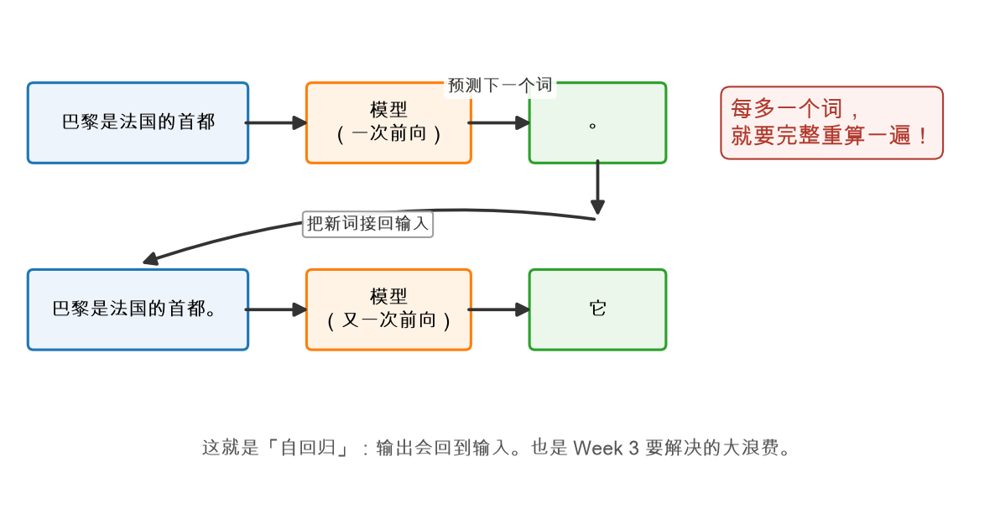

# 第 0 章：总览——vLLM 为什么快

> 本章你将：
> 1. 从"打字机效果"出发，看懂大模型说话的基本方式——**一次只蹦一个词**；
> 2. 知道**推理引擎**管什么、不管什么，以及 vLLM 为什么能快好几倍；
> 3. 拿到一张 **8 周课程地图**，知道每一周在往山顶的哪一段爬；
> 4. 学会本教程的"三件套"用法：战场、参考答案、测试红绿灯；
> 5. 确认一件事：**这门课不需要你懂 CUDA、懂操作系统、懂 Transformer。**

---

## 0.1 从打字机效果聊起

你用过 ChatGPT、Claude 或者豆包，一定注意过一个细节：它的回答**不是一下子全出现的**，
而是一个词一个词往外蹦，像有人在你面前打字。

你可能会想：这是不是故意做的"打字机动画效果"，显得有仪式感？

不是。这个"打字机效果"不是前端动画，而是大模型**根本的工作方式**。
大语言模型其实只会做一件事：

> **给你一段话，它猜出"下一个词最可能是什么"。**

就这一件事。它不会一次性想出整句话，只会：

1. 读你的话："巴黎是法国的首都"→ 猜下一个词："。"；
2. 把"。"接回去，变成"巴黎是法国的首都。"→ 再猜："它"；
3. 把"它"接回去……如此循环，直到它自己猜出"结束符"为止。

这个"**输出接回输入、再猜下一个**"的循环，有个正式名字叫**自回归（autoregressive）**。
第 3 章你会亲手写出这个循环，这里先记住感觉：**模型每说一个词，都要完整地想一遍。**



> 📌 划重点：大模型 = 一台"下一个词预测机"。所谓"生成一段话"，就是把这个预测机
> 循环开起来：猜一个词 → 接回去 → 再猜 → 再接回去……打字机效果就是这么来的。

---

## 0.2 同一个模型，为什么有人快 4 倍？

既然大家用的都是同一个模型（比如 Qwen3-0.6B），猜词的方式也都是上面这个循环，
那"推理"这件事还有什么技术含量吗？直接写个 `for` 循环不就完了？

问得好。我们在这台 Mac 上做了个实测：同一个 Qwen3-0.6B 模型、同一台机器，
一边是最朴素的 `for` 循环写法（每猜一个词就把整段话重算一遍），
一边是真实 vLLM 引擎。结果：


| 写法 | 生成速度 |
|---|---|
| 朴素循环（Week 1 第 3 章你亲手写的那个） | 39.3 token/s |
| 真实 vLLM | 145.8 token/s |

**模型一模一样，输出一字不差，速度差了将近 4 倍。**

慢着！模型没变、硬件没变，那这 4 倍是从哪省出来的？答案就是本课程的主角——
**推理引擎（inference engine）**。模型只负责"算"，而引擎负责"怎么算得聪明"：
哪些中间结果该存下来别重算、内存怎么摆放不浪费、多个请求怎么拼在一起算。

> 💡 你可能会问：4 倍很重要吗？39 tok/s 看着也挺快啊？
>
> 对一个人聊天，39 tok/s 确实够看。但推理引擎的战场是**服务器**：一台机器要同时
> 伺候成百上千个用户。引擎慢 4 倍，意味着同样的硬件只能服务 1/4 的用户——
> 这就是真金白银的成本。而且我们实测的是最小的 0.6B 模型，模型越大、
> 请求越多，差距拉得越开。

---

## 0.3 推理引擎到底管什么？

打个比方：**模型是厨师，推理引擎是餐厅的后厨管理。**

厨师（模型）的手艺是定的——给他食材，他按固定流程炒菜。但一家餐厅能不能赚钱，
看的是后厨管理（引擎）：

| 后厨管理的问题 | 推理引擎的对应物 | 本课程哪周讲 |
|---|---|---|
| 同一道菜重复备料浪费吗？ | **KV cache**：算过的中间结果存下来，不重算 | Week 3 |
| 冰箱（内存）怎么摆才不浪费空间？ | **分页 KV cache（PagedAttention）**：向操作系统借"分页"的智慧 | Week 4 |
| 十桌客人怎么拼单炒菜最省火？ | **continuous batching**：动态拼批，谁吃完谁走，不等陪跑 | Week 5 |
| 客人要微辣还是特辣？ | **采样器**：temperature、top-k、top-p 控制"发挥的随机性" | Week 6 |
| 前台怎么接单、怎么上菜？ | **引擎化**：LLMEngine、流式输出，从脚本变成服务 | Week 7 |

vLLM 就是目前最出名的"后厨管理大师"（开源、生产级、各大公司都在用）。
这门课的目标，就是**参考真实 vLLM 的源码，用 PyTorch 从零手写一个迷你版**，
让你既懂原理、又能读懂真源码。

> 📌 对标 vLLM：真实 vLLM 的"后厨管理"核心在源码仓库（`~/codeDir/pythonCode/vllm`）的
> `vllm/v1/core/sched/scheduler.py`（调度）和 `vllm/v1/engine/llm_engine.py`（引擎门面）。
> 现在打开它们你会头晕；8 周后，Week 8 会带你一行一行读——而且你认得出每个概念，
> 因为每一个你都用双手写过一遍。

---

## 0.4 课程地图：8 周爬到哪

| 周 | 主题 | 一句话 | 你将写出 |
|---|---|---|---|
| **W1** | 见证与上手 | 一个词一个词是怎么蹦出来的 | 张量操作 + 朴素生成循环 |
| W2 | 手写 mini Transformer | 引擎的心脏长什么样 | 一个能前向的小 GPT |
| W3 | KV cache | 别重复算已经算过的 | 带缓存的生成（快 3 倍） |
| W4 | 分页 | 向操作系统借智慧（PagedAttention 的灵魂） | 分页 KV cache |
| W5 | 调度器 | continuous batching，吞吐抬 3 倍 | 请求调度流水线 |
| W6 | 采样与真实权重 | 让引擎说人话 | 采样器 + 加载 Qwen3-0.6B |
| W7 | 引擎化 | 从脚本到服务 | LLMEngine + 流式输出 |
| W8 | 对标真实 vLLM | 读懂源码 | 带读 vLLM 调度器 + 结业实测 |

注意这张表的**坡度设计**：W1、W2 从零开始搭积木（不需要任何 AI 背景），
W3~W5 是引擎的三大核心优化（每周解决一个具体的"浪费"），
W6~W8 把它变成能用、能对标真源码的完整引擎。

---

## 0.5 怎么用本教程：战场、答案、红绿灯

这个仓库里有三个你每周都要打交道的东西，先认识一下：

| 目录 | 角色 | 怎么用 |
|---|---|---|
| `minivllm/` | **你的战场** | 函数体是 `raise NotImplementedError("TODO")`，由你亲手填写 |
| `reference/` | **参考答案** | 完整实现，已全部通过测试。卡住 20 分钟再看，别一上来就抄 |
| `tests/` | **红绿灯** | 填对了测试变绿，填错了变红。绿灯是你唯一的裁判 |

测试靠一个叫 `IMPL` 的环境变量决定"打哪个包"：

```bash
IMPL=reference .venv/bin/pytest tests   # 打参考答案 → 全绿（这是终点）
.venv/bin/pytest tests                  # 打你的战场 → 大片红（这是起点）
```

**先红后绿，是这个课程的正常节奏。** 看到大片红不要慌——红得越整齐，
说明战场越干净。你每周的任务就是把自己那周负责的测试一盏一盏点亮：

```bash
.venv/bin/pytest tests/test_w1.py       # 本周的测试
```

每周的写法固定：**读教程 → 填 `minivllm/` 里的函数 → 跑测试 → 红了看报错改 → 全绿收工。**

> ⚠️ 易踩坑：`IMPL=reference` 只在那一刻有效，别把 `export IMPL=reference` 写进你的
> shell 配置——否则你填完代码跑测试，打的还是参考答案，绿灯会骗你。

---

## 0.6 郑重承诺：你不需要的那些东西

开课前把丑话（其实是好话）说在前面。这门课**不需要**：

- **不需要懂 CUDA。** 全程 PyTorch，在 Mac（Apple Silicon）上用 MPS 后端跑。
  GPU 编程一个字母都不会出现。
- **不需要懂操作系统。** Week 4 的分页思想确实来自操作系统的虚拟内存，
  但我们会用"储物柜"的生活类比从零建立直觉，"页表""虚拟内存"这些词
  都会先落地再使用。
- **不需要懂 Transformer。** Week 2 会从零重建注意力机制，不假设你记得 Q/K/V。
- **不需要数学好。** 用到的数学就一句"对应相乘再相加"，出现时随手复习，没有证明题。

你**需要**的：会 Python（类、模块、pip 都用过），每周能投入 7 小时以上。

> 📌 划重点：这门课学的是"推理引擎"，不是"大模型原理科普"。8 周后你手里会有一个
> 自己写的、能加载真实 Qwen3-0.6B 权重、带分页 KV cache 和 continuous batching 的
> 迷你引擎——以及读懂真实 vLLM 核心源码的底气。

---

## 动手练习

本章没有代码要写，做三件"磨刀"的事：

1. 在仓库根目录下逛一圈：`ls` 看看 `minivllm/`、`reference/`、`tests/` 三个目录，
   打开 `minivllm/tensor_ops.py`，数一数里面有多少个 `TODO`——这些就是 Week 1 的敌人。
2. 打开 `tests/test_w1.py`，通读一遍（读不懂没关系），回答自己一个问题：
   "测试文件是怎么知道该打 `minivllm` 还是 `reference` 的？"
   （提示：看文件开头的 `load` 函数，再看 `tests/_impl.py`。）
3. 把 0.4 节的课程地图拍个照或抄在笔记上——8 周里你会无数次回来对位置。

## 参考答案

本章无代码。第 2 题的答案在 `tests/_impl.py`（就十几行）：它读 `IMPL` 环境变量，
决定 `import minivllm.xxx` 还是 `import reference.xxx`。

---

👉 下一章：[第 1 章：环境搭建——装好工具，先见证奇迹](./01-环境搭建-装好工具先见证奇迹.md)
