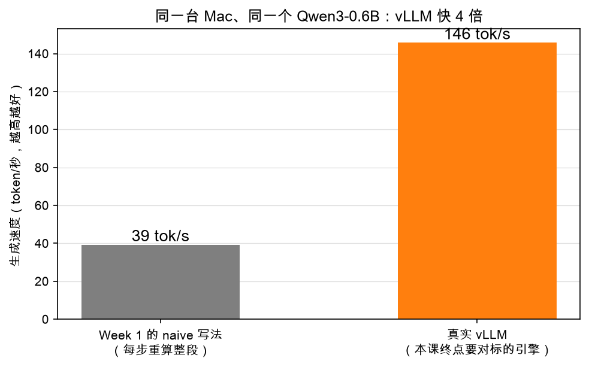

# 第 1 章：环境搭建——装好工具，先见证奇迹

> 本章你将：
> 1. 建好项目虚拟环境 `.venv`，装好全部依赖；
> 2. 先跑参考答案看**全绿**（见证终点），再跑你的战场看**全红**（确认起点）；
> 3. 用真实 vLLM 让 Qwen3-0.6B 生成第一段话——先尝尝终点的味道；
> 4. 看懂实测对比图：naive 39.3 tok/s vs vLLM 145.8 tok/s。

---

## 1.1 为什么先装环境再讲道理？

学系统最怕"纸上谈兵一个月，第一次跑代码在结业前"。这门课反过来：
**第一章就把所有工具跑通**，之后每一周你都是"改代码 → 跑测试 → 看绿灯"的即时反馈循环。

今天的目标是四个里程碑，挨个点亮：

1. ✅ Python 版本合格，`.venv` 建好，依赖装好；
2. ✅ `IMPL=reference` 跑测试——**全绿**（终点长这样）；
3. ✅ 默认跑测试——**大片红**（战场长这样）；
4. ✅ 真实 vLLM 开口说话，并看懂那张 4 倍差距的图。

---

## 1.2 检查 Python，建虚拟环境

本课程在 macOS（Apple Silicon）上开发验证。**建议直接用 Python 3.12**（开发机就是 3.12）：
课程代码本身 3.10 以上就能跑，但 1.5 节要装的真实 vLLM，其 Mac 预编译 wheel
目前只提供 3.12 版——用 3.12 可以一路畅通。
先检查：

```bash
python3 --version
```

看到 `Python 3.12.x` 就最好；`3.10` / `3.11` 也能学完全部课程代码，
只是 1.5 节的真实 vLLM 可能装不上（届时把那节当"看演示"即可）。

接着进入仓库根目录，建虚拟环境、装依赖：

```bash
cd minivllm                      # 进到仓库根目录（有 requirements.txt 的那层）
python3 -m venv .venv            # 在仓库里建一个 .venv/ 文件夹
.venv/bin/pip install -r requirements.txt
```

三行分别干了什么：

- `python3 -m venv .venv`：在项目里造一个**独立的 Python 小包间**。
  之后这个项目装的库都关在这个包间里，不污染你电脑上的其他 Python 项目。
- `.venv/bin/pip install ...`：注意我们**没有用 `source .venv/bin/activate`**，
  而是直接用包间里的 `pip` 全路径。效果一样，还免得每次开终端都要 activate。
  本教程所有命令都用这种"全路径"写法：`.venv/bin/python`、`.venv/bin/pytest`。

装的东西不多（见 `requirements.txt`）：`torch`（主角）、`transformers`（加载真实模型）、
`pytest`（红绿灯）、`matplotlib` + `numpy`（画图）、`safetensors`（模型权重格式）。

> ⚠️ 易踩坑：第一次装 `torch` 比较大（几百 MB），网速慢的话耐心等。
> 装完可以用 `.venv/bin/python -c "import torch; print(torch.__version__)"` 验证。

验证 Mac 的 GPU（MPS 后端）可用：

```bash
.venv/bin/python -c "import torch; print(torch.backends.mps.is_available())"
```

打印 `True` 就说明你的 Mac GPU 待命完毕。`mps` 是 Apple Silicon 上的 GPU 后端，
第 2 章会专门讲"device"是什么，这里先确认它能用。

---

## 1.3 见证终点：参考答案全绿

环境好了，第一件事——**先看看终点长什么样**：

```bash
IMPL=reference .venv/bin/pytest tests
```

`IMPL=reference` 这个环境变量告诉测试："这次打参考答案包"。
你应该看到一片绿（几十条 passed）。其中有 4 条标记为 `slow` 的测试
要加载真实的 Qwen3-0.6B 权重——模型文件已经在本机的 HuggingFace 缓存里，
不需要联网，但会花一两分钟，属于正常。

> 💡 你可能会问：为什么要先看参考答案全绿？反正不是我的代码。
>
> 三个理由：① 它证明**你的环境是完好的**——如果参考答案都跑不过，那是环境问题，
> 立刻修，别等写了自己的代码再怀疑人生；② 让你对"终点"有体感——58 个快测 +
> 4 个慢测全绿，就是你 8 周后的样子；③ 以后每周填代码遇到诡异报错，
> 你随时可以跑一遍 `IMPL=reference` 来区分"我写错了"还是"环境坏了"。

如果你想省时间，可以跳过慢测试：

```bash
IMPL=reference .venv/bin/pytest tests -m "not slow"
```

---

## 1.4 看看战场：你的代码全红

现在去掉 `IMPL=reference`，打默认包 `minivllm/`——你的战场：

```bash
.venv/bin/pytest tests
```

这次是大片红，报错清一色是：

```
NotImplementedError: TODO: 看 learning-guide 对应章节，把这个函数填出来
```

**红得理直气壮。** `minivllm/` 里的函数体全是 `raise NotImplementedError("TODO")`——
这是故意留给你填的。现在红得越整齐，说明战场越干净。

花一分钟读一条报错的完整输出（挑 `test_make_tensor` 那条）：它会告诉你是哪个文件、
哪个函数、哪一行抛的 `NotImplementedError`。之后 8 周，你每天都在和这个画面打交道：
**红点 → 填代码 → 变绿 → 下一个红点。**

> 📌 划重点：从今天起记住两条命令的区别——
> `IMPL=reference .venv/bin/pytest tests` 看终点（全绿），
> `.venv/bin/pytest tests` 看战场（先红后绿）。别搞混，更别 `export IMPL=reference`。

---

## 1.5 见证奇迹：真实 vLLM 开口说话

压轴戏来了。我们直接请出**真实 vLLM**，让它用 Qwen3-0.6B 生成一段话——
这就是你 8 周后要对标的引擎，先听听它的声音。

### 安装真实 vLLM：pip 安装，版本锁定 v0.27.1

真实 vLLM **不需要 clone 源码仓库**——它就是一个普通的 Python 包，
用 pip 装进**同一个 `.venv`** 就行。本书全程锁定版本 **v0.27.1**：
你的安装结果、书里引用的行号、实测数字，全部对得上。

macOS（Apple Silicon）：两个包都从 GitHub release 装——PyPI 上没有 Mac 版
vLLM wheel，官方把预编译 wheel 挂在 release 里；Metal 后端插件 `vllm-metal`
在 PyPI 上的 0.1.0 太旧（不认识 vLLM 0.27 的新目录结构），也要用 GitHub 上
适配 0.27.1 的构建：

```bash
.venv/bin/pip install \
  "vllm @ https://github.com/vllm-project/vllm/releases/download/v0.27.1/vllm-0.27.1%2Bcpu-cp312-cp312-macosx_11_0_arm64.whl" \
  "vllm-metal @ https://github.com/vllm-project/vllm-metal/releases/download/v0.3.0.dev20260819070634/vllm_metal-0.3.0.dev20260819070634-cp312-cp312-macosx_11_0_arm64.whl"
```

Linux 直接走 PyPI：

```bash
.venv/bin/pip install vllm==0.27.1
```

装完验证一下：

```bash
.venv/bin/python -c "import vllm; print(vllm.__version__)"   # 应打印 0.27.1
```

> 📌 **本书的源码约定（先读这一段）**
> pip 装完，真实 vLLM 的**全部源码**就躺在你的 `.venv` 里——
> Python 包安装完就是源码本码，不用另外 clone 仓库。定位它：
> ```bash
> .venv/bin/python -c "import vllm, os; print(os.path.dirname(vllm.__file__))"
> ```
> 打印出来的路径类似 `.../minivllm/.venv/lib/python3.12/site-packages/vllm/`。
> 本书后面凡是说"打开 `vllm/v1/core/sched/scheduler.py`"这类路径，
> 指的都是**这个目录**下的文件。建议现在就在编辑器里打开瞄一眼，
> Week 2 起我们会经常去串门。

在仓库根目录新建一个文件 `hello_vllm.py`，写入：

```python
"""第一次和真实 vLLM 打招呼。

运行（必须写成带 main 守卫的 .py 脚本文件，且必须加两个环境变量）：
    HF_HUB_OFFLINE=1 VLLM_METAL_USE_PAGED_ATTENTION=0 \
      .venv/bin/python hello_vllm.py
"""

from vllm import LLM, SamplingParams


def main():
    llm = LLM(model="Qwen/Qwen3-0.6B", max_model_len=512)

    outs = llm.generate(
        ["The capital of France is"],
        SamplingParams(max_tokens=64, temperature=0),
    )
    print(outs[0].outputs[0].text)


if __name__ == "__main__":
    main()
```

然后运行它（注意整行命令）：

```bash
HF_HUB_OFFLINE=1 VLLM_METAL_USE_PAGED_ATTENTION=0 \
  .venv/bin/python hello_vllm.py
```

第一次运行会加载模型（从本地缓存读，约 1.2GB），等几十秒后，
你会看到模型把 "The capital of France is" 续写成一段完整的话。

这一行命令里的三个"机关"，每一个都有讲究：

| 机关 | 为什么必须 |
|---|---|
| 写成带 `if __name__ == "__main__":` 守卫的 `.py` 脚本 | vLLM 会 **spawn 一个独立的 EngineCore 子进程**，子进程启动时会重新 import 你的主模块。没有 main 守卫，子进程会再执行一遍顶层的 `LLM(...)`，直接报 `RuntimeError: ... bootstrapping phase`。同理也**不能用 `python -c "..."` 或 `python - <<EOF`**——子进程根本找不到主模块。 |
| `HF_HUB_OFFLINE=1` | 让 HuggingFace 走本地缓存（模型已下载好），不联网，启动更快也更稳。 |
| `VLLM_METAL_USE_PAGED_ATTENTION=0` | vllm-metal 的预编译 Metal kernel 需要 macOS 15+。如果你的系统版本较低，就设 `0` 退回 MLX 自带的注意力实现，否则会报错。**注意是 `=0`（关掉），不是 `=1`。** |

> ⚠️ 易踩坑：最容易踩的三个坑——① 手快打成 `VLLM_METAL_USE_PAGED_ATTENTION=1`
> （方向反了，`0` 才是"退回兼容实现"）；② 图省事用 `python -c` 跑；
> ③ 脚本顶层直接写 `llm = LLM(...)` 而没套 `if __name__ == "__main__":`——
> 子进程会把顶层代码再跑一遍，报一大串 multiprocessing 的错。
> 三个坑都在上面表格里，遇到报错先回来对一遍。

> 📌 对标 vLLM：你刚才用的 `LLM` 类，就是真实 vLLM 对用户暴露的门面，
> 源码就在你 `.venv` 里的 `vllm/entrypoints/` 一带（定位方法见上面的约定框）。
> Week 7 你会手写一个迷你版 `LLM`，签名都向它看齐：`generate` 批量生成、
> `stream` 流式输出。

---

## 1.6 那张 4 倍差距的图，再看一眼

第 0 章见过这张图，现在你亲手跑过 vLLM 了，再看会更有感觉：



两个数字都来自本机实测（存在 `figures/data/bench.json` 里）：

| 写法 | 速度 | 是什么 |
|---|---|---|
| naive（无 cache，每步整段重算） | 39.3 token/s | 第 3 章你亲手写的循环 |
| 真实 vLLM | 145.8 token/s | 你刚跑的引擎 |

第 3 章写完 `generate_naive` 之后，你不妨用秒表感受一下自己的版本有多慢——
**那个"慢"，就是接下来 7 周要一刀一刀割掉的肥肉。**

> 💡 你可能会问：vLLM 快的秘诀到底是什么？
>
> 一句话预告：它做了三件大事——把算过的中间结果存下来不重算（KV cache，Week 3）、
> 用分页的方式管理这些缓存不浪费内存（PagedAttention，Week 4）、
> 把多个请求动态拼成一批一起算（continuous batching，Week 5）。
> 每一件你都会亲手实现一遍，最后用 Week 8 的实测看看自己追到了几成功力。

---

## 动手练习

1. 完成 1.2 节的环境搭建，确认 `.venv/bin/python -c "import torch; print(torch.backends.mps.is_available())"` 打印 `True`。
2. 依次跑两条命令并截图（或抄下最后的统计行）：
   - `IMPL=reference .venv/bin/pytest tests -m "not slow"` —— 应该全绿；
   - `.venv/bin/pytest tests/test_w1.py` —— 应该 9 红 2 绿（绿的是两个已给出的函数）。
3. 写好 `hello_vllm.py` 并跑通，把 prompt 换成一句你感兴趣的话（比如
   `"Explain what a KV cache is in one sentence:"`）再跑一次，观察输出。

## 参考答案

本章没有要填的仓库代码。`hello_vllm.py` 的完整内容就在 1.5 节；
命令跑不通时，对照 1.5 节的"三个机关"表格逐条排查，90% 的问题是
`VLLM_METAL_USE_PAGED_ATTENTION` 写成了 `1`、用了 `python -c`、
或忘了 `if __name__ == "__main__":` 守卫。

---

👉 下一章：[第 2 章：PyTorch 热身——张量就是数表](./02-PyTorch热身-张量就是数表.md)
