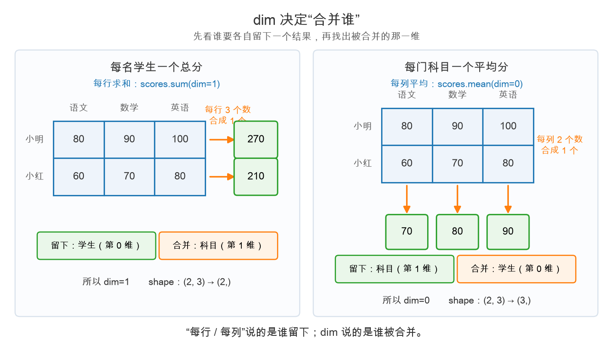

# 第 2 章：PyTorch 热身——张量就是数表

> 本章你将：
> 1. 建立对**张量**（tensor）的第一直觉：它就是一张数表，几维就是几层表格；
> 2. 学会四样生存技能：**创建、索引、矩阵乘、搬 device**；
> 3. 亲手实现 `minivllm/tensor_ops.py` 里的 9 个函数，点亮本周第一批绿灯；
> 4. 为第 3 章埋下关键一发：`last_token_logits`——从模型输出里取出"下一个词的预测"。

---

## 2.1 张量就是数表

PyTorch 没用过？没关系。整个 PyTorch 里你 90% 的时间只跟一样东西打交道：**张量**。
而张量的本质一句话说完：

> **张量就是一张装数字的表。一维是一行数，二维是一张表格，三维是一摞表格。**

| 维度 | 长什么样 | 生活里的对应 | LLM 里的对应 |
|---|---|---|---|
| 1 维 | `[3, 1, 4, 1, 5]` | 一排格子 | 一句话的 token id 序列 |
| 2 维 | 3 行 4 列的表格 | Excel 表 | 一个矩阵（比如一层网络的权重） |
| 3 维 | 一摞表格 | 一沓 Excel 表 | 模型的一次输出：(批次, 位置, 词表) |

四维五维也有，但直觉不变：**每多一维，就是多一层"摞起来"**。
本课程不玩高维花活，最高就用到四维（Week 2 的注意力），到时候会再给你配形状解说。

在 torch 里，每个张量有三样随身信息，先混个脸熟：

- `t.shape`：形状，几行几列。比如 `torch.Size([2, 3])` 表示 2 行 3 列；
- `t.dtype`：格子里装的数的类型，比如 `torch.float32`（32 位小数）；
- `t.device`：这张表住在哪——`cpu`（内存）还是 `mps`（Mac 的 GPU）。

下面我们把这三样全部练到。打开你的战场 `minivllm/tensor_ops.py`，
里面有 10 个函数，其中 `best_device` 已经给好了，剩下 9 个都是 `TODO`——今天全灭。

---

## 2.2 创建：把 Python 列表变成张量

第一个函数 `make_tensor`：把嵌套列表变成张量。参考答案的核心就一行：

```python
return torch.tensor(data, dtype=dtype)
```

`torch.tensor([[1, 2], [3, 4]])` 会做两件事：数清形状（2 行 2 列），
把每个数转成 `dtype` 指定的类型（默认 `torch.float32`，即小数）。

配套的两个小跟班：

```python
torch.zeros((2, 3))   # 2 行 3 列全 0
torch.ones((2, 3))    # 2 行 3 列全 1
```

你可能会想：全 0 全 1 有什么用？用处大了——**先造一张形状正确的空表，再往里填数**，
是写张量代码最常见的起手式（Week 3 的 KV cache 就是这么干的）。

> 💡 你可能会问：为什么默认是 `float32` 小数，不是整数？
>
> 因为神经网络里的一切都是小数运算（权重、概率、中间结果），`float32` 是默认工作类型。
> 后面还会见到 `bfloat16`（一半体积、精度略低，跑大模型省内存，第 3 章加载 Qwen3 就用它）
> 和 `int64`（token id 是整数编号）。现在只需记住：**dtype 决定每个格子占多少内存、能装什么样的数。**

---

## 2.3 索引：从表格里挖数

从表格里挖数据，只用两个语法：`t[i]` 取第 i 行，`t[:, j]` 取第 j 列。

```python
t = torch.tensor([[1., 2., 3.],
                  [4., 5., 6.]])

t[1]      # 第 1 行（从 0 数起）：tensor([4., 5., 6.])
t[:, 0]   # 第 0 列：tensor([1., 4.])
```

两个要点：

1. **下标从 0 开始**：`t[0]` 是第一行，`t[1]` 是第二行。Python 老规矩。
2. **冒号 `:` 表示"这一维全要"**：`t[:, 0]` 读作"所有行、第 0 列"，
   结果就是竖着的那一列。

还有一个马上就会用的技巧：**负数下标从尾巴数**。`t[-1]` 是最后一行。
2.7 节的 `last_token_logits` 全靠它。

对应的两个战场函数：

```python
def select_row(t, i):
    return t[i]

def select_column(t, j):
    return t[:, j]
```

---

## 2.4 沿着轴聚合：sum 和 mean 的 dim 参数

接下来实现 `row_sums`（每行求和）和 `column_means`（每列求平均）。它们都会把一组数合并成一个数，这类操作叫作**聚合**。

这一节最重要的只有一句话：

> **对于 `sum` 和 `mean`，`dim` 指定的是“合并哪一维”，不是“最后留下哪一维”。**

这句话为什么重要？因为初学者很容易想：既然是“每行求和”，是不是应该写行所在的 `dim=0`？恰恰相反：**“每行”表示每一行最后各留一个结果，所以真正被合并的是列，也就是 `dim=1`。**

我们用一张成绩表把它看明白：

```python
scores = torch.tensor([
    [80., 90., 100.],   # 小明的 3 门成绩
    [60., 70.,  80.],   # 小红的 3 门成绩
])

scores.shape             # torch.Size([2, 3])
```

它有 2 行、3 列，形状是 `(2, 3)`：

```text
                 第 1 维：3 门科目
                      ↓
                语文  数学  英语
第 0 维：小明     80    90   100
2 名学生：小红     60    70    80
```

- 第 0 维有 2 个位置，表示两名学生（两行）；
- 第 1 维有 3 个位置，表示三门科目（三列）。

### 每名学生的总分：保留行，合并列

先不用 `dim`，只用上一节学过的索引手算：

```python
scores[0, :].sum()   # 80 + 90 + 100 = 270
scores[1, :].sum()   # 60 + 70 +  80 = 210
```

我们在每一行内部，把 3 门成绩合成了 1 个总分：

```text
[80, 90, 100]  ──求和──> 270
[60, 70,  80]  ──求和──> 210
```

两名学生仍然保留，被合并掉的是“科目”这一维，也就是第 1 维：

```python
scores.sum(dim=1)
# tensor([270., 210.])
```

形状也跟着从 `(2, 3)` 变成 `(2,)`：2 名学生，每人留下 1 个总分。

> **每行求和：行要保留，列要合并，所以用 `dim=1`。**

### 每门科目的平均分：保留列，合并行

这次我们希望每门科目留下一个结果。还是先手算：

```python
scores[:, 0].mean()   # (80 + 60) / 2 = 70
scores[:, 1].mean()   # (90 + 70) / 2 = 80
scores[:, 2].mean()   # (100 + 80) / 2 = 90
```

现在是在每一列内部，把 2 名学生的成绩合成 1 个平均分：

```text
 80    90   100
 60    70    80
 ↓     ↓     ↓
 70    80    90
```

三门科目仍然保留，被合并掉的是“学生”这一维，也就是第 0 维：

```python
scores.mean(dim=0)
# tensor([70., 80., 90.])
```

形状从 `(2, 3)` 变成 `(3,)`：3 门科目，每门留下 1 个平均分。

> **每列平均：列要保留，行要合并，所以用 `dim=0`。**

下面把两种情况放在一张图里对照。看图时先看绿色的“留下”，再看橙色的“合并”；橙色标签中的维度，就是应该填写的 `dim`：



### 不要背方向，问自己两个问题

以后再遇到 `sum` 或 `mean`，不要背“`dim=0` 按列、`dim=1` 按行”。按顺序问：

1. **谁应该各自得到一个结果？** 它就是要保留的维度；
2. **哪些数需要合并？** 它所在的维度就是 `dim`。

| 需求 | 谁留下 | 谁被合并 | 写法 | `(2, 3)` 的结果形状 |
|---|---|---|---|---|
| 每行求和 | 行（第 0 维） | 列（第 1 维） | `t.sum(dim=1)` | `(2,)` |
| 每列求和 | 列（第 1 维） | 行（第 0 维） | `t.sum(dim=0)` | `(3,)` |
| 每行平均 | 行（第 0 维） | 列（第 1 维） | `t.mean(dim=1)` | `(2,)` |
| 每列平均 | 列（第 1 维） | 行（第 0 维） | `t.mean(dim=0)` | `(3,)` |

把规律再压缩成一句口诀：

> **“每行/每列”说的是谁留下，`dim` 说的是谁被合并。**

### 用 shape 检查有没有写反

默认情况下（没有设置 `keepdim=True`），`sum` 和 `mean` 会让被合并的那一维消失：

> **结果形状 = 从原形状中删掉第 `dim` 个数字。**

对于形状为 `(2, 3)` 的 `scores`：

```python
scores.sum(dim=1).shape    # (2,)：删掉第 1 维的 3
scores.mean(dim=0).shape   # (3,)：删掉第 0 维的 2
```

这里特意用了 2×3 而不是 2×2 的表。因为方表无论留下行还是列，结果长度都是 2，只看形状不容易发现方向写反；行数和列数不同，检查起来更直观。

### `dim` 决定分组，sum 和 mean 决定算法

对相同的 `dim`，`sum` 和 `mean` 的分组方式完全相同：

```python
scores.sum(dim=1)     # 每行是一组，然后求和
scores.mean(dim=1)    # 每行是一组，然后求平均
```

所以可以把一次聚合拆成两件事来想：

- `dim`：哪些数要归到同一组；
- `sum` 或 `mean`：一组数最后怎样变成一个数。

对应到战场上的两个函数：

```python
def row_sums(t):
    # 每行留一个结果：保留行，合并列（第 1 维）
    return t.sum(dim=1)


def column_means(t):
    # 每列留一个结果：保留列，合并行（第 0 维）
    return t.mean(dim=0)
```

最后提前看一眼高维张量。以后遇到：

```python
x.shape == (batch, sequence, hidden)
```

那么 `x.mean(dim=-1)` 中的 `-1` 表示最后一维，也就是 `hidden`。它把每个 token 的一组 hidden 数值求平均，留下 `(batch, sequence)`。维度变多了，判断方法仍然没变：**先看谁要留下，再找谁被合并。**

---

## 2.5 矩阵乘：对应相乘再相加

`matmul` 是神经网络的第一主力运算（模型里每一层都在做它），规则一句话：

> **结果的第 i 行第 j 列 = a 的第 i 行 与 b 的第 j 列，对应相乘再相加。**

用式子写就是：

$$C_{ij} = \sum_{k} A_{ik} \cdot B_{kj}$$

别被 $\sum$ 吓到，它就是"把 k 从 0 数到尾，每一项乘起来再加"的缩写。
手算一个例子（这正是测试 `test_matmul` 里的断言）：

$a = \begin{bmatrix}1&2\\\\3&4\end{bmatrix}$，$b = \begin{bmatrix}5&6\\\\7&8\end{bmatrix}$：

- 第 0 行第 0 列 = $1\times5 + 2\times7 = 19$；
- 第 0 行第 1 列 = $1\times6 + 2\times8 = 22$；
- 第 1 行第 0 列 = $3\times5 + 4\times7 = 43$；
- 第 1 行第 1 列 = $3\times6 + 4\times8 = 50$。

结果 $\begin{bmatrix}19&22\\\\43&50\end{bmatrix}$。

形状规则也只有一句：**a 是 (m, k)，b 是 (k, n)，结果 (m, n)**——
中间那个 k 必须一样（不然"对应相乘"配不上对），结果取 a 的行数、b 的列数。

torch 里矩阵乘的写法是 `@` 运算符：

```python
def matmul(a, b):
    return a @ b
```

> 📌 划重点：矩阵乘不用你写循环，`@` 一个符号搞定。但"对应相乘再相加"这个直觉
> 要留着——Week 2 的注意力打分，本质上就是一大堆矩阵乘。

---

## 2.6 device：这张表住在哪、在哪算

张量不止有形状和类型，还有"住址"：**device**。

- `cpu`：住在内存里，用 CPU 算；
- `mps`：住在 Mac 的 GPU 显存里，用 GPU 算（Apple Silicon 的 GPU 后端叫 MPS）。

为什么要把表搬到 GPU？因为矩阵乘这种"成千上万次乘加"的活，
GPU 几千个小核一起干，比 CPU 快一个数量级。LLM 推理基本上就是"矩阵乘的海洋"，
所以模型和输入都要先搬上 GPU 再算。

搬运用 `.to()`：

```python
def to_device(t, device):
    return t.to(device)     # device 是字符串："cpu" 或 "mps"
```

`best_device` 已经给你写好了（不用填），看一眼它的逻辑：

```python
def best_device():
    if torch.backends.mps.is_available():
        return "mps"
    return "cpu"
```

有 GPU 就用 GPU，没有就退回 CPU——后面所有章节要设备时都喊它。

> ⚠️ 易踩坑：**两个张量做运算时，必须住在同一个 device 上。**
> 一个 cpu 张量 @ 一个 mps 张量会直接报错（"Expected all tensors to be on the same device"）。
> 第 3 章加载真实模型时你会看到：模型 `.to(device)` 搬一次，输入 ids 也 `.to(device)` 搬一次，
> 就是为了让他俩住一起。

---

## 2.7 last_token_logits：第 3 章的钥匙

最后一个函数，也是本周最重要的一个。先看背景：

模型一次前向（把整段话过一遍），会给**每个位置**都算一份"下一个词"的预测，
输出形状是 `(batch, seq_len, vocab_size)`——三维：第 0 维是批次（几句话），
第 1 维是位置（第几个词），第 2 维是词表（每个候选词一个分数）。

而我们生成时只关心**最后一个位置**的预测（它预测的才是"整段话接下来的词"）。
假设批次只有 1 句话，要取的就是"第 0 句、最后位置、全部词表分数"：

```python
def last_token_logits(logits):
    return logits[0, -1, :]
```

三个下标各管一维：`0` = 第 0 句；`-1` = 最后一个位置（负数下标从尾巴数）；
`:` = 词表全要。进去 `(1, L, V)`，出来 `(V,)`——一维的"每个候选词的分数表"。

这些分数有个专门的名字叫 **logits**（先混个耳熟：分数越大的词越可能被选中，
怎么从分数变成词，第 3 章讲 argmax，Week 6 讲采样）。

> 📌 对标 vLLM：真实 vLLM 里同样只做"取最后位置"这件事——它的模型输出
> 也只保留每个请求最新位置的 logits 再送去采样。Week 6 我们手写 `Sampler` 时，
> 输入就是这一份 `(V,)` 的分数表。

---

## 2.8 点亮绿灯

9 个函数填完，跑本周测试。先看"张量热身"相关的那批：

```bash
.venv/bin/pytest tests/test_w1.py -k "not generate"
```

`-k "not generate"` 的意思是"跳过名字里带 generate 的测试"（那两条是第 3 章的活）。
剩下的 9 条——`test_make_tensor`、`test_zeros_ones`、`test_select_row_column`、
`test_row_sums_column_means`、`test_matmul`、`test_to_device_roundtrip`、
`test_best_device_is_valid`、`test_last_token_logits`、`test_count_params`——应该全绿。

| 测试 | 考你哪个函数 |
|---|---|
| `test_make_tensor` | `make_tensor` |
| `test_zeros_ones` | `zeros` / `ones` |
| `test_select_row_column` | `select_row` / `select_column` |
| `test_row_sums_column_means` | `row_sums` / `column_means` |
| `test_matmul` | `matmul`（就是 2.5 节手算的那组数） |
| `test_to_device_roundtrip` | `to_device` |
| `test_best_device_is_valid` | `best_device`（已给出，本来就绿） |
| `test_last_token_logits` | `last_token_logits` |
| `test_count_params` | `count_params`（已给出，本来就绿） |

> 💡 你可能会问：CURRICULUM 里说的 `pytest tests/test_w1.py -k tensor` 呢？
>
> `-k tensor` 只会命中 `test_make_tensor` 一条（其他测试名字里没有 "tensor"）。
> 它适合当你填完第一个函数时的"第一盏灯"；全部填完，还是用 `-k "not generate"`
> 一次看 9 条才过瘾。

---

## 动手练习

1. 填完 `minivllm/tensor_ops.py` 里的 9 个 `TODO`（`best_device` 已给出，不用动）。
   每个函数都是一行，但**要求自己先想 30 秒再看教程提示**。
2. 先跑 `.venv/bin/pytest tests/test_w1.py -k tensor` 点亮第一盏灯，
   再跑 `.venv/bin/pytest tests/test_w1.py -k "not generate"` 确认 9 条全绿。
3. 手算挑战（不许跑代码）：$a = \begin{bmatrix}2&0\\\\1&3\end{bmatrix}$，
   $b = \begin{bmatrix}1&4\\\\2&5\end{bmatrix}$，求 `a @ b`。
   算完用 `.venv/bin/python` 交互模式验证。再顺手回答：结果的形状由谁决定？

## 参考答案

`reference/tensor_ops.py` 是标准答案，每个函数就一行。**卡住 20 分钟再看**，
重点对比：你的 `dim` 参数方向、`[0, -1, :]` 的下标顺序。

---

👉 下一章：[第 3 章：自回归——一个词一个词蹦出来](./03-自回归-一个词一个词蹦出来.md)
