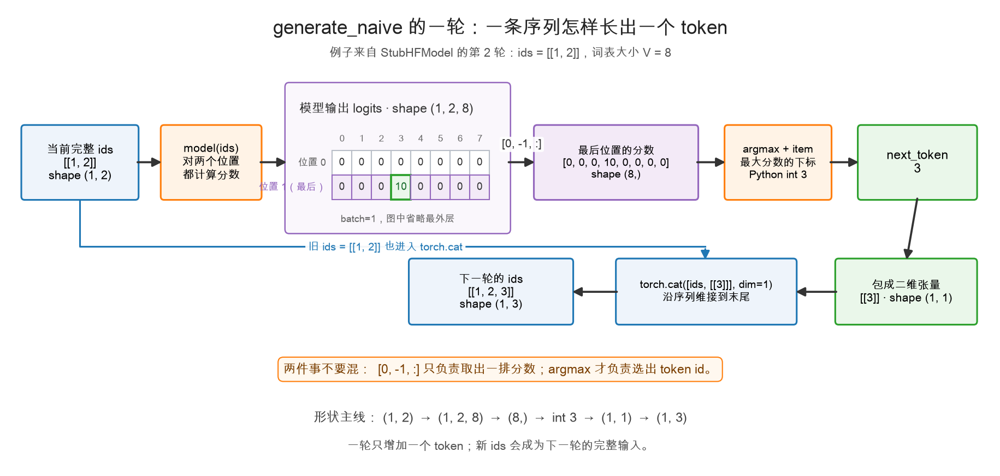
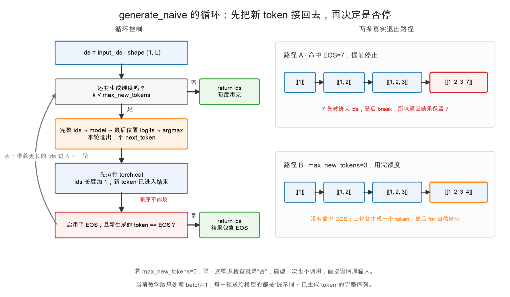

# 第 3 章：自回归——一个词一个词蹦出来

> 本章你将：
> 1. 彻底搞懂**自回归**：输出接回输入、再猜下一个词，循环到结束符为止；
> 2. 认识 **token**：模型眼里的"词"其实是一个个整数编号；
> 3. 亲手写出 `generate_naive`——你的第一个生成循环；
> 4. 先在**假模型**（StubHFModel）上跑通逻辑，再换成**真实 Qwen3-0.6B** 说话；
> 5. 亲身体会 naive 写法"慢在哪"——为 Week 3 的 KV cache 埋下伏笔。

---

## 3.1 下一个词预测：接龙游戏

先玩个游戏。我说"今天天气真"，你脑子里自动补一个字——"好"。
我再接："今天天气真好，我们出去"，你又自动补——"玩"。

**大语言模型干的就是这个接龙**，只不过它的"脑子"是一堆矩阵乘。
给它任意一段话，它输出一份"词表里每个词当下一个词的可能性分数"（就是第 2 章的 logits），
我们挑分数最高的那个词接上去，然后再问它："那再下一个呢？"

这个循环就是**自回归（autoregressive）**：


跟着图走一遍：

1. 输入"巴黎是法国的首都"→ 模型猜出"。"；
2. 把"。"**接回输入**，变成"巴黎是法国的首都。"→ 模型猜出"它"；
3. 再把"它"接回去……直到猜出一个特殊的"结束符"（EOS），循环收工。

注意图右侧那句红字："**每多一个词，就要完整重算一遍！**"——这是本章写的
`generate_naive` 的天生缺陷，先记住这个痛感，3.6 节会回来收拾它。

> 📌 划重点：自回归 = 猜一个词 → 接回输入 → 再猜 → 再接回……
> 模型的输出会绕回来当自己下一轮的输入，"自回归"的"自"就来自这个"绕回来"。

---

## 3.2 token：模型眼里的词是整数

模型不认字，只认数。它眼里的一段话不是 `"巴黎是法国的首都"`，
而是一串整数编号，比如 `[151643, 105234, ...]`。每个整数叫一个 **token id**，
"字/词 → 编号"的翻译官叫**分词器（tokenizer）**。

分词的细节（为什么"巴黎"是一个 token 而不是两个）Week 6 再细聊，
本周你只需要知道三件事：

1. 模型有个**词表**：所有可能的 token，每个一个编号。Qwen3-0.6B 的词表有 15 万多个；
2. 输入模型的张量叫 `input_ids`，形状 `(1, L)`——1 句话、L 个 token 的整数张量；
3. 词表里有个特殊成员 **EOS**（end of sequence，结束符）。模型猜出它，
   就等于说"我说完了"——生成循环该停了。

---

## 3.3 手写 generate_naive：看懂一轮，再看懂循环

轮到本周的主角了。打开 `minivllm/generate.py`，找到 `generate_naive`。
先看完整结构，暂时不要逐行翻译：

```python
@torch.no_grad()
def generate_naive(model, input_ids, max_new_tokens, eos_token_id=None):
    ids = input_ids
    for _ in range(max_new_tokens):
        out = model(ids)
        logits = out.logits if hasattr(out, "logits") else out
        next_token = torch.argmax(logits[0, -1, :]).item()
        ids = torch.cat(
            [ids, torch.tensor([[next_token]], dtype=ids.dtype, device=ids.device)],
            dim=1,
        )
        if eos_token_id is not None and next_token == eos_token_id:
            break
    return ids
```

这段代码真正做的事只有两层：

1. **一轮之内**，让当前序列长出一个新 token；
2. **很多轮之间**，把变长的序列送回模型，直到该停为止。

我们分两张图看。

### 第一张图：一个 token 是怎样长出来的？

图中使用假模型的第 2 轮作为例子。当前序列是 `[[1, 2]]`，词表里有 8 个候选 token：



顺着箭头走，最重要的是看清三次“变身”：

- 模型读入当前**完整序列** `ids`，形状 `(1, 2)`，为两个位置都输出词表分数，
  所以 `logits` 的形状是 `(1, 2, 8)`；
- `logits[0, -1, :]` 只拿最后位置的 8 个分数，`argmax` 再从中选出最大分数的
  **下标 3**。前者负责取分数，后者才负责选 token；
- token id `3` 被包成 `[[3]]`，形状 `(1, 1)`，然后沿 `dim=1` 接到旧 `ids` 末尾，
  得到下一轮的 `[[1, 2, 3]]`，形状 `(1, 3)`。

把例子换成一般情况：提示词原长为 `L`，前面已经生成了 `k` 个 token，
那么这一轮开始和结束时的形状是：

```text
轮首 ids                         (1, L+k)
模型输出 logits                  (1, L+k, V)
最后位置的全部词表分数            (V,)
包好的新 token                   (1, 1)
轮末 ids                         (1, L+k+1)
```

也就是说，**一轮只生成一个 token，序列长度只增加 1**。

> 💡 `out.logits if hasattr(out, "logits") else out` 没有参与形状变化，它只是在统一接口：
> HuggingFace 模型把张量装在 `out.logits` 里，我们后面手写的模型会直接返回张量。
> 无论模型用哪种包装，下一步都得到同样的 `logits`。

> ⚠️ 为什么一定是 `[[next_token]]`？
>
> 旧 `ids` 是二维的 `(1, L+k)`，参与拼接的新张量也必须是二维的 `(1, 1)`。
> 写成 `[next_token]` 只会得到一维的 `(1,)`，维度对不上。
> `dtype=ids.dtype, device=ids.device` 则保证新旧张量同类型、住在同一个设备上。

至于“为什么只取最后位置”，第 2 章 2.7 节已经用三维数表完整拆过：前面位置的后继
已经在输入中，只有最后位置在回答“整段话之后接什么”。这里直接把那个结论拿来使用。

> 💡 **先埋一根绝不能混的界桩：Attention 的输出不等于这里的 logits。**
>
> 本周暂时把 `model(ids)` 当黑盒；Week 2 打开后，你会看到内部其实是：
> `token id → Embedding → Attention 得到每个已有位置的隐藏向量 → lm_head 把每个隐藏向量
> 变成一整排词表 logits`。Attention 不会直接长出新词，序列长度也不会增加；只有这里的
> `argmax` 选出 token id、`torch.cat` 把它接回 `ids` 后，序列才真正多一个位置。

### 第二张图：这一轮怎样接到下一轮，又在何时退出？

一轮结束后，更长的 `ids` 会绕回去成为下一轮输入。但循环不一定非要跑满，
它有两条退出路径：



读这张图时，抓住一句话：

> **先把新 token 拼进 `ids`，再判断它是不是 EOS。**

所以命中 EOS 时，EOS 会保留在返回序列中。以 `EOS=7` 为例：

```text
[[1]] → [[1, 2]] → [[1, 2, 3]] → [[1, 2, 3, 7]] → 返回
```

如果始终没有命中 EOS，`for range(max_new_tokens)` 会自然耗尽。比如最多生成 3 个 token：

```text
[[1]] → [[1, 2]] → [[1, 2, 3]] → [[1, 2, 3, 4]] → 返回
```

这里还有三个边界要看懂：

- `eos_token_id=None` 表示不启用 EOS 提前停止，只能等生成额度耗尽；
- `max_new_tokens=0` 时循环一轮也不进，直接返回原始 `input_ids`；
- 当前教学版固定使用 `logits[0, ...]` 并拼接一个 `(1, 1)` 张量，因此只处理 `batch=1`。

函数最终返回的不是“只有新 token”的序列，而是：

```text
提示词 + 实际生成的 n 个 token，形状 (1, L+n)
```

其中 `0 ≤ n ≤ max_new_tokens`；如果提前生成 EOS，`n` 就会小于上限。

---

## 3.4 先在假模型上跑通

上面的图为什么敢把每个数字都画死？因为测试没有一上来就用不可预测的真实模型，
而是准备了一个**假模型** `StubHFModel`。它只做查表接龙：

```python
class StubHFModel:
    """假 HF 模型：查表决定下一个词。table: {上一个词: 下一个词}"""

    class Out:
        def __init__(self, logits):
            self.logits = logits

    def __init__(self, table, vocab_size=8):
        self.table = table
        self.vocab_size = vocab_size

    def __call__(self, ids):
        last = int(ids[0, -1].item())
        nxt = self.table[last]
        logits = torch.zeros(1, ids.shape[1], self.vocab_size)
        logits[0, -1, nxt] = 10.0  # 目标 token 独得 10 分，argmax 必中
        return self.Out(logits)
```

例如 `table = {1: 2, 2: 3, 3: 7}` 表示：看到 1 就选 2，看到 2 就选 3，
看到 3 就选 7。其他候选都是 0 分，目标 token 独得 10 分，因此每一轮的结果都能手算。
`Out` 则故意模仿 HuggingFace 的返回形式，把张量放进 `.logits` 属性。

两条测试分别守住上一张图中的两个出口：

- `test_generate_naive_follows_chain` 期望 `[1, 2, 3, 7]`：它证明 EOS 被**先拼入结果、再触发停止**；
- `test_generate_naive_respects_max_tokens` 设置 `max_new_tokens=3`，期望 `[1, 2, 3, 4]`：
  它证明每轮只增加一个 token，而且生成预算用完后不会多跑一轮。

假模型的价值就在这里：模型内部可以先假得不能再假，但输入、logits、形状、拼接和停止条件
全部按照真实合同执行。任何一步错了，都能立刻定位。课程后面也会一直使用这个节奏：
**先让小而可控的例子跑通，再换真正的模型。**

---

## 3.5 换真佛：让 Qwen3-0.6B 开口

假模型跑通了，把你的 `generate_naive` 套到真实模型上。
新建一个脚本 `try_generate.py`（仓库根目录），写入：

```python
"""用我们手写的 generate_naive 驱动真实 Qwen3-0.6B。

运行：
    HF_HUB_OFFLINE=1 .venv/bin/python try_generate.py
"""

import torch
from transformers import AutoModelForCausalLM, AutoTokenizer

from minivllm.generate import generate_naive, count_params
from minivllm.tensor_ops import best_device

device = best_device()
model = AutoModelForCausalLM.from_pretrained(
    "Qwen/Qwen3-0.6B", dtype=torch.bfloat16
).to(device)
model.eval()
tok = AutoTokenizer.from_pretrained("Qwen/Qwen3-0.6B")

print(f"参数量：{count_params(model):,}")   # 感受一下"6 亿"这个量级

ids = tok.encode("The capital of France is", return_tensors="pt").to(device)
out = generate_naive(model, ids, max_new_tokens=32, eos_token_id=tok.eos_token_id)
print(tok.decode(out[0].tolist()))
```

运行：

```bash
HF_HUB_OFFLINE=1 .venv/bin/python try_generate.py
```

逐块解释：

- `AutoModelForCausalLM.from_pretrained(...)`：从本地 HuggingFace 缓存加载真实模型。
  `dtype=torch.bfloat16` 用半精度装权重（省一半内存，2.2 节提过）；
  `.to(device)` 把模型搬上 GPU；`model.eval()` 告诉它"是推理不是训练"。
- `HF_HUB_OFFLINE=1`：走本地缓存不联网（和第 1 章跑 vLLM 同一个机关）。
- `count_params(model)`：数参数。你会看到一个**接近 6 亿**的数字——
  "0.6B"就是 0.6 billion（6 亿）个参数的意思。每个参数是一个 bfloat16 小数，
  占 2 字节，所以光权重就约 1.2GB。
- `tok.encode(..., return_tensors="pt")`：分词器把字符串翻译成 `(1, L)` 的 id 张量；
  `.to(device)` 搬到和模型同一个家（2.6 节的规矩）。
- 最后 `tok.decode(out[0].tolist())`：把 id 序列翻译回文字。

等一小会儿（naive 写法慢，耐心点），你会看到模型把
"The capital of France is" 续写成一段完整的话。
**驱动它说话的 `for` 循环，是你亲手写的。**

> 📌 对标 vLLM：你这个"循环调模型、argmax 挑词、拼回输入"的脚本，
> 在真实 vLLM 里对应一条工业级流水线：请求进来 → 调度器排期 → 模型前向 →
> 采样器挑词 → 输出处理器登记。入口门面在源码仓库的
> `vllm/v1/engine/llm_engine.py`，调度核心在 `vllm/v1/core/sched/scheduler.py`。
> 现在的你是"一个人包办全部"，8 周里我们会把这些角色一个一个拆出来、写扎实。

---

## 3.6 慢在哪：每多一个词，整段重算一遍

收工前，回头正视 `generate_naive` 的天生缺陷。看循环体：

```python
for _ in range(max_new_tokens):
    out = model(ids)        # ← 每一步，把【整段话】重新算一遍
```

生成第 1 个词时，模型算了 5 个 token（假设提示词长 5）；
生成第 2 个词时，算了 6 个——其中前 5 个是**刚算过的**；
生成第 3 个词时，算 7 个——前 6 个都算过……生成 64 个词下来，
绝大部分计算都是重复劳动。就像你每次接龙都要把整段话从头朗读一遍才能接下一个字。

这就是实测里 naive 只有 **39.3 token/s**、而 vLLM 有 **145.8 token/s** 的重要原因之一。

> 💡 你可能会想：那把"算过的部分"存下来不就行了？
>
> 英雄所见略同——这正是 **KV cache**，Week 3 的全部主题。
> 到时候你会把 `generate_naive` 升级成 `generate_with_cache`
> （`minivllm/generate.py` 里那个空着的第二个函数），
> 实测同样的小模型能快 3 倍。本周先让这个"慢"刻进肌肉记忆。

---

## 动手练习

1. 填写 `minivllm/generate.py` 里的 `generate_naive`（`generate_with_cache` 是 Week 3 的活，
   本周别动它）。
2. 跑本周全部测试：

```bash
.venv/bin/pytest tests/test_w1.py
```

   应该 **11 条全绿**（2 条 generate 测试 + 第 2 章的 8 条 + 本来就绿的 1 条）。
   红了就对照报错：是形状错了？忘了 `.item()`？还是拼接时维度不对？
3. 写好 `try_generate.py` 并跑通，然后把 `max_new_tokens` 从 32 改成 64 再跑一次，
   掐秒表对比两次耗时——感受 3.6 节说的"越到后面每步越慢"。

## 参考答案

`reference/generate.py` 里的 `generate_naive` 是标准答案。**卡住 20 分钟再看**，
重点对比三处：`hasattr` 兼容逻辑、`torch.tensor([[next_token]], ...)` 的形状和
dtype/device 参数、`break` 的位置（先拼接还是先判断）。

---

👉 下一章：[第 4 章：AI 联系——推理引擎是干什么的](./04-AI联系-推理引擎是干什么的.md)
