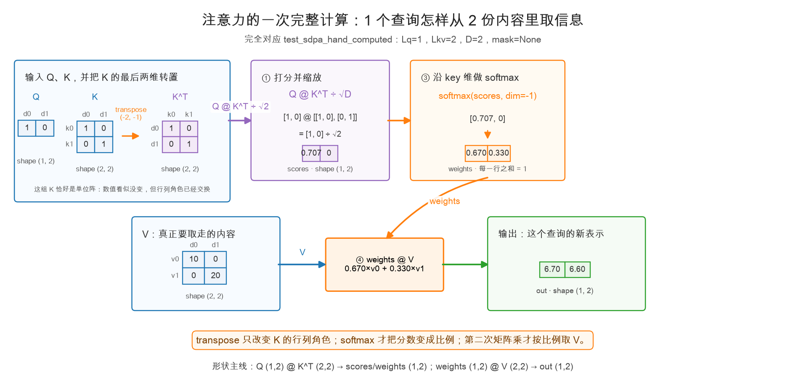
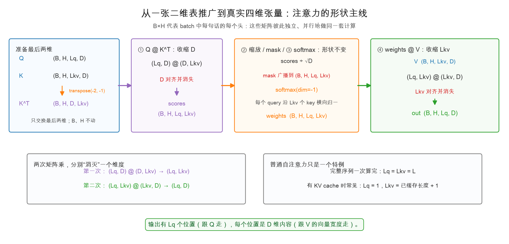
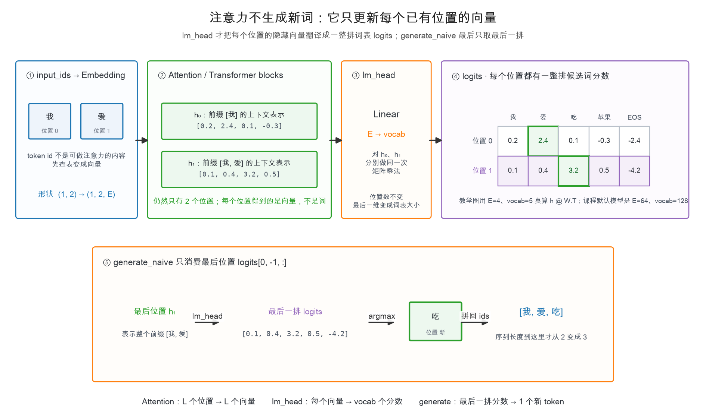

# 第 1 章：注意力——每个词都回头看看

> 本章你将：
> 1. 用"每个词都回头看看前文"建立注意力的直觉；
> 2. 搞懂 Q / K / V 三个角色各管什么（查询 / 标签 / 内容）；
> 3. 看懂并亲手写出注意力的全部数学——就四行；
> 4. 理解 softmax：一句话公式 + "把分数变百分比"的直觉；
> 5. 分清 Attention 的向量输出、整台模型的 logits，以及真正生成的新 token。

---

## 1.1 先回想：黑盒要解决的问题

Week 1 的 `generate_naive` 每走一步，都把整段 token 丢给模型，问一句："下一个词是什么？"

拿一句人话举例。假设输入是：

```
小猫 追着 毛线球 跑 ，它 玩 得 很
```

模型要预测"很"后面是什么（大概是"开心"）。想想看，**你**是怎么猜出来的？你会回头看前文：
看到"它"指的是"小猫"，看到"玩"和"毛线球"，于是"开心"顺理成章。

关键是：**你回头看的时候，并不是每个词平均用力。**"小猫""玩"对你的猜测贡献很大，
"追着""，"贡献很小。这个"有重点地回头看"的动作，就是**注意力（attention）**。

Transformer 的每一层、每一个词，都在做这件事：**回头看看前面所有词，按重要程度，
把它们的"信息"按比例兑在一起，变成自己的新理解。** 一整层 Transformer 里最核心的
运算就是它，其他零件（MLP、残差、归一化）都是配角。

## 1.2 图书馆类比：Q / K / V 三个角色

注意力有三个主角，名字唬人，其实是一场"查图书馆"：

| 角色 | 全名 | 图书馆里的身份 | 在模型里干什么 |
|---|---|---|---|
| **Q**（query，查询） | 查询向量 | **你手里的问题清单** | 每个词拿着它去问："谁跟我有关？" |
| **K**（key，键） | 键向量 | **每本书书脊上的标签** | 每个词把它亮出来，供别人比对 |
| **V**（value，值） | 值向量 | **书的正文内容** | 比对上了，真正被取走的信息 |

流程是这样的（站在"很"这个词的视角）：

1. "很"拿着自己的 **Q**（"我要描述一个状态，主语是谁、在干嘛？"）；
2. 把 Q 和前面每个词的 **K** 逐一比对，算出一个**相关度分数**——
   "小猫"的 K 很匹配，分数高；"，"的 K 八竿子打不着，分数低；
3. 把分数归一成百分比（这就是 softmax，马上讲）；
4. 按百分比去取每个词的 **V**（内容），加权兑在一起——
   "小猫"的内容多兑点，"，"的内容几乎不兑。

兑出来的这杯"鸡尾酒"，就是"很"这个词的新表示：它现在"知道"主语是小猫、在玩耍。

> 💡 **你可能会问：Q、K、V 三个向量从哪来的？**
>
> 都是同一个词的向量，分别乘上三块**可学习的矩阵**（`q_proj`、`k_proj`、`v_proj`）
> 变出来的。类比来说：同一本书，"标签"和"正文"是两种用途，所以用不同的矩阵加工。
> 这三块矩阵是模型训练时学出来的——第 3 章写代码时你会亲手创建它们。

## 1.3 严格一点：注意力的四行数学

先把"向量"复习一句话：一个向量就是一串数，比如 `[1, 0]`；两个向量的**点积**
就是"对应相乘再相加"：`[1,0]·[0,1] = 1×0 + 0×1 = 0`。点积越大，两个向量越"同方向"，
在注意力里就被当成"越相关"。

设每个词的 Q、K、V 向量都准备好了（每个词各一份），注意力一共四步：

$$
\begin{aligned}
\text{① 打分：}\quad & \text{scores} = \frac{Q K^\top}{\sqrt{d}} \\\\
\text{②（可选）挡住不许看的：}\quad & \text{scores}[\text{被禁位置}] = -\infty \\\\
\text{③ 归一成百分比：}\quad & \text{weights} = \text{softmax}(\text{scores}) \\\\
\text{④ 按百分比兑内容：}\quad & \text{out} = \text{weights} \cdot V
\end{aligned}
$$

逐个说：

**① 打分。** $Q K^\top$ 就是“每个查询的 Q 和每个键的 K 做点积”，得到一张
“查询数 $L_q$ × 键数 $L_{kv}$”的分数表：第 i 行第 j 列 = 第 i 个查询看第 j 个键的相关度。
一次处理完整序列时，查询和键都来自同一段长度为 $L$ 的文本，这张表才是常见的
$L \times L$ 方阵。除以一个 $\sqrt{d}$（d 是向量维度）是为了**把分数的尺度摁住**：维度越高，
点积天然越大，softmax 会被推向"赢家通吃"的极端，分数小的词彻底没存在感。
除以 $\sqrt{d}$ 之后，分数回到温和的范围。（不要求证明，记住"除一下防极端"即可。）

**② 挡住不许看的。** 生成第 i 个词时，它后面的词还不存在，绝不允许被看到。
做法是把分数表里"未来"的格子填成 $-\infty$——softmax 之后它们正好变成 0。
这一行就是下一章的主角"因果掩码"，本章先把接口留好。

**③ softmax：把分数变成百分比。** 公式就一句话：

$$
\text{softmax}(s_i) = \frac{e^{s_i}}{\sum_j e^{s_j}}
$$

直觉也一句话：**每个分数取指数（大的会被放得更大），再除以总和，就得到一行
和为 1 的"注意力分配比例"。** 比如分数 `[2, 1, 0]` 会变成大约 `[0.67, 0.24, 0.09]`。

**④ 兑内容。** 用每个查询的这行百分比，对所有 V 做加权求和：相关度高的 V 多拿，
相关度低的少拿。最终有多少个输出位置跟 Q 的查询数 $L_q$ 走；每个输出向量有多宽，
跟 V 的向量维度 $D$ 走。对“很”这一个查询来说，得到的就是它的一份新表示。

> 📌 **划重点：** 注意力 = 打分（QKᵀ/√d）→ softmax → 加权兑 V。
> 整张 Transformer 的"智能"，大半就藏在这四行里。

## 1.4 手算一遍：测试里的那个例子

`tests/test_w2.py` 里的 `test_sdpa_hand_computed` 是用手算就能对上的最小例子，
我们跟着算一遍。

只有 1 个查询、2 个键值对，向量维度 2，也就是 `Lq=1`、`Lkv=2`、`D=2`：

- Q：`[1, 0]`
- K：`[1, 0]` 和 `[0, 1]`（两个词的标签）
- V：`[10, 0]` 和 `[0, 20]`（两个词的内容）

**① 打分**：Q 和第一个 K 的点积 = `1×1 + 0×0 = 1`；和第二个 K 的点积 = 0。
除以 $\sqrt{2}$：分数 = `[0.707, 0]`。

**③ softmax**：$e^{0.707} \approx 2.03$，$e^0 = 1$，总和 $\approx 3.03$，所以

$$
\text{weights} = \left[\frac{2.03}{3.03},\ \frac{1}{3.03}\right] \approx [0.670,\ 0.330]
$$

**④ 兑内容**：

$$
\text{out} = 0.670 \times [10, 0] + 0.330 \times [0, 20] \approx [6.70,\ 6.60]
$$

看，第一个词和自己方向完全一致，拿走了 67% 的权重；第二个词方向垂直，也还分到了 33%
（softmax 不会把任何人真正清零，除非你用掩码把分数打成 $-\infty$）。

## 1.5 代码：注意力的全部实现

打开 `reference/model/attention.py`，`scaled_dot_product_attention` 就长这样——
上面的四行数学，一行对一行：

```python
def scaled_dot_product_attention(q, k, v, mask=None):
    head_dim = q.shape[-1]
    scores = q @ k.transpose(-2, -1) / math.sqrt(head_dim)      # ① 打分
    if mask is not None:                                        # ② 挡住未来（第 2 章细讲）
        scores = scores.masked_fill(~mask, float("-inf"))
    weights = torch.softmax(scores, dim=-1)                     # ③ 归一成百分比
    out = weights @ v                                           # ④ 按百分比兑内容
    return out, weights
```

代码虽然短，真正要看懂的却有两层：

1. **一张二维表里**，Q 怎样给 K 打分，再拿这些权重去取 V；
2. **真实四维张量里**，最后两维怎样变化，前面的 B、H 又在做什么。

我们分两张图看。

### 第一张图：一个查询怎样从两份内容里取信息？

先不管最外层的 B 和 H，直接复用 1.4 节和测试里的数字：1 个查询、2 个键值对、
每个向量 2 维。这次没有传 mask，所以代码会跳过第 ② 步：



顺着箭头走，注意四件事：

- `k.transpose(-2, -1)` 把 K 从“**每一行是一个 key**”变成“**每一列是一个 key**”，
  于是 Q 才能一次和两个 key 都做点积。本例的 K 恰好是单位阵，转置前后数字看起来一样，
  但行和列扮演的角色已经交换；
- `q @ k.transpose(-2, -1)` 得到两个原始分数 `[1, 0]`，再除以
  `sqrt(head_dim) = sqrt(2)`，得到 `[0.707, 0]`；
- `softmax(..., dim=-1)` 沿这两个 key 横向归一，把一排分数变成
  `[0.670, 0.330]`。**transpose 只管摆好 K，softmax 才负责产生百分比**；
- `weights @ v` 用这两个比例取内容：`0.670 × [10, 0] + 0.330 × [0, 20]`，
  最终得到 `[6.70, 6.60]`。这是第二次矩阵乘，不要和前面的 Q、K 打分混在一起。

这一轮的二维形状主线是：

```text
Q (1, 2) @ Kᵀ (2, 2)  →  scores/weights (1, 2)
weights (1, 2) @ V (2, 2)  →  out (1, 2)
```

两个矩阵相乘时，中间挨着的维度必须相等，并会在结果中“消失”。第一次消失的是向量维度 2，
留下“1 个查询 × 2 个键”的分数表；第二次消失的是 2 个键值对，留下“1 个查询 × 2 维内容”。

### 第二张图：`@` 只乘最后两维，B、H 只负责并行

真实代码收到的不是一张二维表，而是一摞四维张量。先认清五个字母：

- `B`：batch，一起计算多少句话；
- `H`：heads，一句话有多少个注意力头（第 3 章细讲）；
- `Lq`：有多少个 query；
- `Lkv`：有多少组 key/value；
- `D`：每个头里一个向量有多少维，也就是 `head_dim`。

本章可以暂时把 B、H 都想成 1。PyTorch 实际上是在 B × H 张二维表上，并行重复刚才的计算：

> 📌 **这一节最重要的一句话：** 对四维张量使用 `@` 时，**只有最后两维按照矩阵乘法
> 的规则相乘；前面的 B、H 不参与相乘，也不会被求和消掉。** 它们只是告诉 PyTorch：
> “这里有 B × H 份注意力，请把这些二维矩阵乘法并行算完。”

换一种更直接的写法，四维的 `@` 等价于固定住一个 batch 和一个 head，再分别做二维矩阵乘法：

```python
# 对每一个 b 和 h，彼此独立地计算
scores[b, h] = q[b, h] @ k[b, h].transpose(-2, -1)
out[b, h] = weights[b, h] @ v[b, h]
```

例如 `B=2、H=3` 时，就有 `2 × 3 = 6` 份互不串线的注意力计算。第 0 句话的第 1 个头
只会使用 `q[0, 1]`、`k[0, 1]`、`v[0, 1]`；它不会和第 1 句话相乘，也不会和别的头相乘。
所以 B、H 会原样保留在结果中。严格地说，如果前置维度不完全相同，`@` 也允许它们
按广播规则对齐；在这里它们都是 `(B, H)`，可以先把它理解成一一配对。



把图里的两次“消失”写成代码旁边的形状，就是：

```text
q                              (B, H, Lq,  D)
k                              (B, H, Lkv, D)
k.transpose(-2, -1)            (B, H, D,   Lkv)
q @ k.transpose(-2, -1)        (B, H, Lq,  Lkv)   # D 消失
scores / mask / softmax         (B, H, Lq,  Lkv)   # 形状不变
v                              (B, H, Lkv, D)
weights @ v                    (B, H, Lq,  D)      # Lkv 消失
```

所以输入输出的通用契约是：

| 张量 | 形状 | 含义 |
|---|---|---|
| `q` | `(B, H, Lq, D)` | B 句话、H 个头、Lq 个查询、每个查询 D 维 |
| `k` / `v` | `(B, H, Lkv, D)` | 每个头有 Lkv 组键和值，每个 D 维 |
| `scores` / `weights` | `(B, H, Lq, Lkv)` | 每个查询给每个键一格分数/权重 |
| `out` | `(B, H, Lq, D)` | 每个查询兑出一个 D 维的新表示 |

普通的完整序列自注意力里，Q、K、V 来自同一段长度为 L 的文本，所以
`Lq = Lkv = L`，分数表看起来就是 `(L, L)` 方阵。但函数本身更通用：1.4 节已经用了
`Lq=1`、`Lkv=2` 的长方形情况；到 Week 3 加入 KV cache 后，你会经常看到
“1 个新查询看许多个已缓存键值”。

掩码也不必为每个 batch、每个头复制一份。只要它能**广播**到
`(B, H, Lq, Lkv)`，`masked_fill` 就能把不允许看的格子填成负无穷。
广播和因果掩码怎样配合，下一章会拿一张具体表格拆开。

> ⚠️ **易踩坑：**
>
> - `transpose(-2, -1)` 是转**最后两维**，别写成 `transpose(0, 1)`——那会动到 batch 维；
> - softmax 必须是 `dim=-1`，也就是沿 `Lkv` 这一维归一；这样每个 query 分给所有 key
>   的权重之和才是 1；
> - 我们的约定是 **mask 里 True = 允许看**，所以 `masked_fill` 填的是 `~mask`，
>   别把真假写反；
> - 输出有几个位置跟 Q 的 `Lq` 走，不是跟 V 的 `Lkv` 走；输出向量的宽度 D 才跟 V 走。

> 📌 **对标 vLLM：** 真实 vLLM 里，注意力的数学一模一样，只是不这么写。
> 打开 `.venv` 里安装的 `vllm/model_executor/models/qwen3.py`（定位方法见 Week 1 第 1 章），
> `Qwen3Attention` 类里你能找到 `self.scaling = self.head_dim**-0.5`——
> 就是我们的 $\frac{1}{\sqrt{d}}$。真正的打分和 softmax 被交给了高度优化的底层 kernel
> （`vllm/v1/attention/backends/` 目录下），因为推理引擎里注意力是性能热点。
> **数学相同，工程不同**——这正是这门课的主旋律。

## 1.6 补上最关键的一座桥：Attention 的 `out` 不是 logits

到这里，代码里出现了一个叫 `out` 的张量：

```python
out = weights @ v
```

这个名字很容易让人产生一个误会：是不是每个输入词经过注意力，就“输出了一个新词”？
**不是。Attention 从头到尾都不生成 token。** 它只为每个已有位置重新计算一份
`head_dim` 维的内容向量。

先把三个经常都被口头叫作“输出”的东西分开：

| 名字 | 典型形状 | 它是什么 | 它不是什么 |
|---|---:|---|---|
| Attention 的 `out` | `(B, H, L, D)` | 每个头、每个已有位置的新内容向量 | 不是词表分数，不是新 token |
| 整台模型的 `logits` | `(B, L, vocab)` | 每个已有位置对整个词表的打分 | 还没有真正选中哪个 token |
| `next_token` | 一个整数 | 从最后位置 logits 中采样/argmax 得到的 token id | 它不是 Attention 直接吐出来的 |

下面用同一个输入 `[我, 爱]` 把三者串起来。图中的隐藏维度 `E=4`、词表大小 `5`
是为了让数字能完整画出来；课程默认模型对应 `E=64、vocab=128`，形状规律完全相同。



跟着图只抓三次变化：

1. `input_ids` 的两个整数先经 Embedding 变成两个向量：
   `(1, 2) → (1, 2, E)`；
2. Attention 和后面的 Transformer block 会更新这两个向量，但**位置数仍是 2**：
   `(1, 2, E) → (1, 2, E)`；
3. 最后的 `lm_head` 才把每个 `E` 维向量变成一整排 `vocab` 个分数：
   `(1, 2, E) → (1, 2, vocab)`。

所以对于 `[我, 爱]`：

```text
位置 0 的隐藏向量 h₀：汇总前缀 [我]
位置 1 的隐藏向量 h₁：汇总前缀 [我, 爱]

lm_head(h₀)：一整排词表分数
lm_head(h₁)：另一整排词表分数
```

Week 1 的 `generate_naive` 只拿第二排：

```python
last_logits = logits[0, -1, :]  # 取 h₁ 对应的整排词表分数
next_token = torch.argmax(last_logits)
```

如果“吃”的分数最大，`argmax` 才得到“吃”的 token id；随后 `torch.cat` 才把它接成
`[我, 爱, 吃]`。**序列长度直到 `torch.cat` 才从 2 变成 3。**

> 📌 **划重点：** Attention 做的是“`L` 个已有位置 → `L` 个上下文向量”；
> `lm_head` 做的是“每个向量 → 一整排词表 logits”；生成循环最后才做
> “最后一排 logits → 1 个新 token”。下一章讲因果掩码时，我们讨论的正是：
> `lm_head` 之前的那个位置向量，到底被允许混入哪些位置的信息。

## 动手练习

1. 打开战场文件 `minivllm/model/attention.py`，把 `scaled_dot_product_attention`
   填出来（就是上面那四行，`mask` 分支先照写，下一章你会彻底搞懂它）。
2. 跑本章相关测试：

```bash
.venv/bin/pytest tests/test_w2.py -k sdpa
```

   预期：`test_sdpa_hand_computed`（就是 1.4 节手算的那个）和
   `test_sdpa_weights_sum_to_one` 变绿；`test_sdpa_mask_blocks_future` 还是红的——
   它需要下一章的 `make_causal_mask`，正常。
3. 手算检查：把 1.4 节的 Q 换成 `[0, 1]`，权重应该正好反过来（约 `[0.330, 0.670]`）。
   用你写的函数验证一下。

## 参考答案

`reference/model/attention.py` 里的 `scaled_dot_product_attention` 是标准答案。
**卡住 20 分钟再看**，重点对比：你有没有忘记除以 $\sqrt{d}$、softmax 的维度写没写对。

---

👉 下一章：[第 2 章：因果掩码——不许偷看未来](./02-因果掩码-不许偷看未来.md)
