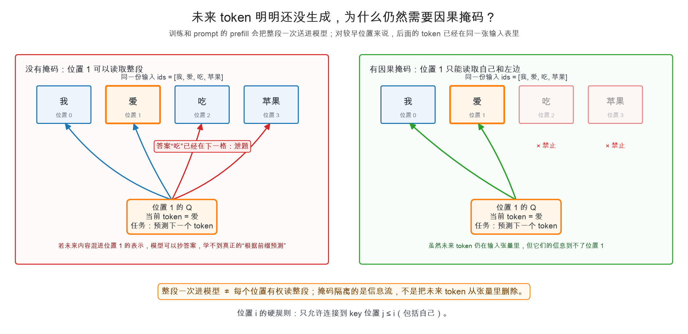
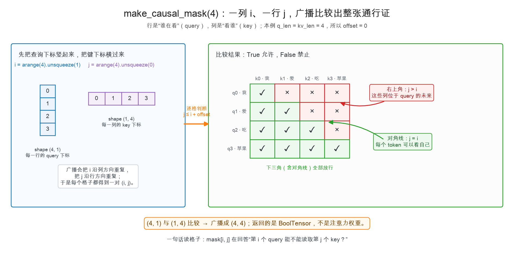
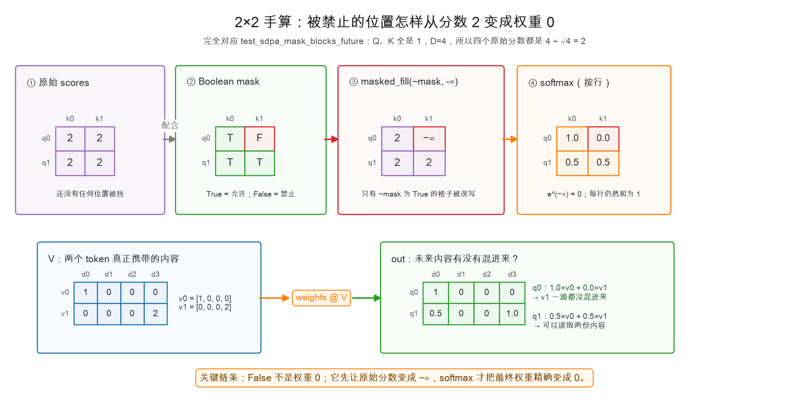
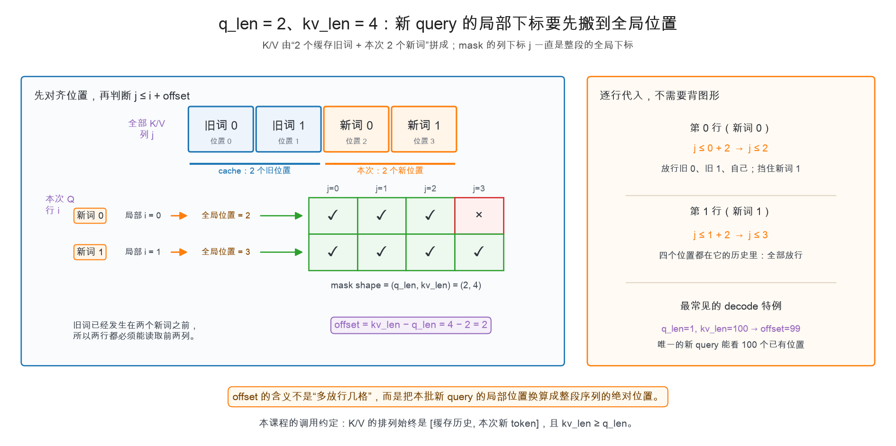

# 第 2 章：因果掩码——不许偷看未来

> 本章你将：
> 1. 解开一个反直觉问题：未来 token 还没生成，模型为什么仍然需要掩码；
> 2. 分清 **Boolean 掩码、原始分数、注意力权重**这三张长得相似、职责不同的表；
> 3. 用 `arange`、`unsqueeze` 和广播亲手造出 `make_causal_mask`；
> 4. 沿着 `2 → -∞ → 0` 的数值链，亲眼确认未来信息一滴都进不来；
> 5. 看懂 `q_len ≠ kv_len` 时的长方形掩码，并知道 `offset` 为什么存在。

---

## 2.1 先问怪问题：未来词都不存在，挡谁？

Week 1 的 `generate_naive` 是这样生成的：已有一段前缀，模型猜一个新 token，把它接回末尾，
再猜下一个。站在**一次 decode** 的视角看，未来 token 确实还不存在，似乎根本没有东西可偷看。

可是 Transformer 不只会“一次处理最后一个位置”。为了并行计算，它还会把许多位置放进
**同一次前向**：

- **训练时**，整段正确文本已经在手里，模型一次为所有位置练习“预测下一个 token”；
- **prompt prefill 时**，用户的整段提示词也会一次送进模型，为每个位置建立中间结果。
  `prefill` 就是“第一次把完整 prompt 填进模型”，Week 3 会正式实现它。

例如整段输入是：

```text
位置        0       1       2       3
输入 token   我       爱       吃       苹果
该位置预测   爱       吃       苹果     下一个 token
```

位置 1 的当前 token 是“爱”，它应该只根据 `[我, 爱]` 预测“吃”。但同一次前向的输入张量里，
位置 2 的“吃”已经摆在那里了。若位置 1 的注意力可以读取位置 2，它就不是在预测，而是在抄答案。



这张图要帮你拆开两个经常混在一起的概念：

- **token 在不在输入张量里**：训练和 prefill 时，后面的 token 可以已经在；
- **某个位置有没有权读取它**：由因果掩码逐行决定。

所以掩码不是把未来 token 从输入里删掉。整段仍然可以并行计算，只是在同一轮计算中，
每个 query 都拿到一张不同的“阅读许可证”。

> 💡 **你可能会问：生成时最后一个位置本来就没有未来，掩码是不是多余？**
>
> 对“只送入一个新 token、K/V 里也只有历史”的单步 decode 来说，唯一的 query 确实没有
> 可屏蔽的未来位置；那一行掩码会全是 True，底层 kernel 甚至可以不真的创建它。
> 但模型必须在训练、整段 prefill 和多 token 输入时遵守同一条因果合同。掩码定义的是
> **模型允许怎样流动信息**，不是只为某一种调用形状准备的小技巧。

规矩现在可以写得很精确：

> **第 `i` 个 query，只允许读取位置 `j ≤ i` 的 key，包括自己。**

这里的“因果”不用想得很玄：过去可以影响未来，未来不能反过来影响过去。

---

## 2.2 第一张表：掩码只是“通行证”

上一章的注意力先得到一张分数表：

$$
\text{scores} = \frac{QK^\top}{\sqrt{d}}
$$

它的**行**对应 query（谁在看），**列**对应 key（看谁）。因果掩码的行列含义完全一样：

```text
mask[i, j] 在回答：第 i 个 query 能不能读取第 j 个 key？
```

本课程统一约定：

| 掩码里的值 | 含义 | 后续处理 |
|---|---|---|
| `True` | 允许看 | 保留原始 score |
| `False` | 禁止看 | 把原始 score 改成 `-∞` |

因此长度为 4 的序列需要这样的权限：

- query 0：只能看 key 0；
- query 1：能看 key 0、1；
- query 2：能看 key 0、1、2；
- query 3：能看全部 key。

慢着，**这还不是注意力权重**。`True` 不代表权重 1，`False` 也不是直接拿来乘 V 的 0。
它只负责说“这条路开不开”；真正分配多少注意力，要等原始 scores 经过 softmax 才知道。

> 📌 **划重点：** 掩码是一张权限表，不是一张百分比分配表。先决定“能不能看”，
> 再由 softmax 在所有获准的位置之间决定“各看多少”。

---

## 2.3 从两串下标造出整张表

`make_causal_mask(4)` 最终要返回一个 `(4, 4)` 的 BoolTensor。我们当然可以手写 16 个
True/False，但序列长度会变，所以要让 PyTorch 根据位置自动生成。

完整实现只有五行：

```python
def make_causal_mask(q_len, kv_len=None):
    if kv_len is None:
        kv_len = q_len
    offset = kv_len - q_len
    i = torch.arange(q_len).unsqueeze(1)
    j = torch.arange(kv_len).unsqueeze(0)
    return j <= i + offset
```

先看最普通的 `q_len == kv_len == 4`。此时 `offset = 0`，最后一行等价于 `j <= i`：



顺着图把代码拆开：

1. `torch.arange(4)` 生成下标列表 `[0, 1, 2, 3]`；
2. `unsqueeze(1)` 给 `i` 在第 1 维插入一根轴，形状从 `(4,)` 变成 `(4, 1)`，
   所以下标竖成一列；
3. `unsqueeze(0)` 给 `j` 在第 0 维插入一根轴，形状从 `(4,)` 变成 `(1, 4)`，
   所以下标横成一行；
4. `(4, 1)` 和 `(1, 4)` 比较时，PyTorch **广播**较短的方向：`i` 横向重复，
   `j` 纵向重复，于是 16 对 `(i, j)` 一次比较完，结果形状是 `(4, 4)`。

以其中三个格子为例：

```text
mask[0, 2]：j=2 <= i=0  → False（query 0 不许看未来的 key 2）
mask[2, 1]：j=1 <= i=2  → True （query 2 可以看过去的 key 1）
mask[2, 2]：j=2 <= i=2  → True （query 2 可以看自己）
```

右上角满足 `j > i`，所以全是 False；对角线和左下角满足 `j <= i`，所以全是 True。
这就是常说的“下三角因果掩码”。不要死记“三角朝哪边”，只要重新问一句
“列位置 `j` 有没有跑到行位置 `i` 的未来”，方向就不会画反。

> ⚠️ **易踩坑：行列写反。**
>
> `scores` 的最后两维是 `(q_len, kv_len)`，因此行是 query、列是 key。
> 若写成 `i <= j`，得到的是上三角，过去位置反而只能看自己和未来，因果关系彻底倒转。

---

## 2.4 第二张表到第三张表：`False` 怎样变成权重 0

造好权限表，下一步是在 softmax **之前**使用它。上一章的实现里正好有这个接口：

```python
scores = q @ k.transpose(-2, -1) / math.sqrt(head_dim)
if mask is not None:
    scores = scores.masked_fill(~mask, float("-inf"))
weights = torch.softmax(scores, dim=-1)
out = weights @ v
```

这里有两个细节值得停一下：

- 我们约定 `True = 允许`，但 `masked_fill(condition, value)` 会改写 condition 为 True 的位置，
  所以要先用 `~mask` 取反，把“禁止”变成“需要填充”；
- 禁止位置填的是 `-∞`，不是 0。softmax 看见普通的 0 仍会分给它正权重，只有
  $e^{-\infty}=0$ 才能把最终权重精确压成 0。

下面直接复用 `tests/test_w2.py` 里的最小例子。两个 query、两个 key，Q 和 K 的每个向量
都是 4 个 1，因此所有点积都是 4；除以 $\sqrt{4}=2$ 后，四个原始分数恰好全是 2。

V 则故意取得很好认：

```text
v0 = [1, 0, 0, 0]
v1 = [0, 0, 0, 2]
```

现在沿着整条数据流走一遍：



第一行，也就是 query 0：

$$
[2, 2] \xrightarrow{\text{mask}} [2, -\infty]
\xrightarrow{\text{softmax}} [1, 0]
$$

所以它的新内容是：

$$
1 \times [1,0,0,0] + 0 \times [0,0,0,2] = [1,0,0,0]
$$

未来的 `v1` 乘上了 0，真的一滴都没有混进来。

第二行，也就是 query 1，两个 key 都不在未来：

$$
[2, 2] \xrightarrow{\text{mask}} [2, 2]
\xrightarrow{\text{softmax}} [0.5, 0.5]
$$

于是输出为：

$$
0.5 \times [1,0,0,0] + 0.5 \times [0,0,0,2] = [0.5,0,0,1]
$$

测试里的两条断言正好卡住这两个方向：

```python
assert weights[0, 0, 0, 1].item() == 0.0  # 过去看未来：必须为 0
assert weights[0, 0, 1, 1].item() > 0.0   # 当前看自己：必须畅通
```

前两维 `[0, 0, ...]` 是“第 0 个 batch、第 0 个注意力头”，最后两维才是图里的
`[query, key]`。这也呼应上一章的形状主线：二维 mask 会广播到四维 scores 的 B、H 维，
同一张通行证供每个 batch、每个头使用。

### 从玩具数字走到真实四头注意力

现在再看一张真实输出。下面不是手画的示意图，而是用课程里的 `reference.MiniTransformer`
跑出 6 个 token、4 个注意力头的 weights：


读图只抓两件事：

- 每个头的右上角都是叉：这些位置在 softmax 之前被填成 `-∞`，最终权重恒为 0；
- 左下角颜色深浅不同：允许不等于平均分配，softmax 仍会根据 Q/K 分数决定各看多少。

这是随机初始化的小模型，所以颜色暂时没有可解释的语言规律。因果结构是真的，语义能力还没学会；
Week 6 加载真实 Qwen3 权重后，注意力的内容才可能呈现有意义的模式。

> 📌 **划重点：** 完整链条不是 `False → 0`，而是
> `False → 原始 score 改成 -∞ → softmax 权重变成 0 → 对应 V 不参与输出`。

---

## 2.5 比看一格权重更强的验收：改未来，过去不动

`test_sdpa_mask_blocks_future` 只检查注意力内部的一格权重。等整台 MiniTransformer 装好后，
我们还能从模型外部验证一条更强的**因果不变量**：只改未来 token，过去位置的输出必须完全不变。

`tests/test_w2.py` 里的测试是这样写的：

```python
ids1 = torch.tensor([[1, 2, 3, 4]])
ids2 = torch.tensor([[1, 2, 9, 9]])  # 前两个位置相同，只改后两个

l1 = mini_model(ids1)
l2 = mini_model(ids2)

assert torch.allclose(l1[:, :2], l2[:, :2], atol=1e-6)
```

两段输入的位置 0、1 完全相同，位置 2、3 被替换了。因果掩码正确时：

- 位置 0 的输出只能依赖位置 0；
- 位置 1 的输出只能依赖位置 0、1；
- 所以后两个位置无论换成什么，`l1[:, :2]` 和 `l2[:, :2]` 都应该一样。

若漏掉掩码、三角方向写反，或某一层让未来信息绕了进来，这个测试都会把它抓住。
它验证的不只是一张 mask 长得对，而是整个模型真的遵守“未来不能影响过去”。

> 💡 **为什么用 `allclose` 而不是 `equal`？**
>
> 神经网络里有大量浮点矩阵乘。理论上相同的结果可能因设备或计算顺序出现极小舍入差异，
> `atol=1e-6` 允许百万分之一量级的误差，但绝不会放过真正的信息泄漏。

---

## 2.6 `q_len ≠ kv_len`：长方形掩码与 `offset`

到目前为止，Q、K 来自同一段长度为 L 的序列，所以 mask 是 `(L, L)` 方阵。
但函数还接受第二个参数 `kv_len`：

```text
q_len   = 本次要计算的 query 数
kv_len  = query 能面对的全部 key/value 数
```

Week 3 会把历史 token 的 K/V 存进 **KV cache**。假设缓存里已经有 2 个旧 token，
本次又一起来了 2 个新 token：

```text
全部 K/V = [旧词 0, 旧词 1, 新词 0, 新词 1]  → kv_len = 4
本次 Q   = [新词 0, 新词 1]                  → q_len  = 2
```

这里最容易犯的错，是把“新词 0”的 query 行号 `i=0` 当成整段序列的位置 0。
其实它前面已有两个缓存 token，所以它的**绝对位置**是 2。



`offset` 做的就是这次位置换算：

$$
\begin{aligned}
\text{offset} &= L_{\mathrm{kv}} - L_{\mathrm{q}} = 4 - 2 = 2 \\\\
\text{query 的绝对位置} &= i + \text{offset} \\\\
\text{允许读取} &\Longleftrightarrow j \le i + \text{offset}
\end{aligned}
$$

逐行代入：

- 新 query 0：`i=0`，绝对位置 `0+2=2`，所以允许 `j≤2`；它能看两个旧词和自己，
  但不能看同批里更新的新词 1；
- 新 query 1：`i=1`，绝对位置 `1+2=3`，所以允许 `j≤3`；四个位置都可以看。

于是 `make_causal_mask(2, 4)` 返回：

```python
tensor([
    [True, True, True, False],
    [True, True, True, True],
])
```

函数本身不会检查哪些 K/V 是缓存、哪些是本次新来的。它依赖课程中的排列合同：
**K/V 总是 `[缓存历史, 本次新 token]`，并且 `kv_len ≥ q_len`。** 在这个合同下，
`kv_len - q_len` 恰好就是缓存的历史长度。

最常见的 decode 是 `q_len=1, kv_len=100`：缓存 99 个旧 token，本次只算 1 个新 query。
这时 `offset=99`，唯一一行判断 `j≤99`，100 个已有位置全部放行。这并没有破坏因果性——
它们全都已经位于这个新 query 的历史中，真正的未来尚未出现。

> ⚠️ **易踩坑：忘掉 `offset`。**
>
> 若长方形场景仍然直接写 `j <= i`，新 query 0 只会看见第 0 列，不仅看不到自己，
> 还会错误挡掉大部分缓存历史。方阵测试可能仍然全绿，所以一定要保留
> `test_causal_mask_with_cache` 这条长方形测试。

---

## 2.7 最后再认名字：为什么叫 decoder-only

现在已经理解机制，再补模型史就不会喧宾夺主了。`decoder-only` 不是说“模型只能把 token
解码成人话”，这个名字来自 2017 年原始 Transformer 的 **encoder–decoder** 结构。

| 结构 | 面对什么输入 | self-attention 能看哪里 | GPT/Qwen 是否保留 |
|---|---|---|---|
| Encoder | 已经完整存在的源文 | 左右都能看，通常不做因果遮挡 | 不保留 |
| 原始 Decoder 的 self-attention | 正在从左到右写的目标文 | 只能看自己和左边 | 保留这个思路 |
| 原始 Decoder 的 cross-attention | Encoder 产出的整段表示 | 读取源文 | 不保留 |

翻译模型需要“先读源文，再写译文”：Encoder 负责读完整源文，Decoder 一边遵守目标文的
因果顺序，一边通过 cross-attention 读取 Encoder。GPT、Qwen 的任务则是“沿着同一串 token
不断预测下一个”，没有另一段必须单独编码的源文，因此它们：

1. 去掉整个 Encoder；
2. 去掉 Decoder 中读取 Encoder 的 cross-attention；
3. 反复堆叠带因果 self-attention 的模块。

这就是 **decoder-only**。严格说，它不是把原始 Decoder 原封不动拆下来，而是保留了
“因果 self-attention + 从左到右预测”的核心思路。两个词不要混为一谈：

- **decoder-only** 描述整台模型的结构家族；
- **causal mask** 是这类模型阻断未来信息的一种具体机制。

> 📌 **对标 vLLM：** 在本课程锁定的 vLLM 版本里，
> `vllm/model_executor/models/qwen3.py` 的 `Qwen3Attention` 默认使用
> `attn_type=AttentionType.DECODER`。真实引擎不会每次都笨重地造一张 Python BoolTensor；
> 它把“这是 decoder 因果注意力”的语义交给底层 attention backend/kernel，结合序列边界和
> KV cache 直接执行。但无论实现多快，语义仍是本章这句 `j <= i + offset`。

---

## 2.8 把四张表在脑中排好队

以后再看到 attention 代码，按这个顺序播放，不容易把概念混掉：

| 顺序 | 表 | 典型值 | 它回答的问题 |
|---|---|---|---|
| 1 | `scores` | `2.0`、`-0.7` | Q 和 K 有多匹配？ |
| 2 | `mask` | `True` / `False` | 这对位置有没有资格连接？ |
| 3 | masked scores | `2.0` / `-∞` | 禁止位置改写后，softmax 会看到什么？ |
| 4 | `weights` | `0.5` / `0.0` | 每个获准的 V 最终兑入多少？ |

一句话串起来：

```text
Q/K 打分 → Bool mask 查通行证 → 禁止位置填 -∞ → softmax 分配权重 → weights @ V
```

> 📌 **本章总检查：**
>
> - 行是 query，列是 key；
> - `True = 允许看`，使用 `masked_fill` 时因此要写 `~mask`；
> - 因果条件是 `j <= i + offset`；
> - mask 在 softmax 之前改 scores，softmax 之后未来权重才精确为 0；
> - 有 KV cache 时，`offset` 把本批 query 的局部下标换算成整段的绝对位置。

## 动手练习

1. 打开 `minivllm/model/attention.py`，填写 `make_causal_mask`。先只实现方阵版本，
   打印 `make_causal_mask(4)` 对照本章第二张图；再加入 `offset` 支持长方形。
2. 在运行代码前，先在纸上预测下面两张表，再让 Python 验证：

```python
print(make_causal_mask(3))
print(make_causal_mask(2, 5))  # 3 个缓存旧词 + 2 个本次新词
```

   第二张表应是 `(2, 5)`：第一行只挡住最后一列，第二行全 True。
3. 跑注意力与掩码的 5 个测试：

```bash
.venv/bin/pytest tests/test_w2.py -k "mask or sdpa"
```

4. 等第 4 章组装好完整 MiniTransformer 后，再单跑端到端因果性测试：

```bash
.venv/bin/pytest tests/test_w2.py -k transformer_causality
```

   这条测试通过，才说明“改未来、过去不动”已经贯穿整台模型，而不只是 mask 长得像答案。

## 参考答案

`reference/model/attention.py` 里的 `make_causal_mask` 是标准答案。
**卡住 20 分钟再看**，重点对比三件事：`i/j` 的行列方向、`offset` 的含义、
以及返回值为什么是 BoolTensor。

---

👉 下一章：[第 3 章：多头与残差——把零件拼成一层](./03-多头与残差-把零件拼成一层.md)
