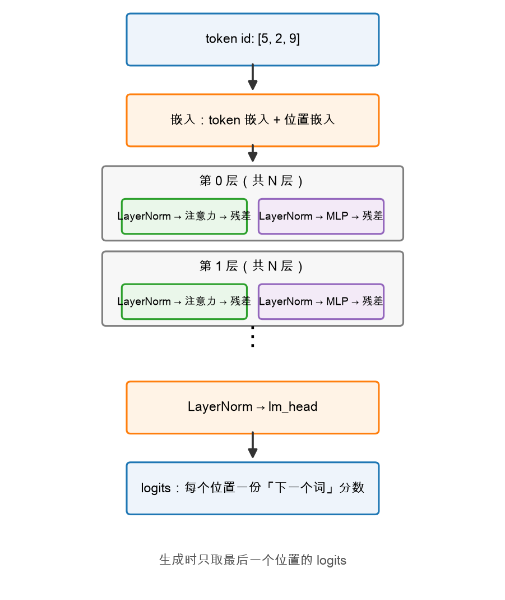
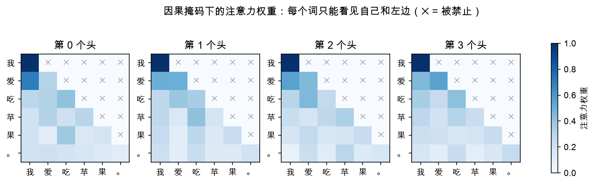

# 第 4 章：组装——MiniTransformer 诞生

> 本章你将：
> 1. 搞懂嵌入（embedding）：怎么把一个词变成一串数，以及为什么还要告诉模型"顺序"；
> 2. 把 N 个 DecoderBlock 堆起来，接上最后的输出头 `lm_head`；
> 3. 写出 `MiniTransformer.forward`，让 `tests/test_w2.py` 8 个测试全绿；
> 4. 亲眼看到我们自己模型的真实注意力热力图和整机结构图。

---

## 4.1 整机地图：先知道自己在造什么

零件都齐了，这一章把它们装成一台整机。先看全貌：



整机分四段：

1. **嵌入**：token id + 位置 → 每个词一个 64 维向量；
2. **N 层 DecoderBlock**：上一章拼好的那层，原样堆 N 次；
3. **最后的 LayerNorm**（`ln_f`）：出厂前最后一次校准；
4. **lm_head**：把每个位置的向量变成"词表里每个词的分数"——这就是 logits。

## 4.2 嵌入：词 → 坐标

模型不认识"小猫"这两个字，它只认识数字。分词器已经把词换成了 id
（比如"小猫" = 5），但一个孤零零的整数没法算注意力——需要把每个 id 变成
一个**向量**。这就是 `nn.Embedding`：

```python
self.tok_emb = nn.Embedding(C.vocab_size, C.hidden_size)
```

一句话解释：`nn.Embedding(V, E)` 就是一张 `(V, E)` 的查找表——**词表里每个词
发一张"身份证"，身份证是 64 个数**。`tok_emb(5)` 就是查第 5 行。这些数随机初始化，
训练时慢慢学成"意思相近的词，身份证也相近"（可以说：每个词被安排到 64 维空间里的
一个坐标上）。

但光这样还不够。看这两句：

```
小狗 追 小猫
小猫 追 小狗
```

词完全一样，意思完全相反——差别只在**顺序**。而注意力本身对顺序是"脸盲"的：
`QKᵀ` 只管内容匹配，不管谁在前谁在后。所以必须额外告诉模型每个词的**位置**，
这就是位置嵌入：

```python
self.pos_emb = nn.Embedding(C.max_seq_len, C.hidden_size)
```

又一张查找表：位置 0 一个向量、位置 1 一个向量……最终每个词的输入表示是
**词的身份 + 位置的身份**，直接相加：

```python
def _embed(self, input_ids, positions):
    return self.tok_emb(input_ids) + self.pos_emb(positions)
```

> 💡 **你可能会问：词向量和位置向量直接加起来，不会互相污染吗？**
>
> 会有干扰，但模型有能力在学的时候把两种信息"编码"到不同的维度方向上——
> 64 维的空间足够大。真实模型里位置编码另有更精巧的做法（RoPE，Week 6 讲），
> 但"加起来"这个最朴素的版本已经完全能跑。

## 4.3 堆叠 N 层 + 输出头

```python
self.blocks = nn.ModuleList(
    [DecoderBlock(C, i) for i in range(C.num_layers)]
)
self.ln_f = nn.LayerNorm(C.hidden_size)
self.lm_head = nn.Linear(C.hidden_size, C.vocab_size, bias=False)
```

- `nn.ModuleList`：就是"一个装着子模块的 Python 列表"，PyTorch 靠它发现
  里面的参数。`num_layers=2` 就放两层；
- 为什么堆多层？每层都是"互通一遍 + 消化一遍"，第二层看到的是**已经融合过
  前文信息**的表示，于是能建起更间接的关系（类比：第一轮传话只能传给邻居，
  多传几轮，消息才能走遍全场）；
- `lm_head`：一块 `(E, V)` 的矩阵，把每个位置的 64 维向量变成 **128 个分数**
  （词表里每个词一个）。这些分数叫 **logits**——"还没归一化的打分，谁大谁更可能"。
  Week 1 你已经在 `last_token_logits` 和 argmax 里用过它了，现在知道它是哪来的。

默认配置有多小？算一下参数总量（用 Week 1 见过的 `count_params`）：
默认 `MiniConfig`（vocab=128, hidden=64, 2 层, 4 头）总共 **124,160** 个参数，
约 12 万。对比一下：Qwen3-0.6B 有 6 亿个，是我们的五千倍。**小不是缺陷，是设计**——
这个尺寸 CPU 上都能瞬间跑完，结构却和真家伙一模一样。

## 4.4 MiniTransformer.forward：整机总装

你要填的最后一块（`minivllm/model/transformer.py` 里的 `MiniTransformer.forward`）：

```python
def forward(self, input_ids, past_kv=None, use_cache=False):
    if use_cache and past_kv is None:
        past_kv = NaiveKVCache(self.config.num_layers)
    offset = past_kv.seq_len() if past_kv is not None else 0
    B, L = input_ids.shape
    positions = torch.arange(offset, offset + L, device=input_ids.device)
    x = self._embed(input_ids, positions)
    for block in self.blocks:
        x = block(x, past_kv=past_kv)
    logits = self._head(x)
    if use_cache:
        return logits, past_kv
    return logits
```

本周真正要关心的只有主干四行：

1. `positions = torch.arange(offset, offset + L)`：生成 `[0, 1, ..., L-1]`——
   每个词的位置编号（`offset` 本周恒为 0，它服务的是 Week 3 的缓存场景）；
2. `x = self._embed(...)`：`(B, L)` 的 id → `(B, L, E)` 的向量；
3. 逐层过 `DecoderBlock`：形状始终是 `(B, L, E)`；
4. `logits = self._head(x)`：`ln_f` + `lm_head`，得到 `(B, L, V)`。

`use_cache` / `past_kv` 相关的三行是 Week 3 的接口，本周照抄即可——
`generate_naive` 只会走 `use_cache=False` 的路。（注意：此时 `NaiveKVCache`
的方法还是 TODO，所以别自己去碰 `use_cache=True`，下周填了缓存再开。）

形状流水账，背下来：

| 阶段 | 形状 | 说明 |
|---|---|---|
| 输入 `input_ids` | `(B, L)` | 词 id |
| 嵌入后 `x` | `(B, L, E)` | 词向量 + 位置向量 |
| 每层 block 输出 | `(B, L, E)` | 形状不变 |
| `logits` | `(B, L, V)` | 每个位置对词表的打分 |

## 4.5 验收：8 个测试全绿

```bash
.venv/bin/pytest tests/test_w2.py
```

8 个测试里，最后三个是整机验收，每一条都值得说说它验的是什么：

- `test_transformer_output_shape`：`(1, 3)` 进去，`(1, 3, vocab)` 出来——
  每个位置都有一份"下一个词"的打分；
- `test_transformer_deterministic`：同样的输入跑两次，输出**一字不差**——
  推理是确定性的计算（测试前 `model.eval()` 关掉了训练期的随机性，
  随机性只该出现在采样环节，Week 6）；
- `test_transformer_causality`：**最有成就感的一条**。`[1, 2, 3, 4]` 和
  `[1, 2, 9, 9]` 前两个词相同、后两个不同，断言前两个位置的 logits 完全相等。
  它为什么能通过？就是因为第 2 章那张因果掩码——前面的词根本"看不见"后面改了什么。
  你亲手焊死的因果性，测试在这里给你盖章。

还有一件很酷的事：回到第 2 章那张热力图——



它不是网上找来的示意图，是 `figures/gen_w2_transformer.py` 用 **reference 版的
MiniTransformer** 真跑了一次前向、把第 0 层 4 个头的注意力权重截获画出来的。
也就是说：**你这周写的东西，和你正在看的这张图，是同一套代码。**

## 4.6 它能"说话"吗？

能跑，但说的是"乱码"——权重是随机的，生成出来的 token 没有任何语义。
别失望，这正是课程的分工：

- **Week 2（本周）**：结构正确。形状对、因果对、确定性对；
- **Week 6**：把 Qwen3-0.6B 的真实权重**灌进**同样结构（升级版）的模型，
  它就开口说人话了。

一个乐队不需要先有好歌才能排练——先把乐器调准。

> 📌 **对标 vLLM：** 真实 Qwen3 的整机在 `~/codeDir/pythonCode/vllm/vllm/model_executor/models/qwen3.py`：
> `Qwen3Model`（约 264 行，继承自 `qwen2.py` 的 `Qwen2Model`）装着
> `embed_tokens` + 一串 `Qwen3DecoderLayer` + 最后的 `norm`；
> `Qwen3ForCausalLM`（约 271 行）再补上 `lm_head`。和你的 `MiniTransformer`
> 逐件对照，一件不缺。

> ⚠️ **易踩坑：**
>
> - `input_ids` 必须是**整数张量**（LongTensor）——`nn.Embedding` 只认整数下标，
>   浮点会直接报错；
> - 序列长度不能超过 `max_seq_len`（默认 128），否则位置嵌入查表越界；
> - 别忘了测试用的是 `model.eval()` 模式，自己手动实验时也建议加上，
>   行为更符合"推理"的语义。

> 📌 **划重点：** MiniTransformer = 嵌入（词+位置）→ N × DecoderBlock →
> LayerNorm → lm_head → logits `(B, L, V)`。生成时只取最后一个位置的 logits
> 挑下一个词——这正是 Week 1 的 `generate_naive` 干的事，黑盒今天彻底打开了。

## 动手练习

1. 打开 `minivllm/model/transformer.py`，填出 `MiniTransformer.forward`
   （4.4 节，`use_cache` 三行照抄）。
2. 跑本周全部测试，收 8 个绿：

```bash
.venv/bin/pytest tests/test_w2.py
```

3. 仪式感一下：把你写的模型接回 Week 1 的生成循环，亲眼看它"一个词一个词蹦"：

```bash
.venv/bin/python -c "
import torch
from minivllm.model.transformer import MiniConfig, MiniTransformer
from minivllm.generate import generate_naive, count_params
torch.manual_seed(0)
model = MiniTransformer(MiniConfig(vocab_size=64, hidden_size=32, num_layers=2, num_heads=4, max_seq_len=64))
model.eval()
ids = torch.tensor([[1, 2, 3]])
out = generate_naive(model, ids, max_new_tokens=5)
print('参数量:', count_params(model))
print('生成结果:', out.tolist())
"
```

   输出是随机 id，正常的——Week 6 它就说人话了。

## 参考答案

`reference/model/transformer.py` 里的 `MiniTransformer.forward` 是标准答案。
**卡住 20 分钟再看**，重点对比 `positions` 和 `offset` 的处理。

---

👉 下一章：[第 5 章：AI 联系——这就是 vLLM 里的 model](./05-AI联系-这就是vLLM里的model.md)
