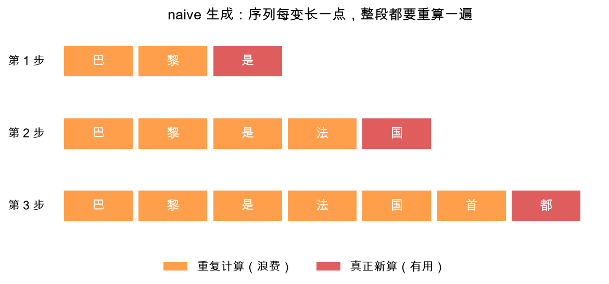

# 第 1 章：浪费在哪——每步重算整段话

> 本章你将：
> 1. 重温 `generate_naive` 的生成循环，看清它每一步到底算了什么；
> 2. 亲手数一数：生成 $n$ 个词，naive 一共"处理"了多少个 token，其中多少是白算；
> 3. 明白一个关键事实：**同一个词，不管重算多少遍，算出来的中间结果一模一样**——这正是"可以缓存"的底气；
> 4. 看清浪费随序列变长是**平方级**增长的。

---

## 1.1 先回放一遍 naive 生成

Week 1 你写的 `generate_naive`（在 `minivllm/generate.py`）长这样：

```python
ids = input_ids
for _ in range(max_new_tokens):
    out = model(ids)                      # 整段序列，从头算一遍
    logits = out.logits if hasattr(out, "logits") else out
    next_token = torch.argmax(logits[0, -1, :]).item()   # 只取最后一个位置的预测
    ids = torch.cat([ids, torch.tensor([[next_token]], ...)], dim=1)  # 接回输入
```

循环里唯一用到的是 `logits[0, -1, :]`——**最后一个位置**的预测。但为了得到这一个位置，我们把整段 `ids` 都喂进了模型：每个位置都要过嵌入、过 $N$ 层注意力和 MLP，全部算一遍。

Week 1 这么做完全正确，因为当时我们的目标是"先跑起来"。现在跑起来了，该算账了。

## 1.2 一个具体例子：巴黎是法国首都

假设提示词是"巴黎是"（3 个 token），模型接着生成"法国首都"……看下面这张图，
它画出了前 3 步各自**实际参与计算**的 token：



一行就是一步。红色的格子是这一步**真正需要新算的**（只有它一个），
橙色的格子全是**重复计算**——这些词在上一步、上上一步已经算过了，而且算出来的
结果和这次**一模一样**（模型权重没变、输入这个词的上下文没变，结果凭什么变？）。

第 3 步的时候，7 个 token 里有 6 个是在做无用功。序列越长，红色的占比越小，
浪费的占比越夸张。

## 1.3 拿笔算一算：到底白算了多少

光看图还不够心疼，我们来数个数。假设提示词有 4 个 token，要生成 48 个新词
（这正是本章实测图 `w3_speedup.png` 用的配置）：

- 第 1 步：前向处理 4 个 token；
- 第 2 步：前向处理 5 个 token；
- ……
- 第 48 步：前向处理 51 个 token。

naive 一共处理的 token 数：

$$
4 + 5 + 6 + \cdots + 51 = \frac{(4 + 51) \times 48}{2} = 1320
$$

而如果每个 token 只算"真正需要的那一次"，总共只需要：

$$
\underbrace{4}_{\text{提示词}} + \underbrace{47}_{\text{每步一个新词}} = 51
$$

（第一个新词是提示词那次前向顺带预测出来的，不用单独算。）

$$
\frac{1320}{51} \approx 26
$$

**naive 做了大约 26 倍的计算量。** 而且这还只是按"token 个数"粗略计的账。
注意力内部的浪费更严重：第 $L$ 步要算一个 $L \times L$ 的注意力分数矩阵
（每个词回头看每个词），而生成一个词的真相是——只需要最新那个词回头看的
$1 \times L$ 一行。所以总浪费比 26 倍还要大，并且是随长度**平方**膨胀的。

| | naive（每步重算整段） | 理想（每词只算一次） |
|---|---|---|
| 48 步共处理的 token 数 | 1320 | 51 |
| 第 $L$ 步的注意力分数 | $L \times L$ 一整个方阵 | $1 \times L$ 一行 |
| 序列变长时 | 浪费平方级膨胀 | 每步开销几乎不变 |

> ⚠️ **易踩坑：** 数计算量时别忘了**提示词本身**也是一次完整前向（第 1 步）。
> 另外"理论浪费 26 倍"不等于"实测会快 26 倍"——每次前向还有固定开销，
> 具体倍数留到第 4 章实测揭晓。

> 💡 **你可能会问：重算一遍，结果真的一个字都不差吗？**
>
> 真的不差。一个词的中间结果（它的 K、V，它在每层的表示）只取决于**它自己和它前面的词**
> （因果掩码保证了不许偷看未来，Week 2 第 2 章）。给序列后面接了新词，
> 老词前面的内容一个字没变，所以老词重算出来的值和上次**逐 bit 相同**。
> 这就是整个 KV cache 的合法性来源：**能缓存，是因为算过的不会再变。**

## 1.4 为什么 Week 1 还能忍，现在不能忍

你可能会想：慢点就慢点呗，反正能出字。两个理由让我们必须解决它：

1. **用户等不起。** 真实对话动辄几百上千 token。naive 的每步耗时随序列变长而增加，
   生成到后面越吐越慢，像打字机卡壳。
2. **钱等不起。** GPU 是按算力付费的，26 倍的重复计算就是 26 倍的电费账单——
   还一分钱新信息都没多产出。

> 📌 **对标 vLLM：** 真实 vLLM 里根本不存在"naive 模式"——KV cache 从第一天起就是
> 推理的默认姿势。你在 vLLM 的注意力层（`vllm/model_executor/layers/attention/attention.py`）里会看到
> 每次前向都读写一个叫 `kv_cache` 的东西，那就是我们本周要手写的东西的工业版。

> 📌 **划重点：** naive 生成的病根只有一句话——**每个新词都逼着所有老词陪着重算，
> 而老词算出来的东西和上次一模一样。** 病根找到了，下一章开药方。

---

## 动手练习

本章是"看懂"章，不用填代码，但请你动手验证浪费：

1. 打开 `minivllm/generate.py`，找到你 Week 1 写的 `generate_naive`，
   在循环里加一行打印：`print(f"本步前向处理了 {ids.shape[1]} 个 token")`；
2. 随便用一个提示词跑 10 步，把每步打印的数字加起来，验证它等于
   $L + (L+1) + \cdots + (L+9)$；
3. 验证完**记得把打印删掉**（测试不喜欢多余输出）。

## 参考答案

本章无代码答案。想提前偷看药方的话，`reference/cache/kv_cache.py` 和
`reference/generate.py` 里的 `generate_with_cache` 就在那里——但建议先自己想想
"如果是你，你会存什么"。**卡住 20 分钟再看。**

---

👉 下一章：[第 2 章：KV cache——把中间结果存下来](./02-KVcache-把中间结果存下来.md)
