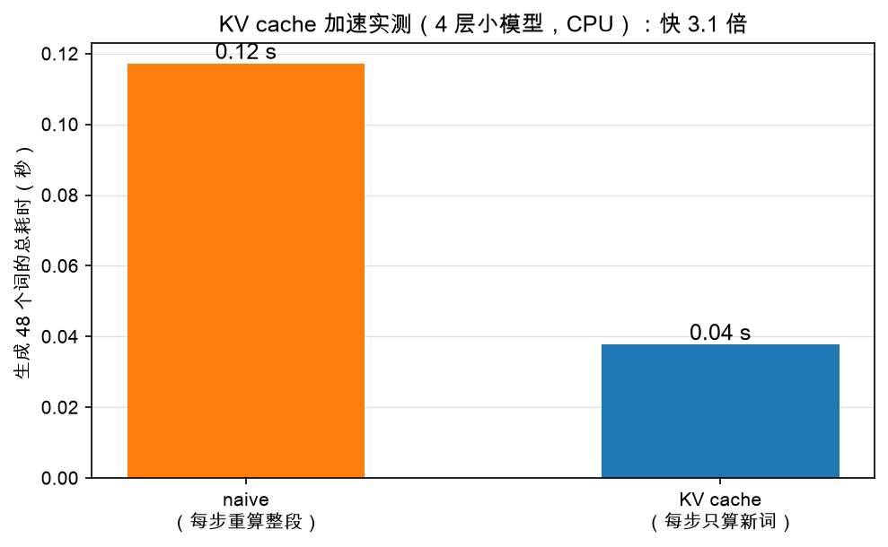
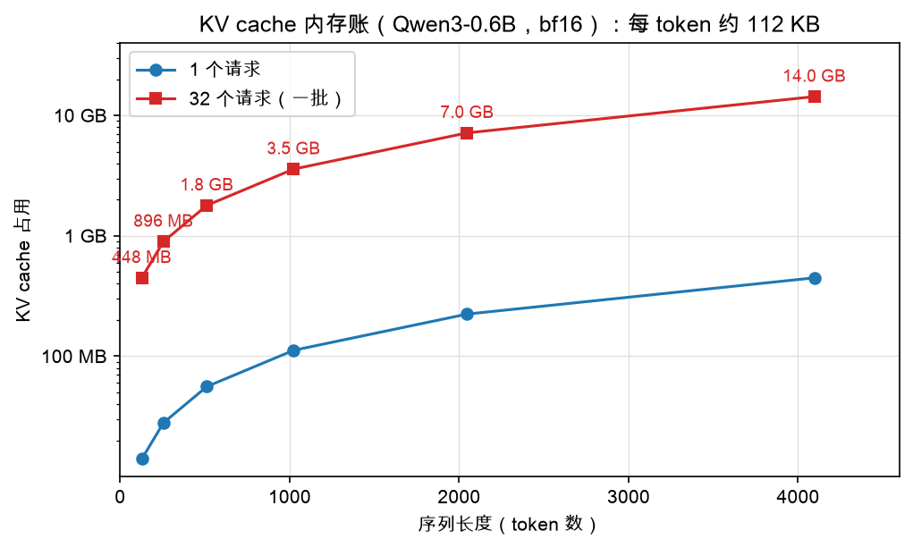

# 第 4 章：实测加速与内存账

> 本章你将：
> 1. 看实测：同一个模型，KV cache 到底快多少倍，以及为什么不是理论上算的 26 倍；
> 2. 认识 KV cache 的"另一面"：它用**内存**换时间，天下没有免费的午餐；
> 3. 实现 `kv_cache_memory_bytes`，并手算出 Qwen3-0.6B **每 token 112 KB** 这笔账；
> 4. 跑绿 `pytest tests/test_w3.py -k memory_bytes`。

---

## 4.1 先看疗效：实测 3.0 倍

耳听为虚。仓库里的生图脚本（`figures/gen_w3_kv_cache.py`）拿一个 4 层、
hidden=256、8 头的小模型在 CPU 上实测：提示词 4 个 token，生成 48 个新词——
正是第 1 章我们算出"理论浪费约 26 倍"的那个配置：



naive 用了 0.12 秒，KV cache 版 0.04 秒，**快 3.0 倍**。

真实模型上同样成立。本机 Mac 上用真实 Qwen3-0.6B（HuggingFace 版）实测的数据
存在 `figures/data/bench.json` 里：

| 生成方式 | 吞吐 |
|---|---|
| naive（HF 模型，无 cache，整段重算） | 39.3 tok/s |
| 带 KV cache（HF 模型自带 cache） | 57.1 tok/s |

约 1.45 倍。没有小模型实验那么夸张，但方向一致，而且别忘了第 1 章的结论：
**序列越长，naive 越慢（平方膨胀），cache 基本持平**——对话拉得越长，
两条曲线分得越开。

> 💡 **你可能会问：理论上浪费 26 倍，怎么实测才快 3 倍？**
>
> 好问题，说明你真的在想。三个原因：
> ① 第 1 章的"26 倍"数的是 token 个数，但每次前向除了"按 token 数收费"的计算，
> 还有**固定开销**（Python 循环、权重从内存搬进算力单元、 kernel 启动）——
> decode 每步只算 1 个词，固定开销一分不少，摊薄了收益；
> ② naive 重算的是**大矩阵**，矩阵一大 GPU/CPU 的利用率反而高，并不是纯浪费效率；
> ③ 小模型上计算总量本来就小，固定开销占比更大。
> 所以正确的预期是：**KV cache 一定更快，倍数取决于模型大小、序列长度和硬件，
> 而且序列越长差距越大。**

## 4.2 另一面：cache 不是白来的，它吃内存

到目前为止 KV cache 像个纯好事。但停下来想一秒：那些 K/V 张量**存在哪**？
内存（显存）里。每个词、每一层、K 和 V 各一份，一直在那里占着，直到生成结束。

这就是推理引擎的核心交易：**用内存换时间。** 省下了重复计算，背上了内存账单。
这笔账有多大？不能凭感觉，得会算。于是有了本周第二个要实现的函数
（`minivllm/cache/kv_cache.py`）：

```python
def kv_cache_memory_bytes(num_layers, num_heads, head_dim, seq_len, dtype_bytes=2):
    """算一算：一个请求的 KV cache 要占多少字节？

    每个 token、每一层，都要存一份 K 和一份 V，
    每份是 num_heads × head_dim 个数，每个数占 dtype_bytes 字节。
    """
```

心算路线（也是实现路线）：

1. 每个 token、每一层：K 一份 + V 一份 = **2 份**；
2. 每份是 `num_heads × head_dim` 个数（所有头的维度拼起来，其实就是 hidden_size）；
3. 每个数占 `dtype_bytes` 字节（bf16/fp16 是 2 字节，fp32 是 4 字节）；
4. 乘以层数、乘以序列长度，完事：

$$
\text{字节数} = \underbrace{2}_{K\text{和}V} \times \text{num\_layers} \times \text{seq\_len} \times \text{num\_heads} \times \text{head\_dim} \times \text{dtype\_bytes}
$$

测试 `test_kv_cache_memory_bytes` 给了一组小数字，正好用来手算对答案：
2 层、4 头、每头 8 维、10 个 token、bf16（2 字节）：

$$
\underbrace{2}_{K,V} \times \underbrace{2}_{\text{层}} \times \underbrace{10}_{\text{token}} \times \underbrace{4 \times 8}_{\text{每份个数}} \times \underbrace{2}_{\text{字节}} = 2560 \text{ 字节}
$$

## 4.3 大场面：Qwen3-0.6B 的内存账

现在代入真实模型的尺寸。我们 Week 6 要加载的 Qwen3-0.6B：
**28 层，KV 是 8 个头，每头 128 维，权重和 cache 都是 bf16（2 字节）。**

> （细心的你会问：Q 不是 16 个头吗？没错——Qwen3 的 K/V 头比 Q 少一半，
> 这个设计叫 GQA，是 Week 6 的正式话题。算 cache 账时只认 **KV 的头数 = 8**。）

每个 token、每一层：

$$
2 \times 8 \times 128 \times 2\ \text{字节} = 4096\ \text{字节} = 4\ \text{KB}
$$

乘以 28 层：

$$
4\ \text{KB} \times 28 = 112\ \text{KB}
$$

**每生成（或读入）一个 token，KV cache 就要多吃 112 KB。** 注意这个数和
序列里已有多长**无关**——它是"每来一个新词"的边际成本。于是：

| 一个请求的序列长度 | KV cache 占用 | ×32 个并发请求 |
|---|---|---|
| 128 token | 14 MB | 448 MB |
| 512 token | 56 MB | 1.8 GB |
| 1024 token | 112 MB | 3.5 GB |
| 2048 token | 224 MB | 7.0 GB |
| 4096 token | 448 MB | **14.0 GB** |

画成图（注意纵轴是对数刻度，每一格是 10 倍）：



盯一下最右下角那个数字：**32 个请求、每个 4096 token，光 KV cache 就要 14 GB**。
而 Qwen3-0.6B 的模型权重本身，bf16 下才约 1.2 GB（6 亿参数 × 2 字节），
还是所有请求**共享**的一份。

> ⚠️ **易踩坑：** 算这笔账的三个常见错误——
> ① 忘了乘 2（K 和 V 是**两份**）；
> ② 用 Q 的头数（16）而不是 KV 的头数（8）；
> ③ 忘了乘层数（28）。每个 token 是"每层都存一份"，不是只存一份。
> 三个错全犯，112 KB 能被算成 2 KB，差出 56 倍——容量规划就是这么崩的。

> 📌 **对标 vLLM：** 真实 vLLM 启动时有个著名参数 `gpu_memory_utilization`
> （默认 0.9）：加载完权重后，把显卡剩余显存的 90% **整体预分配给 KV cache**，
> 切成固定大小的块统一管理（`vllm/v1/core/kv_cache_manager.py`）。
> 为什么敢这么激进？因为这节课的账：**显存的真正主人是 KV cache，不是权重。**

## 4.4 小结：一笔交易的两面

| | 计算（时间） | 内存（空间） |
|---|---|---|
| naive | 每步重算整段，平方级浪费 | 几乎不额外占内存 |
| KV cache | 每步只算 1 个新词 | 每 token 112 KB（Qwen3-0.6B） |

这就是工程的味道：没有银弹，只有**交易**。KV cache 之所以伟大，是因为在
LLM 推理这个场景里，内存相对便宜、延迟直接烫手——这笔交易划算。
但 14 GB 那个数字也预告了：**内存很快会成为新的瓶颈**，这就是下一章的话题。

> 📌 **划重点：** 实测快 3.0 倍（小模型）/ 1.45 倍（真实 0.6B）；
> 代价是每 token 每层存 2 × 头数 × 每头维度 × 字节数，
> Qwen3-0.6B 合计**每 token 112 KB**。会算这笔账，是推理工程师的基本功。

---

## 动手练习

1. 实现 `minivllm/cache/kv_cache.py` 里的 `kv_cache_memory_bytes`
   （把 4.2 节的公式翻译成一行 `return`）；
2. 跑：

```bash
.venv/bin/pytest tests/test_w3.py -k memory_bytes
```

3. 手算挑战（不用写代码）：在 Python 里调你写的函数验证——
   `kv_cache_memory_bytes(28, 8, 128, 4096)` 应该等于 448 MB 对应的字节数
   （458752 KB，即 $448 \times 1024^2$ 字节）；再乘 32，看看是不是 14 GB。
4. （思考题）如果把 bf16 换成 fp32（4 字节），同样的预算能装的 token 数怎么变？
   这就是"KV cache 量化"为什么能省内存的直觉。

## 参考答案

`reference/cache/kv_cache.py` 底部的 `kv_cache_memory_bytes` 是标准答案
（函数体只有两行）。**卡住 20 分钟再看。**

---

👉 下一章：[第 5 章：AI 联系——KV cache 是推理的头号内存](./05-AI联系-KVcache是推理的头号内存.md)
