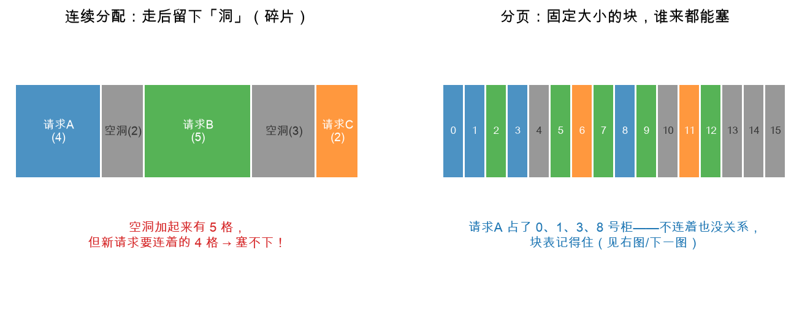

# 第 1 章：内存碎片——储物柜的智慧

> 本章你将：
> 1. 看清 Week 3 的 `NaiveKVCache` 在"多请求"场景下的致命伤——**内存碎片**；
> 2. 用"储物柜"的类比，从零建立**分页**思想：固定大小的块 + 一张对照表；
> 3. 听懂"虚拟内存""页表"这两个操作系统的词，其实说的是同一件事；
> 4. 知道 PagedAttention 这个名字的由来，以及它要消灭的三种浪费。

---

## 1.1 先回忆：KV cache 要吃多少内存

Week 3 我们算过账：KV cache 是推理的**头号内存**。以 Qwen3-0.6B 为例，每个 token 要在每一层存一份 K 和一份 V，加起来一个 token 就是约 112 KB——一个 1000 token 的请求，光 KV cache 就要一百多 MB。

内存这么金贵，接下来就是理所当然的问题：**这些内存是怎么分配给各个请求的？**

Week 3 的 `NaiveKVCache` 给了个最直白的答案：每个请求一个 cache 对象，每层的 K/V 是两张连续的张量，来一个 token 就 `torch.cat` 拼一截。单请求时这完全没问题。但真实的服务是**很多请求同时在跑**：

- 请求 A 带着 10 个 token 的提示词来了；
- 请求 B 带着 500 个 token 的提示词来了；
- 请求 A 生成完 20 个 token，结束了，内存还回来；
- 请求 C 带着 200 个 token 的提示词来了……

每个请求要的内存**大小不一、来去时间不定、还会边走边长**（每生成一个 token，KV cache 就长一截）。这种场景，是内存管理里最经典的老大难。

## 1.2 储物柜的故事：连续分配 vs 固定格子

把内存想象成超市门口的一排**储物柜**，每个请求是一件要寄存的行李。

**方案一：连续分配。** 规矩是"一件行李必须占一排**连号**的柜子"。A 的行李要 4 格，就给它 0~3 号；B 要 5 格，给它 4~8 号。看起来很整齐。

现在 A 取件走了，0~3 号空出来；C 来了，要 6 个连号的柜子——糟糕，空着的柜子东一个西一个，**单看哪段空档都不够 6 格**，可全加起来的空柜子明明比 6 多得多！C 只能干等。

这些"加起来不少、但哪段都不够用"的空档，就是**内存碎片（fragmentation）**——准确地说是**外部碎片**：空闲内存散落在各个洞里，拼不成一整块。

看左图：请求 A（4 格）、B（5 格）、C（2 格）之间留下了 2 格和 3 格两个空洞，空洞加起来有 5 格，但新请求要**连着的 4 格**——塞不下。

**方案二：分页。** 换一套规矩：

1. 柜子**全部统一大小**，一个柜子就叫一个**块（block）**；
2. 行李随便放，**不要求连号**——A 的 4 个包裹可以放 0、1、3、8 号柜，爱在哪在哪；
3. 给每件行李发一张**取件清单**，按顺序记着"第 1 个包裹在 0 号柜、第 2 个在 1 号柜、第 3 个在 3 号柜……"。取件时照着清单挨个开柜就行。

看右图：块大小统一后，任何空柜都能立刻利用，**永远不会有"拼不起来"的洞**。那件行李眼里的包裹是连续的（第 1 个、第 2 个、第 3 个……），物理上却散在各处——中间做翻译的，就是那张取件清单。

这张取件清单，就是本周的主角之一：**块表（BlockTable）**，也就是操作系统里的"页表"。

## 1.3 操作系统的同款智慧：虚拟内存与页表

你可能听说过操作系统有"虚拟内存""分页""页表"这些词，听起来很高深。其实它们说的就是储物柜这个故事，一字不差：

| 储物柜故事 | 操作系统 | 我们的 KV cache |
|---|---|---|
| 一排储物柜 | 物理内存 | 一大块 KV cache 显存 |
| 统一大小的柜子 | 页框（page frame） | **块（block）**，每块装 block_size 个 token 的 K/V |
| 一件行李 | 一个程序 | 一个请求 |
| 行李眼里的"第几个包裹" | 虚拟地址 | 请求里的**逻辑位置**（第几个 token） |
| 取件清单 | **页表（page table）** | **块表（BlockTable）** |
| 柜子管理员 | 内存管理模块 | **块池（BlockPool）** |

操作系统在 1960 年代就想明白了这件事：程序以为自己占着一整块连续内存（虚拟地址），实际上物理内存被切成固定大小的页框，程序的几页爱放哪放哪，**页表负责翻译**。这样一来，外部碎片从根上消失了——任何空页框都能分给任何程序。

vLLM 的论文标题就叫 *Efficient Memory Management for Large Language Model Serving with **PagedAttention***（2023）。它做的事情，就是把操作系统这套分页思想，原封不动地搬到 KV cache 上：

- **Paged** = KV cache 按固定大小的块管理，不按请求整段分配；
- **Attention** = 注意力计算时，按块表把散落的 K/V 找回来用。

## 1.4 分页到底消灭了哪三种浪费

在"每个请求占一段连续内存"的老办法里，其实藏着**三种**浪费，不止碎片一种：

1. **外部碎片**：上一节讲的"洞"。请求来来走走，空闲内存被切成小段，拼不出大段。
2. **内部碎片**：就算没有洞，还有个问题——分配时你**不知道这个请求最终会生成多长**。怎么办？只能按最大可能长度（比如 2048 token）先占着。结果它只生成 50 个 token 就停了，剩下 1998 个 token 的空间白占了全程。这种"分给你但你没用上"的浪费，发生在分配块的**内部**，所以叫内部碎片。
3. **预留的浪费**：更隐蔽的一种——很多系统为了保险，会按"提示词 + 最大生成长度"一次性把内存占死。请求还没开始生成，它"将来可能要用的"内存就已经不能给别人了。

PagedAttention 论文里有一个触目惊心的实测：传统方案下，KV cache 里**真正装着 token 的空间只有 20%～38%**，其余全被上面这三种浪费吃掉了。

分页方案怎么一一化解：

| 浪费 | 分页的解法 |
|---|---|
| 外部碎片 | 块统一大小，任何空块都能用，**洞根本不存在** |
| 内部碎片 | 按需领块，生成一个 token 才占一个槽位；浪费最多发生在**最后一块没装满**，且永远小于一个块 |
| 预留的浪费 | 不预留。走到哪领到哪，请求一结束块立刻归还 |

慢着，你可能会想：**"按需领块"听着美好，但注意力计算需要看到全部历史的 K/V，它们散在各个块里，怎么用？**

答案就在那张取件清单上：算注意力之前，按块表把 K/V 挨个从块里"取回来"（这个操作叫 **gather**），拼成连续张量再算。**存储是分散的，计算时看到的还是连续的**——鱼与熊掌兼得。这正是第 3 章要实现的 `PagedKVCache.gather`。

> 💡 **你可能会问：既然 gather 回来还是连续的，那折腾这一圈图什么？**
>
> 图的是**存储层**的自由。连续张量只在"算注意力的那一瞬间"存在，算完就扔；而长期占用内存的 cache 本体永远是分页的、紧凑的、谁都能用的。浪费发生在"长期占用"上，不发生在"临时拼一下"上。

## 1.5 本周的三件套

故事讲完，该见见本尊了。本周我们要实现三个类，正好对应储物柜故事的三个角色：

| 角色 | 类 | 职责 |
|---|---|---|
| 柜子管理员 | `BlockPool` | 记录哪些块闲着，发块（`allocate`）、收块（`free`） |
| 取件清单 | `BlockTable` | 一个请求的"逻辑第几个 token → 物理哪个槽位"对照表 |
| 储物柜本体 | `PagedKVCache` | 真正存 K/V 的地方，按槽位写入（`write`）、按槽位读回（`gather`） |

> 📌 **对标 vLLM：** 真实 vLLM v1 里，块管理员是 `vllm/v1/core/block_pool.py` 的 `BlockPool`（它连名字都没改），页表逻辑在 `vllm/v1/core/kv_cache_manager.py` 里。你本周写的代码和它们是同构的——读完本周再去看，会有"这不就是我写的那个吗"的感觉。

> ⚠️ **易踩坑：** 别把"块"和"token"混为一谈。块是**存储单位**（一块装 block_size 个 token），token 是**内容单位**。本周所有公式都在这两者之间做换算，换算的唯一桥梁是接下来会反复用的公式：物理槽位 = 块号 × 块大小 + 块内偏移。

> 📌 **划重点：** 连续分配怕"长长短短、来来去去"，会留下拼不起来的洞；分页把内存切成统一大小的块、按需领取、用一张表记住位置，三种浪费一起消失。这就是 PagedAttention 的 "Paged"。

---

## 动手练习

本章是思想章，没有要填的函数。但请做两件事，给下一章热身：

1. 手算：假设块大小为 4，请求 A 领了 3、7、1 三个块（按这个顺序），它一共有 10 个 token。问：A 的第 0 个 token 在哪个物理槽位？第 5 个呢？第 9 个呢？（用"物理槽位 = 块号 × 块大小 + 块内偏移"算：第 i 个 token 住第 i // 4 块、块内第 i % 4 格。答案是 12、29、5。算不出来没关系，第 2 章会手把手再算一遍。）
2. 打开 `tests/test_w4.py`，通读一遍，不用跑。看看本周的终点长什么样——尤其是最后那个 `test_paged_equals_naive`，体会它的名字。

## 参考答案

`reference/cache/` 目录下的三个文件就是本周全部答案，但**现在别看**。先把第 2 章读完、亲手填一遍 `minivllm/cache/block_pool.py` 和 `block_table.py`，卡住 20 分钟再翻。

---

👉 下一章：[第 2 章：BlockPool 与 BlockTable——页表本尊](./02-BlockPool与BlockTable-页表本尊.md)
