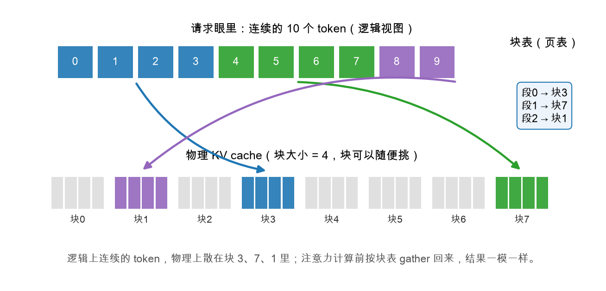

# 第 2 章：BlockPool 与 BlockTable——页表本尊

> 本章你将：
> 1. 亲手实现 `BlockPool` 的 `allocate` / `free`——储物柜管理员怎么发柜子、收柜子；
> 2. 亲手实现 `BlockTable` 的 `append_slot` / `physical_slots`——取件清单怎么记、怎么查；
> 3. 把本周最重要的公式刻进肌肉记忆：**物理槽位 = 块号 × 块大小 + 块内偏移**；
> 4. 跑通 `pytest tests/test_w4.py -k "pool or block_table"`，本周第一次见绿。

---

## 2.1 管理员上岗：BlockPool

回忆储物柜故事：管理员手里有一份"空柜子清单"，有人来就划掉一格发出去，有人走就把格子加回来。`BlockPool` 就干这一件事——它甚至**不关心块里装了什么**，只管编号。

```python
from collections import deque

class OutOfBlocksError(RuntimeError):
    """池子里没有空闲块了。"""

class BlockPool:
    """管理 num_blocks 个固定大小的块。"""

    def __init__(self, num_blocks, block_size):
        assert num_blocks > 0 and block_size > 0
        self.num_blocks = num_blocks
        self.block_size = block_size
        # 空闲块队列。用 deque 让取块/还块都是 O(1)。
        self._free = deque(range(num_blocks))
```

`__init__` 已经给你了，看一眼关键设计：

- 块没有"实体"，**块就是一个编号**（0 到 num_blocks-1）。真正存数据的地方下一章才出现；
- 空闲编号放在一个 `deque`（双端队列）里。`deque` 是 Python 标准库里的队列，两头进出都飞快：发块从左边取（`popleft`），还块往右边放（`append`）。

你要填的是两个方法，每个都只有两三行：

**`allocate()`：领一个块，返回块号。**

```python
def allocate(self):
    """领一个空闲块，返回块号。池空则抛 OutOfBlocksError。"""
    if not self._free:
        raise OutOfBlocksError(
            f"KV cache 块用完了（共 {self.num_blocks} 块）"
        )
    return self._free.popleft()
```

池子空了不许装死，必须**抛异常**喊出来——这是下周调度器的救命信号："内存满了，新请求先排队！"

**`free(block_id)`：归还一个块。**

```python
def free(self, block_id):
    """归还一个块。"""
    if block_id in self._free:
        raise ValueError(f"块 {block_id} 已经是空闲状态，重复归还")
    self._free.append(block_id)
```

那个 `if` 检查的是**重复归还**：同一个块还两次，管理员手里的空闲清单就会出现两个相同编号，下一次会把同一个块同时发给两个请求——两份 K/V 互相覆盖，灾难。所以宁可当场报错。

另外两个方法已经给好了，读一遍就行：

- `num_free_blocks()`：还剩几个空块，就是 `len(self._free)`；
- `can_fit(num_tokens)`：池子还装得下 num_tokens 个 token 吗？里面有个小技巧值得看：

```python
blocks_needed = -(-num_tokens // self.block_size)  # 向上取整
```

`//` 是整除（向下取整），但"7 个 token、每块装 4 个"需要 **2** 块不是 1 块，得**向上**取整。Python 没有内置的向上整除，惯用 trick 就是 `-(-a // b)`：先取负、向下除、再取负，效果等于向上取整。下周调度器准入新请求时会调用 `can_fit` 做"保守检查"。

## 2.2 全周最重要的一个公式

在写取件清单之前，先把地址换算的规则定死。整个 Week 4（以及 Week 5、7）都在用这一条：

$$
\text{物理槽位} = \text{块号} \times \text{块大小} + \text{块内偏移}
$$

什么叫"物理槽位"？把整块 KV cache 想象成一根从 0 开始编号的长队，**每个位置能放一个 token 的 K/V**，这个位置编号就是物理槽位。块大小为 4 时：

| 块号 | 块内偏移 0 | 偏移 1 | 偏移 2 | 偏移 3 |
|---|---|---|---|---|
| 块 0 | 槽位 0 | 槽位 1 | 槽位 2 | 槽位 3 |
| 块 1 | 槽位 4 | 槽位 5 | 槽位 6 | 槽位 7 |
| 块 3 | 槽位 12 | 槽位 13 | 槽位 14 | 槽位 15 |

为什么要这样编号？因为下一章的仓库张量形状是 `(num_blocks, block_size, num_heads, head_dim)`——前两维"块号 × 块内偏移"一压平，正好就是一根 `(num_blocks × block_size)` 的长队，**物理槽位直接就是下标**。先记住公式，下一章看到 `view(-1, H, D)` 你会恍然大悟。

## 2.3 取件清单：BlockTable

`BlockTable` 是**一个请求**的页表。它要记住两件事：这个请求占了哪些块（`block_ids`，按逻辑顺序排）、已经装了多少个 token（`num_tokens`）。`__init__` 已给好：

```python
class BlockTable:
    """一个请求的 逻辑位置 → 物理槽位 对照表。"""

    def __init__(self, pool):
        self.pool = pool
        self.block_ids = []  # 这个请求占用的块号，按逻辑顺序排
        self.num_tokens = 0  # 已经占用了多少个槽位
```

注意它手里攥着 `pool`——清单自己不发柜子，**块满了就找管理员领**。

### `append_slot()`：为下一个 token 占座

每来一个 token（prefill 的每个提示词 token、decode 的每个新 token），就调一次 `append_slot()`，它返回这个新 token 该住进的物理槽位：

```python
def append_slot(self):
    """为下一个 token 占一个槽位，返回它的物理槽位号。"""
    block_size = self.pool.block_size
    if self.num_tokens % block_size == 0:
        # 需要新开一个块（第一个 token 也会走到这里）
        self.block_ids.append(self.pool.allocate())
    block_id = self.block_ids[-1]
    offset = self.num_tokens % block_size
    self.num_tokens += 1
    return block_id * block_size + offset
```

逐行看（以块大小 2 为例，跟着走一遍）：

1. `if self.num_tokens % block_size == 0`：**当前块刚好装满**（或一个块都还没有，第 0 个 token 也满足）→ 找管理员领个新块，挂到 `block_ids` 尾巴上；
2. `block_id = self.block_ids[-1]`：新 token 永远住进**最后一块**（前面的块都满了）；
3. `offset = self.num_tokens % block_size`：它在这块里是第几格；
4. 套用公式 `block_id * block_size + offset`，返回物理槽位。

手算一遍（池子是新的，块按 0、1、2… 顺序发，块大小 2）：

| 第几次调用 | num_tokens（调用前） | 要新领块吗 | 块号 | 偏移 | 返回槽位 |
|---|---|---|---|---|---|
| 第 1 次 | 0 | 要（0 % 2 == 0），领块 0 | 0 | 0 | **0** |
| 第 2 次 | 1 | 不要（1 % 2 == 1） | 0 | 1 | **1** |
| 第 3 次 | 2 | 要（2 % 2 == 0），领块 1 | 1 | 0 | **2** |

这正是测试 `test_block_table_slots` 断言的 `[0, 1, 2]`。再看一个**不连着**的例子，体会分页的精髓（这次块大小换成 4）：假设池子先发给别人几个块，轮到我们时领到的是块 3 和块 7，那 5 个 token 的槽位就是 `[12, 13, 14, 15, 28]`——**逻辑上第 0~4 个 token，物理上散了，但清单记得住，丢不了。**

### `physical_slots()`：把整张清单翻译成槽位序列

注意力计算前，需要这个请求**全部** token 的物理槽位（按逻辑顺序），好去仓库里把 K/V 挨个取回来：

```python
def physical_slots(self):
    """返回全部 token 的物理槽位，按逻辑顺序（一个 list[int]）。"""
    block_size = self.pool.block_size
    slots = []
    for i in range(self.num_tokens):
        block_id = self.block_ids[i // block_size]
        slots.append(block_id * block_size + i % block_size)
    return slots
```

逻辑位置 `i` 住在第 `i // block_size` 块（整除：第几块）、块内第 `i % block_size` 格（取余：第几格）——又是那条公式。`//` 和 `%` 这对好兄弟，一个管"翻页"，一个管"页内"。



上图就是这一章的完整画面：请求眼里自己是连续的 10 个 token（块大小 4，分成 3 段）；物理上它们散在块 3、块 7、块 1 里；右边的**块表**记着"段 0 → 块 3、段 1 → 块 7、段 2 → 块 1"。`physical_slots()` 做的事，就是顺着这张表把 10 个 token 的槽位挨个翻译出来：`[12, 13, 14, 15, 28, 29, 30, 31, 4, 5]`。

### 两个已给好的方法

- `needed_blocks(extra_tokens)`：**再**装 extra_tokens 个 token，还需要几个新块？内部同样是向上取整。下周调度器靠它做"保守准入"：块池得装得下"提示词 + 全部待生成"才放行新请求。
- `free()`：请求结束，把占用的块**全部**还给池子，清单清零。还回去的块马上可以发给别人——这就是"碎不了"的底气。

> 💡 **你可能会问：为什么 `BlockTable` 一个请求一张，而不是全局一张大表？**
>
> 因为"逻辑位置"是**每个请求自己的编号**——每个请求都从第 0 个 token 数起。请求结束，它的清单一撕、块一还，干净利落，和别人毫无瓜葛。操作系统里也一样：每个进程一张自己的页表。

> ⚠️ **易踩坑：** `append_slot` 里"领新块"的判断是 `self.num_tokens % block_size == 0`，用的是**自增之前**的 `num_tokens`。先加一再取模、或先取模再加一，写反了第一格就错位。写完务必用 2.3 节那张手算表对一遍。

> 📌 **对标 vLLM：** 真实 vLLM v1 的 `vllm/v1/core/block_pool.py` 里也有一个 `BlockPool`，用 `free_block_queue` 管理空闲块，发块叫 `get_new_blocks`；页表的职责则分散在 `vllm/v1/core/kv_cache_manager.py` 里（每个请求对应一个 `KVCacheBlocks` 列表）。思想和你写的这两个类一一对应。

> 📌 **划重点：** `BlockPool` 管"哪些块闲着"，`BlockTable` 管"我的第 i 个 token 住在哪"，两者的翻译规则只有一条：物理槽位 = 块号 × 块大小 + 块内偏移。

---

## 动手练习

1. 填出 `minivllm/cache/block_pool.py` 的 `BlockPool.allocate` 和 `BlockPool.free`；
2. 填出 `minivllm/cache/block_table.py` 的 `BlockTable.append_slot` 和 `BlockTable.physical_slots`；
3. 跑：

```bash
.venv/bin/pytest tests/test_w4.py -k "pool or block_table"
```

   7 条测试（`test_pool_*` 4 条 + `test_block_table_*` 3 条）应该全绿。特别留意 `test_pool_double_free_raises`——它在检查你有没有写"重复归还"的防线。
4. （选做）自己写三行验证"散块"情形：造一个 `BlockPool(8, 4)`，先 `allocate()` 两次把块 0、1 发掉，再建 `BlockTable` 追加 5 个槽位，打印 `physical_slots()`——你会看到 `[8, 9, 10, 11, 12]`（块 2 和块 3）。试试先 `free` 一个再追加，槽位序列会变得更"碎"，但逻辑顺序永远正确。

## 参考答案

`reference/cache/block_pool.py` 和 `reference/cache/block_table.py`。**卡住 20 分钟再看**，重点对比你"领新块"的判断条件写的是自增前还是自增后。

---

👉 下一章：[第 3 章：PagedKVCache——写进去，读回来](./03-PagedKVCache-写进去读回来.md)
