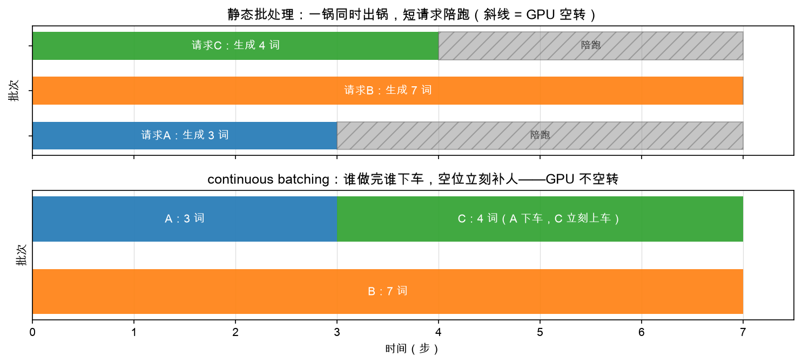

# 第 1 章：静态批处理——陪跑的浪费

> 本章你将：
> 1. 用一张甘特图看懂"静态批处理"到底浪费在哪——短请求全程陪跑；
> 2. 亲手算出浪费的比例（不用任何公式，数格子就行）；
> 3. 说出 continuous batching 的一句话思想：**每一步都重新点名**；
> 4. 明白为什么这件事必须等 Week 4 的分页 KV cache 就位才能做。

---

## 1.1 先回忆：我们已经会"批量"了

Week 4 你写的 `decode_batch` 已经能让**一批请求一步各出一个词**：B 个请求的
新 token 拼成一个 `(B,)` 的输入，一次前向全部算完。GPU 喜欢这种"大块头的活"——
一次大矩阵乘远胜于 B 次小矩阵乘。

但"会批量"不等于"会安排"。想象你现在开了一家生成服务公司，门口不断有请求进来，
每个请求要生成的长度**不一样、事先也不知道**。怎么把它们编成一批一批地喂给
`decode_batch`？

最朴素的排法叫**静态批处理（static batching）**：

1. 凑齐一锅请求（比如 3 个）；
2. 一起进站，一步一批地生成；
3. **整锅全部做完**，才放下一锅进来。

听起来很合理？问题就出在第 3 条。

## 1.2 一锅同时出锅：短请求在陪跑

来了三个请求：

- 请求 A：生成 3 个词就说完了；
- 请求 B：要生成 7 个词；
- 请求 C：要生成 4 个词。

静态批处理把 A、B、C 凑成一锅。每过一步，锅里每个请求各出一个词。第 3 步，
A 已经说完了——但锅还没出，B 才生成到一半。A 的位置怎么办？**占着座位空转**：
每步照样跟着前向跑，产出的词直接扔掉。C 在第 4 步说完，也要陪跑到第 7 步。

看甘特图的上半张（斜线区域就是陪跑）：



数一下格子：这一锅跑了 7 步（由最长的 B 决定），每步 3 个座位，
总共 $7 \times 3 = 21$ 个"座位·步"。真正干活的只有 $3 + 7 + 4 = 14$ 个，
剩下 7 个全在陪跑——**三分之一的算力被白白烧掉**。

而且这还没算另一种浪费：C 如果是第 2 步才到门口的，它得在门口干等到第 7 步
下一锅开煮。请求的等待时间也被拉长了。

> 💡 **你可能会问：为什么不按长度分组，把差不多长的请求凑一锅？**
>
> 好问题，真实系统确实会做长度排序来减少陪跑。但这只是"减少"，不是"消灭"——
> 生成长度是**边生成边知道**的（模型什么时候说"完了"，撞到结束符才知道），
> 进门时你只知道提示词多长，不知道它会生成多长。只要"一锅必须同时出锅"
> 这条规矩还在，陪跑就根除不了。

## 1.3 continuous batching：每一步都重新点名

破局的思路，是把"一锅"这个概念彻底扔掉，换成：

> **每生成一步，都重新点名一次：谁做完了谁下车，空出的座位立刻让排队的人补上。**

看甘特图的下半张。第 3 步 A 说完下车，C **立刻**坐进 A 的座位接着跑，
第 7 步 B 和 C 恰好一起说完。同样 14 个词的活，这次 21 个座位·步里
一个都没浪费——斜线区域消失了。

这就是 **continuous batching（连续批处理）**，也叫 iteration-level scheduling
（步级调度）：批次的成员不是固定的，而是**每一步都可以变**。GPU 上的座位
永远坐满正在干活的请求。

| | 静态批处理 | continuous batching |
|---|---|---|
| 批次成员 | 一锅定终身 | 每步重新点名 |
| 短请求做完 | 陪跑到锅尾 | 立刻下车 |
| 新请求进门 | 等下一锅 | 有座就上 |
| 本例利用率 | 14 / 21 ≈ 67% | 14 / 14 = 100% |

> 📌 **对标 vLLM：** continuous batching 是 vLLM 的立身之本（思想源自 Orca
> 系统），实现就在 `vllm/v1/core/sched/scheduler.py` 的 `schedule()` 方法里——
> 它每被调用一次，就是"点名一次"。本周第 3 章你写的 `Scheduler.schedule()`
> 是它的迷你版。

## 1.4 为什么现在才能做这件事

你可能会想：这么好的主意，Week 1 怎么不做？因为它有两个硬前提，都是
前两周才备齐的：

1. **请求要能随时上下车。** 请求中途加入，它的 KV cache 得立刻有地方放；
   中途下车，占的内存得立刻还给别人。Week 3 的 `NaiveKVCache` 是"一个请求
   一根连续长货架"，做不到这一点；Week 4 的**分页 KV cache** 才行——
   上车时 `append_slot()` 占几个槽位，下车时 `block_table.free()` 把块还回池子。
2. **一批长短不一的请求要能一起算。** 这就是 Week 4 的 `decode_batch`：
   补 0 对齐 + 掩码，B 个历史长度不同的请求共享一个仓库各走一步。

所以本周的活其实只剩最后一块拼图：**谁来决定每一步让哪些请求上车、下车**——
调度器。

> 📌 **划重点：** 静态批处理的浪费叫"陪跑"：一锅以最长的请求为准，短请求做完
> 只能空转。continuous batching 每一步重新点名，做完的下车、排队的补位，
> GPU 不空转。它不改任何一个生成的字，只改排班表。

---

## 动手练习

1. （思考题，不写代码）还是 A=3、B=7、C=4 三个请求。如果第 4 步时门口又来了
   请求 D（生成 2 个词）：静态批处理（3 个一锅）和 continuous batching 各需要
   多少步才能把这 4 个请求全部做完？各浪费多少"座位·步"？
   提示：静态批处理里 D 只能等下一锅；continuous batching 里 B 第 7 步下车后
   D 才能上车（C 占了 A 的座）。
2. 见证本周终点（和 Week 1 一样的仪式）：

```bash
IMPL=reference .venv/bin/pytest tests/test_w5.py -q
```

   参考答案全绿——这就是你本周要抵达的地方。再跑 `.venv/bin/pytest tests/test_w5.py -q`
   看看你战场的现状（大部分红，正常）。
3. 打开 `minivllm/scheduler/` 目录翻一遍三个文件，找到所有
   `raise NotImplementedError` 的位置——那是你本周的战场。

## 参考答案

本章没有要填的代码。思考题的一个参考结论：两种排法都要 9 步（B 第 7 步下车前
没人能给 D 让座）。浪费方面：静态批处理第一锅浪费 7 个座位·步，D 单独开一小锅
不浪费，共浪费 7；continuous batching 前 7 步零浪费，但最后 2 步只剩 D 在车上、
另一个座位空转，浪费 2。你自己的数格子结果对上就成。

---

👉 下一章：[第 2 章：Request 与两个队列——waiting 与 running](./02-Request与两个队列-waiting与running.md)
