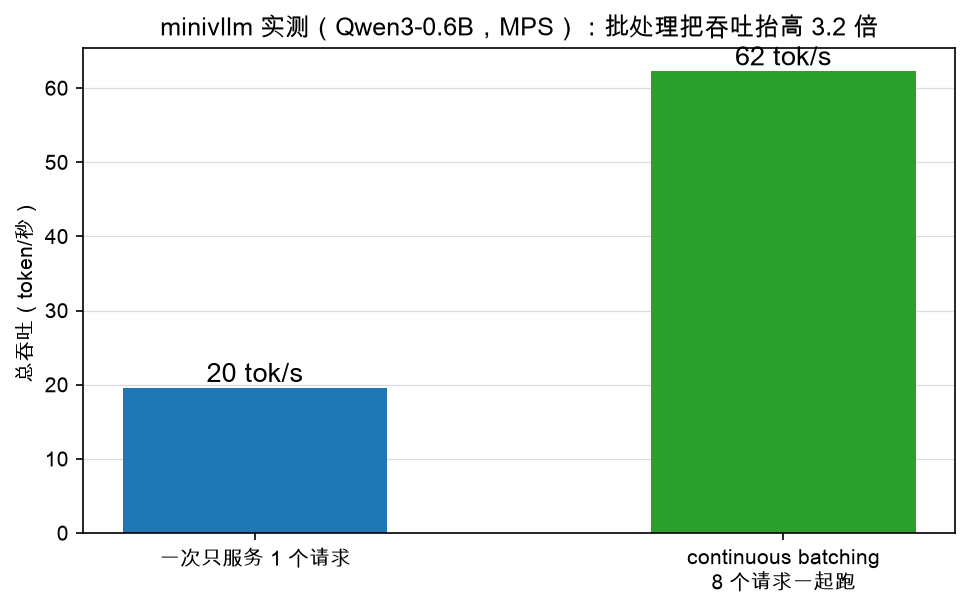

# 第 5 章：实测——批处理把吞吐抬高 3 倍

> 本章你将：
> 1. 看真实数字：我们的引擎，单请求 19.6 tok/s → 8 请求一起跑 62.3 tok/s；
> 2. 说清**为什么**批处理能提吞吐：模型权重每步只搬一遍，8 个请求分摊；
> 3. 分清"吞吐"和"延迟"两个指标——批处理提的是前者，不坑后者；
> 4. 知道这些数字从哪个脚本跑出来、记在哪个文件里。

---

## 5.1 数字说话

老规矩，先上证据。在我们的 Mac（Apple Silicon，MPS）上，用真实权重的
Qwen3-0.6B 实测（完整数据在 `figures/data/bench.json`）：



| 跑法 | 总吞吐 |
|---|---|
| 一次只服务 1 个请求 | 19.6 tok/s |
| continuous batching，8 个请求一起跑 | 62.3 tok/s |

**62.3 / 19.6 ≈ 3.2 倍。** 服务器还是那个服务器，模型还是那个模型，
每个请求生成的字一个没变——只是排班表从"一次接待一位客人"换成了
"每步点名、座位坐满"，每秒吐出的总词数就翻了 3 倍多。

> 📌 **划重点：** 这 3.2 倍就是本周全部代码的意义。模型一个字没变快，
> 快的是"座位利用率"。

## 5.2 为什么批处理能提吞吐：权重搬运的分摊

要理解这 3.2 倍，得先知道 decode 一步的时间花在哪。答案可能违反直觉：
**主要不是花在"算"上，而是花在"搬"上。**

每生成一个词，模型都要做一次完整的前向：28 层的所有权重（0.6B 参数，
约 1.2 GB）都要从内存读进计算单元，过一遍。而 decode 的每个请求只有
**一个**新词要处理——一个词的矩阵运算量小得可怜，计算单元绝大部分时间
在**等权重搬过来**。

这就是"内存带宽瓶颈"：搬运是定额开销，不管你来几个词，每一步都得把
这 1.2 GB 搬一遍。

于是账就好算了：

- **单请求**：搬一遍 1.2 GB 权重 → 产出 1 个词；
- **8 请求批处理**：还是搬一遍 1.2 GB 权重（权重只有一份！）→ 一次前向
  产出 8 个词。

同样的搬运，8 倍的产出。这就是为什么 Week 4 说"GPU 喜欢大块头的活"——
B 个请求拼成一批，B 次小乘变一次大乘，**权重搬运被 8 个请求分摊了**。

那为什么实测只有 3.2 倍，不是 8 倍？因为批次变大后，计算本身也开始占时间了
（8 个词的运算不再是零头），加上我们的玩具实现里还有 Python 层的开销
（逐个 prefill、逐行 argmax、每步组装张量），都会吃掉一部分红利。
3.2 倍是一个玩具引擎在笔记本上的诚实数字——真实 vLLM 在真正的 GPU 上，
批处理红利可以接近数量级。

## 5.3 吞吐 vs 延迟：别把两个指标搞混

这里必须停下来澄清一对概念，它们是推理引擎的"血压"和"心率"：

| 指标 | 定义 | 谁关心 |
|---|---|---|
| **吞吐（throughput）** | 整个系统每秒吐出多少词 | 提供服务的人（同样一张卡，服务越多人越赚） |
| **延迟（latency）** | 单个请求多快拿到结果 | 用户（我的问题多久有回应） |

批处理提的是**吞吐**：8 个请求一起跑，总产出 62.3 tok/s。那每个请求自己的
速度呢？大约 62.3 / 8 ≈ 7.8 tok/s——**反而比独享时的 19.6 慢**！

这不是 bug，是共享的本质：蛋糕做大了 3.2 倍，但分成了 8 份。对用户来说，
关键是要生成速度仍然比阅读速度快（人阅读大约每秒几个词），体验就不差；
对服务商来说，同样一张卡多服务了好几倍的人。**continuous batching 就是在
"单人体验还够用"的前提下，把"总蛋糕"做到最大。**

> 💡 **你可能会问：那有没有一个指标衡量"用户等第一个词等了多久"？**
>
> 有，叫 TTFT（Time To First Token，首词延迟）——主要花在 prefill 上。
> 我们的引擎实测 TTFT 约 62 ms（`bench.json` 里的 `minivllm_ttft_ms`）。
> Week 8 第 4 章会正式实现这两个指标的测量工具。

## 5.4 和真实 vLLM 比一比

`bench.json` 里还有真实 vLLM 的同机实测，摆在一起看最有意思：

| 引擎 | 单请求 | 8 请求 |
|---|---|---|
| minivllm（我们） | 19.6 tok/s | 62.3 tok/s（**+3.2 倍**） |
| 真实 vLLM | 145.8 tok/s | 143.3 tok/s（**持平**） |

两个观察：

1. **vLLM 的单请求比我们快 7 倍多。** 差距不在调度思想（思想我们本周已经
   有了），而在工程实现：手写的 Metal/CUDA kernel、融合的算子、varlen
   注意力……这些 Week 8 第 5 章会逐项盘点；
2. **vLLM 的 8 请求几乎没提升。** 因为它的单请求已经把这台机器的内存带宽
   吃到接近上限了——搬运分摊的红利它在 b=1 时就已经拿到大半。而我们单请求
   离硬件上限还很远（Python 开销大），所以批处理红利显得格外肥。

一句话：**批处理的红利大小，取决于你离硬件上限有多远。** 这个视角能帮你
看懂一切性能优化的宣传数字。

## 5.5 数字从哪来

诚实交代一下测量方法：

- 脚本：`scripts/bench_minivllm.py`（跑的是 `reference/` 里组装好的完整引擎——
  调度核心就是你本周写的这套 `Scheduler`，外加 W6 采样、W7 的 `LLM` 门面）；
- 模型：Qwen3-0.6B 真实权重，本地 HF 缓存；
- 方法：8 个固定提示词，每个生成 64 词，总词数除以总耗时；先预热一轮再计时；
- 结果：合并进 `figures/data/bench.json`，本教程所有性能数字都出自这个文件。

你现在还没学 W6/W7，暂时跑不了这个脚本——没关系，**本周的测试
`test_w5.py` 已经验证了"批处理结果正确"，性能数字先当结论记住**；
等 Week 7 组装完自己的引擎，重跑一次：

```bash
.venv/bin/python scripts/bench_minivllm.py
```

亲手量出你自己的 3 倍，那感觉完全不同。

> ⚠️ **易踩坑：** 谈性能数字一定要带前提：什么硬件、什么模型、什么批次、
> 生成长度多少。脱离前提的"快 N 倍"都是耍流氓——这也是我们把
> `bench.json` 留在仓库里、教程只引用它的原因。

> 📌 **划重点：** 实测 19.6 → 62.3 tok/s（3.2 倍）。批处理提吞吐的本质是
> 分摊"权重搬运"这个定额开销；它做大总蛋糕，单个请求的速度反而被分摊变慢——
> 吞吐和延迟是两个指标，别混。

---

## 动手练习

1. （思考题）为什么批处理的红利是 3.2 倍而不是 8 倍？用 5.2 节的"搬运/计算"
   账本，说出至少两个原因；
2. （思考题）如果模型换成 7B（权重大 10 倍多），其他条件不变，你猜批处理
   红利会变大还是变小？提示：搬运开销在一步里的占比会怎么变；
3. （选做，需真实权重）Week 7 学完后回来跑
   `.venv/bin/python scripts/bench_minivllm.py`，对比你测出的数字和
   `bench.json`，想想差异可能来自哪（机器负载、是否预热等）。

## 参考答案

本章没有要填的代码。思考题的参考要点：① 红利不足 8 倍，是因为批次大了
计算占比上升、加上 Python 层每步的固定开销（逐个 prefill、组装张量）；
② 模型越大，搬运占比越高，单请求越"喂不饱"硬件，批处理红利越大。

---

👉 下一章：[第 6 章：AI 联系——真实 vLLM 调度器还多了什么](./06-AI联系-真实vLLM调度器还多了什么.md)
