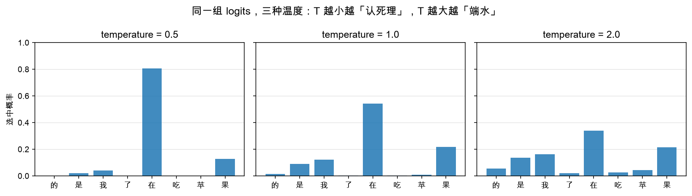

# 第 1 章：从 logits 到词——greedy 与 temperature

> 本章你将：
> 1. 重新认识模型的输出：不是"一个词"，而是词表上 **15 万个分数（logits）**；
> 2. 复习 softmax——把任意分数变成"加起来等于 1"的概率（公式 + 直觉）；
> 3. 实现两个最基础的挑词策略：**贪心（greedy）** 和 **温度缩放（temperature）**；
> 4. 看懂三种温度下同一份概率分布怎么变形（配图）；
> 5. 跑绿 `pytest tests/test_w6_sampler.py -k "greedy or temperature"`。

---

## 1.1 模型吐出来的不是词，是分数

Week 1 我们就见过这个画面：模型前向一次，吐出形状 `(1, L, V)` 的 logits，
其中 $V$ 是词表大小。Qwen3 的词表有 **151 936** 个词元（token），
所以"模型预测下一个词"的真实含义是：

> 给词表里**每一个**候选词打一个分数，15 万个分数排成一排。

这些分数叫 **logits**。它们有三个"不讲道理"的性质：

- 可正可负，范围不限（-37.2 也行，+108 也行）；
- 互相之间**加起来不等于 1**，不是概率；
- 只有**相对大小**有意义：分数高的词，模型觉得"更该出现"。

你可以把 logits 想象成考试卷上的**原始得分**：语文 91、数学 88、英语 95——
能看出谁高谁低，但要说"每门课被我选中的概率是百分之几"，还得先做一步换算。

这一步换算就是 softmax。

## 1.2 softmax：把分数变成概率

Week 2 在注意力里见过一次 softmax，这里正式复习一遍。对一排分数
$z_1, z_2, \dots, z_V$，softmax 分两步：

$$
p_i = \frac{e^{z_i}}{e^{z_1} + e^{z_2} + \cdots + e^{z_V}}
$$

直觉拆解：

1. **先取 $e$ 的指数**（$e^{z_i}$）：$e$ 的任何次方都是正数，负数分数瞬间变正；
   而且指数函数"嫌贫爱富"——分数越高，放大得越狠，差距被进一步拉开；
2. **再除以总和**：所有结果加起来恰好等于 1，可以名正言顺地叫"概率"了。

算个小例子找感觉：三个词的 logits 是 $[1, 2, 3]$。

- $e^1 \approx 2.72$，$e^2 \approx 7.39$，$e^3 \approx 20.09$，总和约 $30.19$；
- 概率：$[0.09,\ 0.24,\ 0.67]$。

注意：排序没变（3 号还是老大），但"老大领先多少"被翻译成了百分比语言。
有了概率，我们就可以谈两种挑词哲学了。

## 1.3 贪心：永远挑第一名

**贪心（greedy）** 是最朴素、也是前五周一直在用的策略：

> 不看概率，直接挑 logits 最大的那个词。

代码一行，`torch.argmax`（第一次见：返回张量里**最大值所在的下标**）：

```python
def greedy_sample(logits):
    """贪心：挑分数最高的那个 token id。logits: (vocab,)"""
    return int(torch.argmax(logits).item())
```

对应测试 `test_greedy_picks_argmax`：

```python
logits = torch.tensor([0.1, 2.3, -1.0, 2.29])
assert greedy_sample(logits) == 1   # 2.3 > 2.29，下标 1 获胜
```

故意放了个 $2.29$ 紧贴 $2.3$——**贪心不管差距多小，只认第一名**。

贪心的性格非常鲜明：

| 优点 | 缺点 |
|---|---|
| 确定性：同样输入，永远同样输出，**可复现** | 容易"认死理"，爱说套话、容易复读 |
| 零额外计算 | 不会给出任何惊喜 |

事实问答、代码补全这类"有标准答案"的场景，贪心很合适；写故事、闲聊这种
"没有标准答案"的场景，贪心的输出会干巴巴的。想要点变化？先学会拧温度。

## 1.4 temperature：给分数"兑水"或"浓缩"

**温度（temperature，记作 $T$）** 的做法简单到不像话：

> 在过 softmax **之前**，把所有 logits 除以 $T$。

$$
p_i = \text{softmax}\!\left(\frac{z_i}{T}\right)
$$

回忆 1.2 节的例子 $[1, 2, 3]$，看除法的效果：

- $T = 0.5$：logits 变成 $[2, 4, 6]$，概率约 $[0.02, 0.12, 0.87]$——差距被**放大**，
  第一名更稳了，模型更"保守"；
- $T = 2.0$：logits 变成 $[0.5, 1, 1.5]$，概率约 $[0.19, 0.31, 0.51]$——差距被**抹平**，
  老二老三也有机会了，模型更"放飞"。

一句话记忆：**$T$ 小 = 认死理（分布变尖），$T$ 大 = 端水大师（分布变平）。**

下图用同一组 logits 画了三种温度下的概率分布，候选词是"的 是 我 了 在 吃 苹 果"：



看三根最高的柱子（都是"在"）：$T=0.5$ 时它独占约八成概率；
$T=1.0$ 时约一半；$T=2.0$ 时只剩三分之一——连"果"这种原本的第二选择
都被抬到了两成。**温度没有改变谁的排名，改变的是排名的"含金量"。**

> 💡 **你可能会问：温度能不能取 0？**
>
> 不能除——除以 0 直接爆炸。但注意 $T$ 越小分布越尖，$T \to 0$ 的极限
> 恰好就是"第一名拿走全部概率"，也就是**贪心**。所以工程上有个约定俗成：
> **`temperature = 0` 就是"我要贪心"的暗号**，代码里见到 0 就直接走
> argmax 分支，根本不进 softmax。我们的 `SamplingParams` 就是这么约定的
> （第 3 章细讲）。

## 1.5 实现 apply_temperature

骨架在 `minivllm/sampling/sampler.py` 里，合同很短：

```python
def apply_temperature(logits, temperature):
    """温度缩放：logits / T。

    T < 1：分数差距被放大 → 更保守；T > 1：差距被抹平 → 更随机。
    """
```

实现两行的事，但有一个坑要堵上：按 1.4 节的约定，$T \le 0$ 是**调用方的错误**
（贪心请走 `temperature = 0` 的暗号），所以这里直接拒绝服务：

```python
if temperature <= 0:
    raise ValueError("temperature 必须 > 0（贪心请用 temperature=0 的约定）")
return logits / temperature
```

测试 `test_apply_temperature` 把它钉死了：

```python
logits = torch.tensor([1.0, 2.0])
assert torch.equal(apply_temperature(logits, 2.0), torch.tensor([0.5, 1.0]))
```

> ⚠️ **易踩坑：** 两个高频错误——
> ① 写成 `logits * temperature`。方向反了：乘 $T$ 会让 $T$ 越大越尖锐，
> 和所有框架的行为相反；
> ② 忘了拦 $T \le 0$。不拦的话 $T = 0$ 会静默产出 inf/nan，错误要等到
> softmax 之后才炸，排查半天找不到源头。

> 📌 **对标 vLLM：** 真实 vLLM 的温度逻辑在 `vllm/v1/sample/ops/` 目录下
> （对整批 logits 一次性除温度），采样参数的字段定义在
> `vllm/sampling_params.py`——我们的 `SamplingParams` 就是它的 mini 版，
> 第 3 章对比着看。

> 📌 **划重点：** logits 是原始分数，softmax 把它变成概率；贪心 = 只认第一名；
> 温度 = softmax 之前除以 $T$，$T$ 小更保守、$T$ 大更随机；`temperature = 0`
> 是"走贪心"的工程约定。

---

## 动手练习

1. 在 `minivllm/sampling/sampler.py` 里实现 `greedy_sample` 和
   `apply_temperature`（先自己写，别看参考答案）；
2. 跑：

```bash
.venv/bin/pytest tests/test_w6_sampler.py -k "greedy or temperature"
```

   `test_greedy_picks_argmax` 和 `test_apply_temperature` 应该变绿。
   （这条命令还会命中 `test_sample_token_greedy_ignores_filters`，
   它要等第 3 章的 `sample_token` 写好才能绿，现在红着是正常的。）
3. （手算题）logits 为 $[0, 4]$，分别算 $T=1$ 和 $T=4$ 时第二个词的概率。
   提示：$e^4 \approx 54.6$，$e^1 \approx 2.72$。感受一下"兑水"的力量。

## 参考答案

`reference/sampling/sampler.py` 里的 `greedy_sample` 和 `apply_temperature`
是标准答案，加起来 5 行。**卡住 20 分钟再看**，重点对照：你有没有拦
`temperature <= 0`。

---

👉 下一章：[第 2 章：top-k 与 top-p——给随机性画个圈](./02-topk与topp-给随机性画个圈.md)
