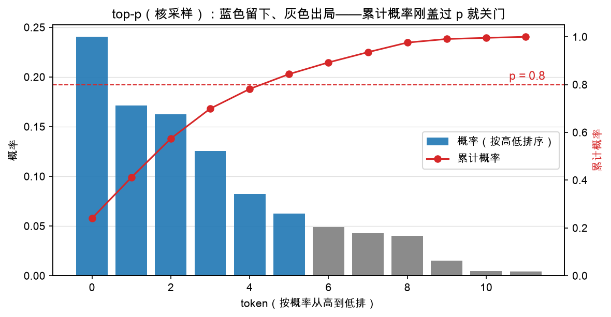

# 第 2 章：top-k 与 top-p——给随机性画个圈

> 本章你将：
> 1. 明白"纯随机"的危险：15 万个候选词里，垃圾词也有中奖机会；
> 2. 学会两个"画圈"工具：**top-k**（固定圈住前 k 名）和 **top-p**（圈住累计概率到 p 为止）；
> 3. 掌握采样工程里最重要的一招——用 `-inf` 把词"礼貌地请出考场"；
> 4. 逐个实现 `top_k_filter` 和 `top_p_filter`；
> 5. 跑绿 `pytest tests/test_w6_sampler.py -k "top"`（大部分用例）。

---

## 2.1 为什么要"画圈"？

上一章我们学会了按概率抽签（softmax + 温度）。但直接对**全部 15 万个词**抽签，
有个隐患：

> softmax 不会给任何词打零分——哪怕是完全不着边际的词，也分到一丁点概率。

"今天天气真"后面，"香蕉"可能分到 0.001% 的概率。抽 10 万次才中一次，
听起来无所谓？但模型一次生成就是几百上千步、成千上万用户在用，
**小概率事件天天发生**——表现就是聊天机器人突然蹦出一个莫名其妙的词。

工程上的对策不是消灭随机性，而是**给随机性画个圈**：

1. 先把"明显不可能"的词踢出候选圈；
2. 只在圈内按概率抽签。

top-k 和 top-p 是两种画圈法，一个画**固定大小**的圈，一个画**自适应大小**的圈。

## 2.2 关键一招：-inf 踢人法

怎么"踢出一个词"？把它的 logits 改成 $-\infty$（负无穷）。

为什么是 $-\infty$ 而不是 0？回忆 softmax 的第一步：$e^{z_i}$。
$e^{-\infty} = 0$——负无穷的分数过完指数函数**恰好归零**，这个候选的概率
被精确地打成 0，抽签永远抽不中它。而如果把 logits 改成 0，$e^0 = 1$，
反而给它发了张不小的彩票。

> 📌 **划重点：** 采样工程里，"删掉一个词"的标准动作就是把它的 logits
> 置为 `-inf`。它不删数据、不改形状，只是在数学上让这个词"不存在"。

## 2.3 top-k：只留前 k 名

**top-k** 的规则一句话：只保留分数最高的 $k$ 个词，其余全部 `-inf`。

实现分三步（骨架在 `minivllm/sampling/sampler.py`）：

```python
def top_k_filter(logits, k):
    """只保留分数最高的 k 个，其余置 -inf（概率归零）。k <= 0 表示不截断。"""
    if k is None or k <= 0 or k >= logits.shape[-1]:
        return logits
    threshold = torch.topk(logits, k).values[..., -1]
    return logits.masked_fill(logits < threshold, float("-inf"))
```

逐行看（两个新 torch 操作，各一句话）：

1. **边界放行**：`k <= 0` 表示"不截断"；`k` 大于等于词表大小也等于没截——
   原样返回，省事；
2. **`torch.topk(logits, k)`**：返回"最大的 k 个值 + 它们的下标"。
   我们只要 `.values` 里最后一个 `[..., -1]`——**第 k 名的分数**，它就是门槛；
3. **`masked_fill(条件, 值)`**：把满足条件的位置替换成给定值。
   低于门槛的全部置 `-inf`，踢出圈。

测试 `test_top_k_filter` 手算一遍：

```python
logits = torch.tensor([1.0, 5.0, 2.0, 4.0])
out = top_k_filter(logits, 2)
# 前两名是 5.0（下标 1）和 4.0（下标 3），门槛 = 4.0
# out = [-inf, 5.0, -inf, 4.0]
assert out[1].item() == 5.0 and out[3].item() == 4.0
assert out[0].item() == float("-inf") and out[2].item() == float("-inf")
# k 越界或 <= 0：原样返回
assert torch.equal(top_k_filter(logits, -1), logits)
assert torch.equal(top_k_filter(logits, 99), logits)
```

top-k 的缺点也很直观：**圈的大小是死的**。模型胸有成竹时（第一名占 99%），
k=50 硬塞进 49 个凑数的；模型举棋不定时（前五名各 15%），k=3 又把好选项
拦在圈外。能不能让圈"该大时大、该小时小"？

## 2.4 top-p：累计概率盖过 p 就关门

**top-p**（核采样，nucleus sampling）的思路：不按名次画圈，按**概率**画圈——

> 把候选词按概率从高到低排，从高往低累加，**刚盖过 p 就关门**，
> 圈外一律 `-inf`。

看图最直观。下图把候选词按概率从高到低排成柱子，红色折线是累计概率，
虚线是 $p = 0.8$：



前 6 根蓝柱子的累计概率刚盖过 0.8，关门；后面的灰柱子全部出局。
注意圈的**大小是活的**：如果第一名就占了 0.9，圈只有 1 个词；
如果分布很平，圈会自动扩大——这正是 top-k 做不到的事。

### 实现：四步 + 一个细节

```python
def top_p_filter(logits, p):
    """核采样（nucleus）：保留累计概率刚好盖过 p 的最小集合。"""
    if p is None or p >= 1.0:
        return logits
    sorted_logits, indices = torch.sort(logits, descending=True)
    probs = torch.softmax(sorted_logits, dim=-1)
    cum_probs = torch.cumsum(probs, dim=-1)
    remove = (cum_probs - probs) > p  # 注意减回去：当前这名还没让累计超 p 就保留
    sorted_logits = sorted_logits.masked_fill(remove, float("-inf"))
    out = torch.full_like(logits, float("-inf"))
    return out.scatter(-1, indices, sorted_logits)
```

逐行走（三个新 torch 操作）：

1. **`torch.sort(logits, descending=True)`**：从大到小排序，返回
   `(排好序的值, 原来的下标)`。下标待会儿要用来"物归原主"；
2. **`softmax` 后 `torch.cumsum`**：cumsum（累计和）第 $i$ 项 = 前 $i$ 名概率之和，
   就是图上那条红色折线；
3. **判断谁出局**，细节在这一行：`remove = (cum_probs - probs) > p`。
   `cum_probs - probs` 是"**轮到它之前**的累计概率"。为什么要减回去？
   因为规则是"刚盖过 p 就关门"——关门的那一名本身要**留下**。
   不减回去的话，让累计刚超 p 的那名也被删了，圈就画小了；
4. **`scatter(-1, indices, sorted_logits)`**：scatter 一句话解释——
   "按 indices 把值撒回原来的位置"。排序打乱了顺序，踢完人后要按原下标
   摆回去（没进圈的位置保持 `-inf`，所以先用 `torch.full_like` 铺一床 `-inf`）。

### 拿测试算一遍

`test_top_p_filter` 构造了一组概率恰好为 $[0.5, 0.3, 0.15, 0.05]$ 的 logits
（取对数再喂进去，softmax 后还原）：

```python
logits = torch.log(torch.tensor([0.05, 0.5, 0.15, 0.3]))
out = top_p_filter(logits, 0.6)
kept = torch.isfinite(out).nonzero().flatten().tolist()
assert kept == [1, 3]
```

跟着代码走一遍：

| 名次 | 概率 | 累计概率 | 轮到它之前的累计 | > 0.6？ | 去留 |
|---|---|---|---|---|---|
| 第 1 名（原下标 1） | 0.50 | 0.50 | 0 | 否 | 留 |
| 第 2 名（原下标 3） | 0.30 | 0.80 | 0.50 | 否 | **留（关门这名）** |
| 第 3 名（原下标 2） | 0.15 | 0.95 | 0.80 | **是** | 踢 |
| 第 4 名（原下标 0） | 0.05 | 1.00 | 0.95 | **是** | 踢 |

留下来的按原下标摆回去是 `[1, 3]`，和断言一致。第 2 名就是"刚盖过 p 的
关门那名"——体会一下 `cum_probs - probs` 那一减的作用：不减的话它就冤死了。

还有一条贴心的边界测试 `test_top_p_keeps_at_least_one`：哪怕 $p = 0.01$，
第一名也必须留下（第 1 名"轮到它之前的累计"永远是 0，永远不大于 p）。
**圈再小，也不能是空的**——否则 multinomial 无签可抽。

> ⚠️ **易踩坑：** 三个高频错误——
> ① 判断写成 `cum_probs > p`，把关门那名也踢了，小 p 时会全灭；
> ② 忘了 `scatter` 摆回原顺序，直接返回排好序的张量——下标全乱，
> 采出来的词张冠李戴；
> ③ `top_k_filter` 里用 `<=` 当门槛条件，把并列第 k 名的词也误伤
> （正确是严格小于 `<` 才踢）。

> 💡 **你可能会问：top-k 和 top-p 能一起用吗？**
>
> 能，而且实践中经常一起用（比如 Qwen3 官方推荐 top_k=20 配 top_p=0.95）。
> 顺序是先 top-k 再 top-p：top-k 先砍掉长尾垃圾，top-p 再在剩下的里面
> 画自适应的圈。下一章的 `sample_token` 流水线就是这个顺序。

> 📌 **对标 vLLM：** 真实 vLLM 的 top-k/top-p 在
> `vllm/v1/sample/ops/topk_topp_sampler.py`，和我们一模一样的思路：
> 排好序、算累计、`-inf` 踢人——只是它对**整批请求**的 logits 一次性处理，
> 每个请求的 k/p 可以不同。这个"每请求一套参数"的需求，正是下一章的主角。

> 📌 **划重点：** 踢人靠 `-inf`；top-k 画固定圈（前 k 名），
> top-p 画自适应圈（累计概率刚盖过 p 就关门，关门那名要留下）；
> 圈至少留一个词。

---

## 动手练习

1. 在 `minivllm/sampling/sampler.py` 里实现 `top_k_filter` 和 `top_p_filter`；
2. 跑：

```bash
.venv/bin/pytest tests/test_w6_sampler.py -k "top"
```

   `test_top_k_filter`、`test_top_p_filter`、`test_top_p_keeps_at_least_one`
   应该变绿。（`test_sample_token_respects_top_k_support` 依赖第 3 章的
   `sample_token`，现在红着正常。）
3. （手算题）概率分布 $[0.4, 0.3, 0.2, 0.1]$，$p = 0.65$，哪些词留下？
   用"轮到它之前的累计概率"那列推一遍，再和直觉对一下。

## 参考答案

`reference/sampling/sampler.py` 里的 `top_k_filter`（3 行）和
`top_p_filter`（8 行）是标准答案。**卡住 20 分钟再看**，重点对照：
你的出局条件是不是 `(cum_probs - probs) > p`，以及最后有没有 `scatter`
摆回原顺序。

---

👉 下一章：[第 3 章：Sampler——每个请求一套参数](./03-Sampler-每个请求一套参数.md)
