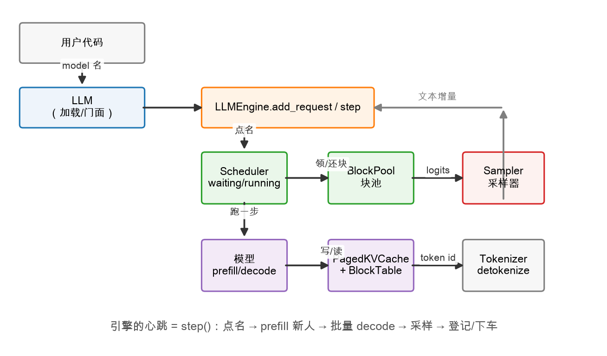

# 第 1 章：从函数到引擎——为什么要 LLMEngine

> 本章你将：
> 1. 看清 Week 5 的 `continuous_batch_generate` 作为"引擎"还差哪三块短板；
> 2. 认识 `LLMEngine` 的全貌：它肚子里装了哪些零件、各自来自哪一周；
> 3. 读懂已给出的 `__init__` / `add_request` / `has_unfinished` / `RequestOutput`；
> 4. 用一张架构图把"用户代码 → LLM → LLMEngine → 各零件"的接线关系记牢。

---

## 1.1 先回顾一下：Week 5 我们组装出了什么

Week 5 的最后一章，你写出了 `continuous_batch_generate`（在
`reference/scheduler/batching.py` 里能看到定稿版）。它的流程概括起来是：

1. 造好块池、分页 KV cache、调度器三件家当；
2. 把**所有** prompt 一次性塞进调度器；
3. `while` 循环：点名 → prefill 新人 → 批量 decode → 登记，直到全部做完；
4. 按提交顺序返回所有结果，函数结束。

它已经很能打了——continuous batching 的核心（每步重新点名、随走随上）都在。
但如果你真的想拿它开一个"聊天服务"，用不了五分钟就会撞到三堵墙。

## 1.2 三堵墙：函数为什么不够用

**第一堵墙：请求必须一次给齐。**
函数的第一件事就是 `for i, prompt in enumerate(prompts)` 全部入队。跑到一半，
新来一个用户想插队？没门——`scheduler` 是函数的局部变量，外面根本够不着。
真实的聊天服务里，用户是**陆陆续续**来的，引擎必须随时能收新请求。

**第二堵墙：结果必须一次拿全。**
`return` 发生在**全部**请求做完之后。用户盯着屏幕等 30 秒，然后"唰"地一下
看到整段话——这不是我们习惯的 ChatGPT 体验。我们想要的是**打字机效果**：
出一个词显示一个词。

**第三堵墙：零件用完就扔。**
函数一返回，块池、KV cache、调度器、采样器全部变成垃圾等回收。下次调用再重造
一遍。批与批之间想共享状态（比如"引擎已经服务了多少请求"）？存不下。

一句话总结：**函数是"煮一锅饭"，引擎是"开一家食堂"。** 食堂得随时收单、
窗口得一份一份出餐、灶台的火候状态得一直在。修法也很直接——把那四步从函数体里
拆出来，变成一个**对象的方法**：

| 函数里的一段 | 变成引擎的什么 |
|---|---|
| 开头的一次性入队 | `add_request()`：随时可调的收件箱 |
| `while` 循环体（一轮点名+计算） | `step()`：引擎的心跳，跳一下走一步 |
| `while` 的循环条件 | `has_unfinished()`：还有活儿吗 |
| 结尾的一次性返回 | `generate()`（攒齐再拿）/ `stream()`（逐字吐） |
| 函数局部变量（块池、cache、调度器…） | `self.xxx`：引擎的成员，随引擎一起活着 |

这就是本周的全部蓝图。剩下的章节只是把它填成代码。

## 1.3 引擎架构全景图



跟着图走一遍数据的旅程：

1. **用户代码**只跟 `LLM` 打交道：给个模型名，给几个字符串 prompt（第 4 章的主角）；
2. `LLM` 把字符串变成 token id，转交给 **`LLMEngine`**——本周的心脏；
3. 引擎每跳一下心跳（`step()`）：先找 **Scheduler** 点名（谁 prefill、谁 decode），
   点完名让**模型**跑一步（`prefill` / `decode_batch`），模型的 K/V 读写都落在
   **PagedKVCache + BlockTable** 上，块不够用了找 **BlockPool** 领；
4. 模型吐出 logits，**Sampler** 按每个请求自己的 `SamplingParams` 采出下一个 token；
5. token id 攒在请求身上，**Tokenizer** 负责把它 decode 成文本，
   以"文本增量"的形式流回用户。

> 📌 **划重点：** 图里每一个方块，除了最上面的 `LLM` 和中间的 `LLMEngine` 本身，
> 你在 Week 4/5/6 **全都亲手写过**。本周写的只是"接线的盒子和外面的壳"。

## 1.4 LLMEngine 的肚子：`__init__` 逐行读

打开 `minivllm/engine/llm_engine.py`，`__init__` 已经帮你写好了——因为它纯粹是
"把旧零件 new 出来摆好"，没有新东西。但我们逐行过一遍，确保每颗螺丝你都认识：

```python
def __init__(
    self,
    model,
    tokenizer,
    num_blocks=256,
    block_size=16,
    max_num_seqs=8,
    eos_token_id=None,
):
    self.model = model
    self.tokenizer = tokenizer
    if eos_token_id is None:
        self.eos_token_ids = ()
    elif isinstance(eos_token_id, int):
        self.eos_token_ids = (eos_token_id,)
    else:
        self.eos_token_ids = tuple(eos_token_id)
```

头三行参数自白：`model` 是任何实现了引擎接口（`prefill` / `decode_batch`）的模型
——MiniTransformer 和 Qwen3ForCausalLM 都满足；`tokenizer` 只需要会
`encode` / `decode` 两件事。`eos_token_id` 做了个小归一化：不管你给 `None`、
一个 int、还是一串 int，内部统一存成元组 `eos_token_ids`——因为有的模型有
**多个**停止符（Qwen3 除了 `<|endoftext|>` 还有 `<|im_end|>`），统一成集合
后面判断"撞没撞停止符"就只要一句 `token in eos_token_ids`。

接着是摆零件：

```python
    self.device = next(model.parameters()).device
    C = model.config
    self.block_pool = BlockPool(num_blocks, block_size)
    self.kv_cache = PagedKVCache(
        num_layers=C.num_layers,
        num_heads=C.num_kv_heads if hasattr(C, "num_kv_heads") else C.num_heads,
        head_dim=C.head_dim,
        num_blocks=num_blocks,
        block_size=block_size,
        device=self.device,
        dtype=next(model.parameters()).dtype,
    )
    self.scheduler = Scheduler(self.block_pool, max_num_seqs=max_num_seqs)
    self.sampler = Sampler()
    self._next_request_id = 0
    self._requests = {}  # request_id -> Request（含已完成的）
```

- `device` 和 `dtype` 都**从模型身上问出来**（`next(model.parameters())` 取第一个
  参数，它在哪台设备、什么精度，cache 就跟它保持一致）——免得用户传错；
- 有一行值得停下来看一眼：
  `num_heads=C.num_kv_heads if hasattr(C, "num_kv_heads") else C.num_heads`。
  这是在兼容 Week 6 的 **GQA**：Qwen3 的 K/V 只有 8 个头（Q 有 16 个），
  它的 config 里有 `num_kv_heads`；而我们的 MiniTransformer 没有 GQA，
  config 里没这个字段，就退回 `num_heads`。KV cache 的尺寸按 **K/V 的头数**算，
  这一行就是 GQA 省内存的落点；
- 调度器、采样器都是你写的旧朋友，原样 new 出来；
- 最后两行是引擎的**账本**：`_next_request_id` 是自增的请求编号器；
  `_requests` 是一个字典，**所有**请求（包括已完成的）都按 id 存在这里——
  这样请求做完之后，我们还能随时翻出它的完整结果。

> 💡 **你可能会问：Scheduler 里不是也存着请求吗（waiting/running/finished 三个队列）？
> 为什么还要一个 `_requests` 字典？**
>
> Scheduler 的三个队列是"调度视角"：请求做完就从 `running` 挪到 `finished`，
> 它关心的是**谁在跑**。而引擎要回答的是"用户视角"的问题："我 3 号请求的结果呢？"——
> 哪怕它早做完了。`_requests` 按 id 索引、永不删除，专门回答这类问题。
> 同一份 Request 对象被两边引用，不冲突。

## 1.5 进件与查询：add_request / has_unfinished

这两个方法也已给出，都很短，但语义要说清：

```python
def add_request(self, prompt_token_ids, sampling_params=None):
    """提交一个请求（token id 序列），返回 request_id。"""
    params = sampling_params or SamplingParams()
    req = Request(self._next_request_id, prompt_token_ids, params)
    self._next_request_id += 1
    self.scheduler.add_request(req)
    self._requests[req.request_id] = req
    return req.request_id

def has_unfinished(self):
    return self.scheduler.has_unfinished()
```

`add_request` 做了四件事：没给采样参数就补个默认的（`SamplingParams()` 默认
贪心、最多 16 个新词）→ 造 `Request` 并领一个编号 → 塞进调度器的 waiting 队尾
→ 登记到账本。**注意它只"收件"，不"开工"**——请求进了 waiting 队列，
什么时候轮到它跑，是下一次 `step()` 点名时调度器说了算。这个"收件与开工分离"
就是引擎能随时收新请求的关键。

`has_unfinished` 则是直接转发调度器的判断：waiting + running 非空，就还有活儿。

## 1.6 交付单：RequestOutput

最后是结果的外包装，也已给出：

```python
class RequestOutput:
    """一次生成的最终结果（对标 vLLM 的 RequestOutput 的极简版）。"""

    def __init__(self, request, text):
        self.request_id = request.request_id
        self.prompt_token_ids = request.prompt_token_ids
        self.output_token_ids = request.output_token_ids
        self.text = text
        self.finish_reason = request.finish_reason
```

就是一张"交付单"：请求号、提示词、生成的 token id、decode 好的文本、结束原因
（`"length"` 达到上限 / `"stop"` 撞停止符）。从 `Request` 身上把用户关心的字段
抄出来，再加上文本（token id → 文本需要 tokenizer，所以文本在引擎里 decode 好
再塞进来，这就是第 3 章 `_make_output` 干的事）。

> 📌 **对标 vLLM：** 真实 vLLM 里同样存在这三层——用户侧的 `LLM`
> （`vllm/entrypoints/llm.py`）、同步引擎 `LLMEngine`
> （`vllm/v1/engine/llm_engine.py`）、以及结果包装 `RequestOutput`
> （`vllm/outputs.py`）。真实的 `RequestOutput` 还装着 prompt 的 logprobs、
> 累计用量等字段，但骨架和我们这张交付单一模一样。

> 📌 **划重点：** 函数变引擎，本质是三件事：收件箱（`add_request` 随时进件）、
> 心跳（`step` 随时可跳）、账本（`_requests` 随时可查）。本章读完了收件箱和账本，
> 下一章写心跳。

---

## 动手练习

本章没有要填的函数（`__init__`、`add_request` 等都已给出），但有一个
"见证装配"的小实验，帮你在填代码之前先摸一遍引擎的内脏：

1. 新建一个临时脚本（别放进 `minivllm/`，比如 `play_w7_ch1.py`），
   用你自己的战场代码构造一台引擎：

```python
import torch
from minivllm.model.transformer import MiniConfig, MiniTransformer
from minivllm.engine.llm_engine import LLMEngine
from tests.conftest import ToyTokenizer   # 借测试里的玩具分词器用一下

torch.manual_seed(0)
model = MiniTransformer(MiniConfig(vocab_size=64, hidden_size=32,
                                   num_layers=2, num_heads=4, max_seq_len=64))
model.eval()
tok = ToyTokenizer(["a b c", "d e f"])
eng = LLMEngine(model, tok, num_blocks=16, block_size=4, max_num_seqs=2)

rid = eng.add_request(tok.encode("a b c"))
print("领到 request_id:", rid)
print("还有活儿吗:", eng.has_unfinished())
print("waiting 队列长度:", len(eng.scheduler.waiting))
print("running 队列长度:", len(eng.scheduler.running))  # 还没点名，应该是 0
print("块池空闲块:", eng.block_pool.num_free_blocks())
```

2. 跑一跑，对照输出想一想：`add_request` 之后请求为什么不在 `running` 里？
   （提示：收件与开工分离。）
3. （思考题，不写代码）`eng.add_request` 连调三次，`rid` 分别是多少？
   `_requests` 字典里会有几个条目？如果其中一个请求做完了，字典里会少一个吗？

## 参考答案

本章没有要填的代码；想对照 `__init__` / `add_request` 的理解，看
`reference/engine/llm_engine.py` 的前 90 行即可。思考题的答案：
rid 是 0、1、2（自增）；`_requests` 永远只增不减——做完了也留在账本里，
这正是 `generate` 能按提交顺序取回所有结果的依靠（第 3 章见分晓）。

---

👉 下一章：[第 2 章：step——引擎的心跳](./02-step-引擎的心跳.md)
