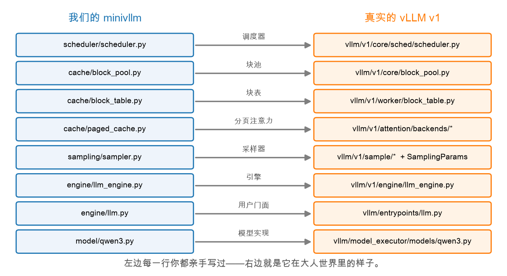

# 第 1 章：模块对照——你已经认识它们了

> 本章你将：
> 1. 拿到一张 **minivllm ↔ 真实 vLLM v1 的模块对照表**，逐行认领你亲手写过的老朋友；
> 2. 知道真实 vLLM 源码在本机的哪个目录、先从哪个文件读起；
> 3. 建立读工业级源码的正确心态：**不求全懂，先找认识的**；
> 4. 领到本周的"探险地图"（`material/vllm-源码对照.md`）。

---

## 1.1 一个可能让你意外的事实

真实 vLLM 有多少代码？光 `vllm/` 这一个包就是几十万行。第一次打开它的人，
十个里有九个会被吓退：目录几十层、类名一长串、配置文件套配置文件。

但你不是"第一次打开它的人"。过去 7 周，你把它的**灵魂**亲手写了一遍：

- Week 3 你写过 KV cache——"算过的别重算"；
- Week 4 你写过 BlockPool 和 BlockTable——分页、页表、物理槽位公式；
- Week 5 你写过 Scheduler——waiting / running 两个队列、每步点名、保守准入；
- Week 6 你写过 Sampler 和 Qwen3——温度、top-p、RMSNorm、RoPE、GQA、SwiGLU；
- Week 7 你写过 LLMEngine 和 LLM——`step()` 心跳、`generate` / `stream` 两种用法。

所以这周读源码的正确姿势是：**不是去学新东西，而是去认领老朋友。**
看到 `RequestStatus`，你要能脱口而出"这不就是我们的 WAITING / RUNNING / FINISHED 吗"。

## 1.2 对照表：左边每一行你都写过



这张图就是本周的总地图。左边是你 7 周来的战场，右边是它在"大人世界"里的样子。
真实 vLLM 的源码就在你的 `.venv` 里（定位命令见 Week 1 第 1 章），逐行过一遍：

| minivllm（你写的） | 真实 vLLM v1 | 你在哪周写的 | 它管什么 |
|---|---|---|---|
| `scheduler/scheduler.py` | `vllm/v1/core/sched/scheduler.py` | W5 | 调度器（continuous batching） |
| `scheduler/request.py` | `vllm/v1/request.py` | W5 | 请求的状态机 |
| `cache/block_pool.py` | `vllm/v1/core/block_pool.py` | W4 | 空闲块管理 |
| `cache/block_table.py` | `vllm/v1/worker/block_table.py` | W4 | 逻辑→物理块映射 |
| `cache/paged_cache.py` | `vllm/v1/attention/backends/` | W4 | 分页注意力的存取 |
| `sampling/sampler.py` | `vllm/v1/sample/` + `vllm/sampling_params.py` | W6 | 采样 |
| `engine/llm_engine.py` | `vllm/v1/engine/llm_engine.py` | W7 | 同步引擎 |
| `engine/llm.py` | `vllm/entrypoints/llm.py` | W7 | 用户门面 |
| `model/qwen3.py` | `vllm/model_executor/models/qwen3.py` | W6 | 模型实现 |

三行值得停下来多看一眼：

- **块表搬了家。** 我们的 `BlockTable` 在真实 vLLM 里对应
  `vllm/v1/worker/block_table.py`——它在 worker 侧，因为真实 vLLM 的调度器和
  跑模型的 worker 可以不在同一个进程里，块表跟着 worker 走。调度器侧的
  "给请求分块"逻辑则在 `vllm/v1/core/kv_cache_manager.py`，职责被拆得更细；
- **分页注意力不是一个文件，是一个目录。** 我们的 `PagedKVCache` 用
  `write` / `gather` 模拟了分页存取；真实 vLLM 里这是一整个
  `vllm/v1/attention/backends/` 目录——`flash_attn.py`、`cpu_attn.py`……
  每种硬件一套 kernel。Week 4 说过差别：我们 gather 成连续内存再算注意力，
  真实 kernel 直接按块表读散块，连"搬回来"这一步都省了；
- **模型文件你一定认得。** 打开 `vllm/model_executor/models/qwen3.py`，
  你会看到 `Qwen3Attention`、`Qwen3DecoderLayer`、`RMSNorm`、
  `get_rope`（RoPE）、`num_kv_heads`（GQA）、QK-Norm 的 `q_norm` / `k_norm`——
  全是 Week 6 的老朋友，下一章我们会去串门。

> 💡 **你可能会问：为什么真实 vLLM 的一个模块要拆成那么多文件？**
>
> 因为它要同时伺候：几十种模型、四五种硬件（NVIDIA/AMD/CPU/TPU…）、
> 多卡并行、量化、LoRA、投机采样、多模态……每多支持一样东西，就多一层抽象。
> 我们的 minivllm 只伺候"一台 Mac + 一个 Qwen3-0.6B"，所以能把骨架露出来。
> **这正是先学迷你版的意义：骨架认得，肉再多也吓不到你。**

## 1.3 本周的阅读材料与带读顺序

仓库里有一份为你准备好的阅读材料：`material/vllm-源码对照.md`，
里面就是上面这张对照表、真实 `schedule()` 的开篇注释、以及建议的带读顺序：

1. 先读 `vllm/v1/request.py`：找 `RequestStatus`，和我们的一一对应；
2. 再读 `vllm/v1/core/sched/scheduler.py` 的 `schedule()` 前 100 行：
   找 waiting / running 队列、token budget，对照我们的保守准入；
3. 然后 `vllm/v1/core/block_pool.py` 的 `get_new_blocks()`：对照我们的 `allocate()`；
4. 最后 `vllm/model_executor/models/qwen3.py`：找 RMSNorm / RoPE / GQA / SwiGLU
   四个关键词，每一处都是 Week 6 写过的。

下一章我们就按这个顺序走一遍前 3 步（第 4 步留给你自己探险）。

> ⚠️ **易踩坑：** 读真实源码时最容易犯的错是"想把每一行都搞懂"。
> 真实 `schedule()` 里全是各种边界情况：多模态编码器预算、LoRA 约束、
> KV 传输、流水线并行……这些**第一遍全部跳过**。你只用盯住三样东西：
> 队列（waiting / running）、预算（token budget）、分块（allocate_slots）。
> 其余的，等你真用到再回来查。

> 📌 **划重点：** minivllm 的 9 个模块在真实 vLLM v1 里各有本尊。
> 本周不是学新知识，是把老朋友一个个认领回来。

---

## 动手练习

1. 打开终端，确认真实 vLLM 的源码文件就在本机（先定位 venv 里的 vLLM 源码目录，
   Week 1 第 1 章学过）：

```bash
VLLM_DIR=$(.venv/bin/python -c "import os, vllm; print(os.path.dirname(vllm.__file__))")

ls $VLLM_DIR/v1/core/sched/scheduler.py \
   $VLLM_DIR/v1/request.py \
   $VLLM_DIR/v1/core/block_pool.py \
   $VLLM_DIR/model_executor/models/qwen3.py
```

   四个文件都应该存在（这就是本周要"带读"的四个文件）。

2. 用 grep 玩一次"寻宝"，验证对照表不是嘴上说说：

```bash
grep -n "class RequestStatus" $VLLM_DIR/v1/request.py
grep -n "def schedule" $VLLM_DIR/v1/core/sched/scheduler.py
grep -n "def get_new_blocks" $VLLM_DIR/v1/core/block_pool.py
grep -n "class Qwen3Attention" $VLLM_DIR/model_executor/models/qwen3.py
```

   每找到一处，在旁边标注"这对应我写过的哪个类/哪个方法"。
3. （思考题）对照表里只有 `cache/paged_cache.py` 对应的是一个**目录**而不是
   单个文件。为什么？提示：想想我们的 `gather` 做了什么，真实 kernel 省了哪一步。

## 参考答案

`material/vllm-源码对照.md` 就是本章的标准答案——对照表、带读顺序、
以及"我们的版本是去掉两件大事后的骨架"的说明都在里面。思考题可以先忍住不看，
下一章带读时答案会自己浮出来。

---

👉 下一章：[第 2 章：带读 vLLM 调度器源码](./02-带读vLLM调度器源码.md)
