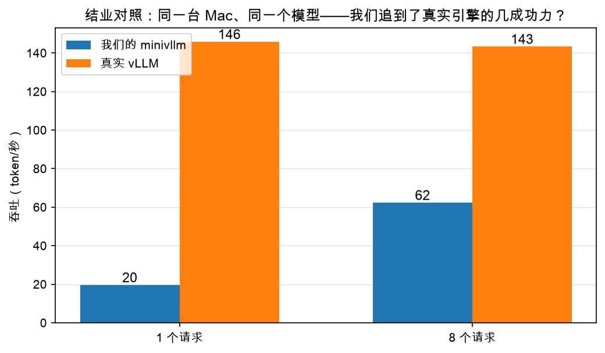

# 第 5 章：结业实测——我们追到了几成功力

> 本章你将：
> 1. 亲手跑完三组实测：naive HF、我们的 minivllm、真实 vLLM（同机、同模型）；
> 2. 拿到结业成绩单并读懂每一个数字：minivllm 62.3 tok/s vs vLLM 143.3 tok/s；
> 3. 一条条说出差距来自哪里：kernel、Python 开销、没做的三个高级特性；
> 4. 理解为什么"追到四成"不但不丢人，反而是这门课最好的毕业证。

---

## 5.1 赛前约定：同机、同模型、同 prompt

公平的比武要有规则。这次实测的规则：

- **同一台机器**：本机 Mac（Apple M3 Max、96 GB 内存，MPS 后端；配置见
  Week 1 第 1 章 1.2 节）；
- **同一个模型**：Qwen3-0.6B，bfloat16；
- **同一批 prompt**：8 条（`"The capital of France is"`、`"1+1="`、
  `"Write a haiku about memory:"` 等，写在脚本里），每条生成 64 个新 token；
- **同一套指标**：batch 1 吞吐、batch 8 吞吐、TTFT（第 4 章的定义）；
- 数字已存在 `figures/data/bench.json`，脚本跑完会自动合并进去。

参赛选手三位：naive（HF 不带 cache，Week 1 的写法）、
**我们的 minivllm**（reference 实现）、**真实 vLLM**（v0.27.1，vllm-metal 后端）。

## 5.2 开跑：三个脚本

### 第一组：naive vs HF 自带 cache

```bash
.venv/bin/python scripts/bench_naive_hf.py
```

这个脚本（`scripts/bench_naive_hf.py`）跑两遍单请求生成：
一遍 `use_cache=False` 每步整段重算（naive），一遍 `model.generate`
走 HF 自带 cache（cached）。各先预热一次再计时。

### 第二组：我们的引擎

```bash
.venv/bin/python scripts/bench_minivllm.py
```

`scripts/bench_minivllm.py` 用我们 Week 7 的 `LLM` 门面起引擎
（`max_model_len=512, max_num_seqs=8`），预热后依次测：
单请求吞吐、8 请求吞吐、单请求流式 TTFT——用的正是你第 4 章写的
`measure_ttft`（脚本里 import 的是 reference 版，行为一样）。

### 第三组：真实 vLLM

真实 vLLM 也在同一个 `.venv` 里，跑法有四个"必须"（Week 1 见过，这里复习）：

```bash
HF_HUB_OFFLINE=1 VLLM_METAL_USE_PAGED_ATTENTION=0 VLLM_HOST_IP=127.0.0.1 \
  .venv/bin/python scripts/bench_vllm.py
```

- **必须从带 `if __name__ == "__main__":` 守卫的 .py 脚本运行**：vLLM 会
  spawn 独立的 EngineCore 子进程，不能用 `python - <<EOF` 或 `python -c`
  （三个实测脚本都带 main 守卫，直接跑就行）；
- **`VLLM_METAL_USE_PAGED_ATTENTION=0`**：本机是 macOS 14.1，预编译
  Metal kernel 需要 macOS 15+，加这个变量退回 MLX 自带注意力；
- **`HF_HUB_OFFLINE=1`**：模型走本地 HF 缓存，不联网；
- **`VLLM_HOST_IP=127.0.0.1`**：代理工具的 TUN 模式会接管默认路由，
  vLLM 会把自己的 IP 认成虚拟网卡地址（`198.18.0.1`），内部 TCPStore
  随即连不上，固定成回环地址即可。

每个脚本都要跑几分钟（模型加载是大头），去倒杯水。

## 5.3 成绩单

三组跑完，`figures/data/bench.json` 里的数字（本机实测）：

| 选手 | batch 1 吞吐 | batch 8 吞吐 | TTFT |
|---|---|---|---|
| naive（HF，无 cache，整段重算） | 39.3 tok/s | — | — |
| HF 自带 cache | 57.1 tok/s | — | — |
| **我们的 minivllm** | 19.6 tok/s | **62.3 tok/s** | **62 ms** |
| **真实 vLLM** | 145.8 tok/s | 143.3 tok/s | — |



先别急着看差距，先看三个**属于我们的亮点**：

1. **batch 8 时，我们超过了 HF 自带 cache（62.3 vs 57.1）。**
   一个教学引擎，靠着分页 + continuous batching，在并发场景下赢了
   HuggingFace 的官方 generate——Week 4 和 Week 5 的两周硬仗，值回票价；
2. **我们自己身上就验证了整个课程的主线**：19.6 → 62.3 tok/s，
   调度器把吞吐抬了 3.2 倍（Week 5 的甘特图成真了）；
3. **TTFT 62 ms**：从按下回车到第一个字出现，62 毫秒，
   人的体感是"秒回"。

再看和真实 vLLM 的差距：

- batch 1：19.6 vs 145.8，约 **1.4 成**；
- batch 8：62.3 vs 143.3，约 **4.3 成**。

## 5.4 差距在哪：四条账，一条条算

这几成差距不是一笔糊涂账，每一块都能指认出具体来源。

### ① 注意力 kernel：我们"搬回来再算"，真家伙"就地取材"

这是最大的一块。回忆 Week 4：我们的 `PagedKVCache.gather` / `gather_padded`
在每次注意力之前，先把散在各块里的 K/V **拷贝拼成连续张量**，再算普通注意力。
每个请求、每一层、每一步都要搬一次——0.6B 模型 28 层，一批 8 个请求，
每步仅"搬家"就是几百次小张量拷贝。

真实 vLLM 的 paged attention kernel（`vllm/v1/attention/backends/` 那一目录）
**拿着块表直接读散块计算**，一次搬运都没有。我们分页省的是内存，
人家分页连计算路径都是分页的。

### ② Python 开销：我们的每一步都"过手"太多层

看 batch 1 那一栏：19.6 vs 145.8，差 7 倍多，比 batch 8 难看得多。
为什么？单请求时 GPU 每步的实际计算极少（一个词过一遍 0.6B），
**时间全花在"算账"上**：我们每步要在纯 Python 里走调度器点名、
逐请求拼 `slot_mapping`、逐层调 `write` / `gather`……每一步的 Python
开销是固定的，batch 越小，它占的比例越刺眼。

batch 8 时 GPU 每步干的活多了 8 倍，Python 开销占比就被摊薄了——
这就是为什么 8 请求时我们能追到 4 成，单请求只有 1 成多。
真实 vLLM 用热路径 C++/CUDA 化、张量一次拼好、异步调度等手段，
把每步的"算账"压到几乎为零。

> 💡 **你可能会问：那是不是说我们的引擎"Python 太慢，白学了"？**
>
> 恰恰相反——这堂课上你最值钱的收获就是亲眼看到：**同一个算法，**
> **瓶颈可以从"算得不对"（naive 重算）挪到"存得不对"（碎片），**
> **再挪到"排得不对"（静态批处理），最后挪到"Python 解释器本身"。**
> 优化永远是打地鼠，知道下一只地鼠在哪，你就已经赢过绝大多数人了。

### ③ 没做的三个高级特性

第 3 章的三位：

- **chunked prefill**：我们 prefill 一次吃饱。实测里 prompt 都短
  （最长的也就十几个 token），影响还小；真实流量里长提示词一来，
  别人的 decode 就被我们堵住；
- **prefix caching**：8 条 prompt 开头各不相同，这次测不出来；
  但真实场景（共享系统提示、多轮对话）里这是白捡的加速；
- **varlen / flash 类 kernel**：我们的批量 decode 用 `gather_padded`
  补 0 对齐再加掩码，等于为最长的请求陪跑；真实 kernel 按各请求
  实际长度算（varlen），短请求一秒冤枉路都不走。

### ④ 公平起见：真实 vLLM 也背着"全家桶"

也要替对手说句公道话：真实 vLLM 启动时加载的是为几十种模型、
多卡、多模态准备的完整框架，`LLM(...)` 一行的初始化比我们的重得多。
另外注意它 batch 8 反而略低于 batch 1（143.3 vs 145.8）——
0.6B 模型在这台 Mac 上单请求已接近打满，8 个请求的收益被
调度和通信开销吃掉了一点。**在"小模型 + 单卡 Mac"这个擂台上，**
**continuous batching 的红利本来就有限**；擂台换成大模型 + 数据中心 GPU，
那一栏的差距会拉大到几十倍——那才是 vLLM 的主场。

## 5.5 怎么向人介绍这份成绩单

如果以后有人问你"你手写的引擎和 vLLM 比怎么样"，你可以这样说：

> "同机同模型，batch 8 吞吐追到真实 vLLM 的四成（62 vs 143 tok/s），
> 超过 HuggingFace 官方 generate。剩下的差距我能逐条指认：
> paged attention kernel、热路径的 Python 开销、chunked prefill /
> prefix caching / varlen 三个没做的高级特性——每一条我都知道在源码哪里补上。"

最后半句才是重点。**数字是给外行看的，"差距在哪"才是给内行看的。**

> ⚠️ **易踩坑：** 跑实测最常见的两个乌龙——
> ① 跑 `bench_vllm.py` 时漏了环境变量（`VLLM_METAL_USE_PAGED_ATTENTION=0`、
> `HF_HUB_OFFLINE=1`、`VLLM_HOST_IP=127.0.0.1`），报错、卡在联网上，
> 或刷屏 `Failed to recv, got 0 bytes`；
> ② 拿第一次运行的数字当真（忘了预热，权重加载和图编译全被算进吞吐）。
> 我们的脚本里都写了预热，你自己写测量代码时别丢。

> 📌 **划重点：** 结业成绩单：minivllm 62.3 tok/s（b8）/ 62 ms TTFT，
> 约为真实 vLLM 的四成功力，赢过 HF 自带 cache。差距四大来源：
> 分页 kernel、Python 热路径、三个高级特性、擂台尺寸。

---

## 动手练习

1. 按 5.2 节跑齐三个脚本（可以只跑前两组 + 看 `bench.json` 里已有的 vLLM 数字），
   对照你的 `figures/data/bench.json`，看数字是否和 5.3 的表一个量级；
2. 用第 4 章的 `format_report` 给你的引擎打印一份正式成绩单。提示：
   从 `benchmark_throughput(llm.generate, PROMPTS, params)` 拿到 `BenchResult`，
   再塞给它 `ttft` 字段后打印；
3. （思考题）5.4 节说"batch 越小，Python 开销占比越刺眼"。如果哪天你要给
   minivllm 提速，**第一件事**该做什么？提示：想想哪几段代码每一步、
   每请求、每层都在跑。

## 参考答案

实测脚本在 `scripts/bench_naive_hf.py` / `scripts/bench_minivllm.py` /
`scripts/bench_vllm.py`（已定稿，直接跑）；第 2 题的用法可参考
`scripts/bench_minivllm.py` 里 `measure_ttft` 的调用方式。第 3 题提示：
`gather_padded` 的逐请求补 0 和 `decode_batch` 里逐层 Python 循环是两个
首要嫌疑犯——真实 vLLM 把它们分别交给了 varlen kernel 和一次成型的张量。

---

👉 下一章：[第 6 章：大结业——完整旅程回顾与下一步](./06-大结业-完整旅程回顾与下一步.md)
